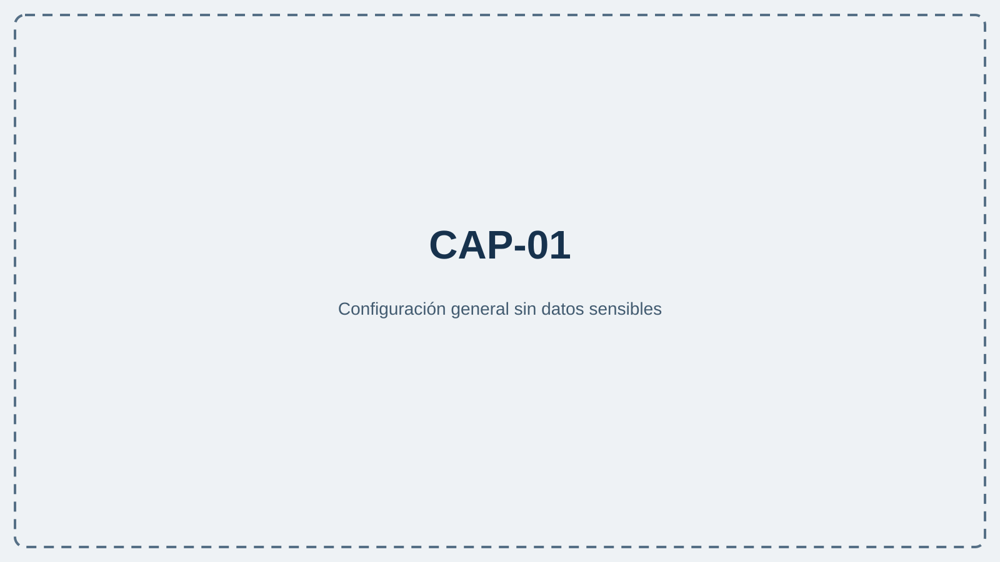
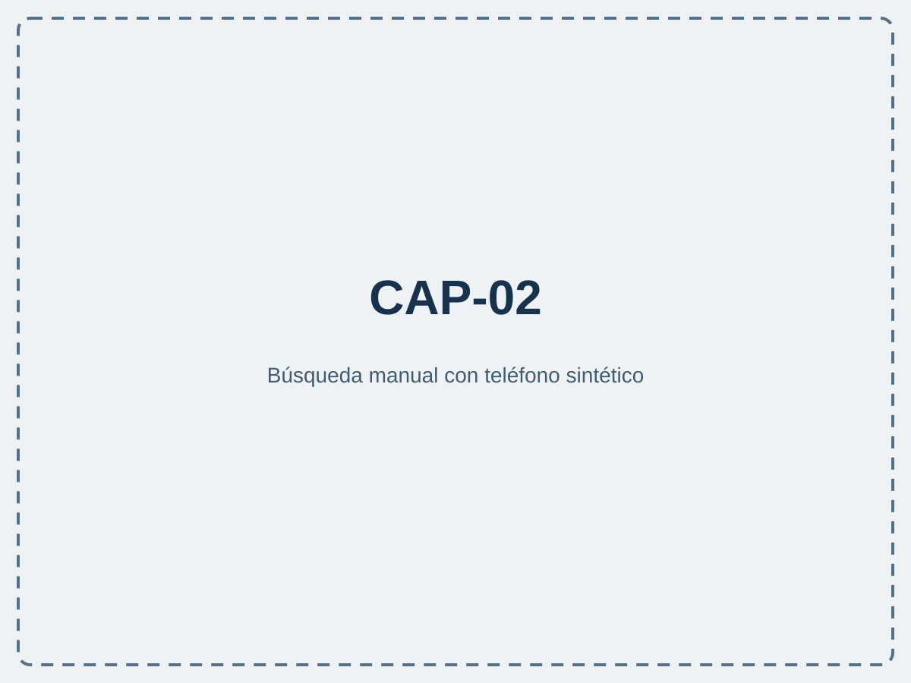
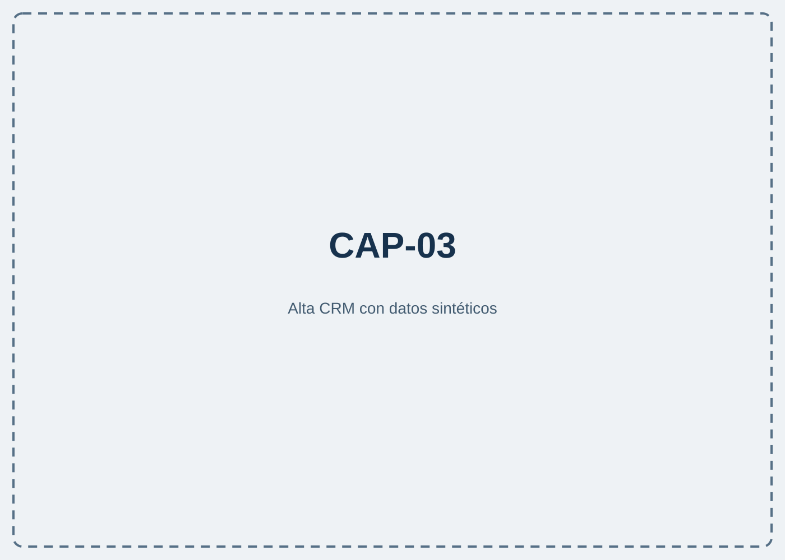
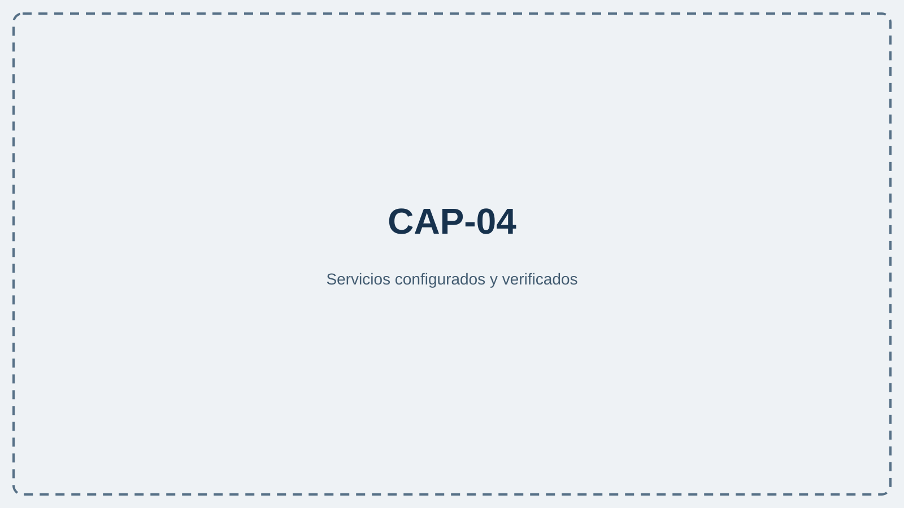

# Centralita IA Teamleader

## Contexto de Teamleader para gestionar cada llamada con un flujo más ordenado

Aplicación de escritorio para equipos que trabajan en Windows y utilizan Teamleader Focus. Relaciona teléfonos con información del CRM y permite añadir grabación y análisis con IA cuando la organización decide configurarlos. <!-- CLAIM-001: verified -->

## Llegar a la conversación con el contexto correcto

Una llamada no debería obligarle a reconstruir la relación con el cliente desde cero. Centralita IA Teamleader reúne la búsqueda del teléfono, la selección de contexto y la preparación de la nota en un flujo guiado. Las funciones disponibles dependen de la configuración, los permisos de Teamleader y los servicios opcionales activados.

## Funcionalidades clave

### Identifique el registro relacionado antes de actuar <!-- CLAIM-002: verified -->

**Qué permite conseguir.** Buscar el teléfono entre contactos y empresas de Teamleader y presentar el contexto disponible en una prenota.

**Ejemplo de uso.** Al recibir una llamada o introducir un número manualmente, la persona usuaria confirma el cliente y selecciona únicamente la oportunidad, el ticket o la nota anterior que corresponde.

**Alcance y condiciones.** Requiere una integración Teamleader validada. Los resultados dependen de los permisos y de los datos existentes; conviene comprobar prefijos y duplicados antes de crear un registro.

### Dé de alta un teléfono que todavía no está en el CRM <!-- CLAIM-003: verified -->

**Qué permite conseguir.** Abrir un flujo de alta para preparar un contacto o una empresa cuando Teamleader no devuelve una coincidencia.

**Ejemplo de uso.** Un posible cliente llama por primera vez; el usuario revisa el número, completa nombre, empresa y correo, y decide qué registro crear.

**Alcance y condiciones.** La información debe revisarse antes de guardar. El folleto no presupone enriquecimiento automático ni exactitud de datos obtenidos fuera de Teamleader.

### Adapte la captura de audio a su entorno <!-- CLAIM-004: verified -->

**Qué permite conseguir.** Elegir entre no grabar, grabación interna u OBS Studio y, si se desea, configurar un proveedor de IA para analizar el audio.

**Ejemplo de uso.** Un equipo utiliza el modo interno con una carpeta local; otro configura host, puerto, contraseña, ruta y escena de OBS y prueba la conexión antes de trabajar.

**Alcance y condiciones.** La grabación exige una ruta válida, la configuración del modo elegido y las normas de información y consentimiento de la organización. El análisis requiere Google AI u OpenRouter configurado.

### Prepare una nota con contexto y revisión humana <!-- CLAIM-005: verified -->

**Qué permite conseguir.** Añadir el objetivo, apuntes y elementos pertinentes de Teamleader para orientar el análisis posterior de la llamada.

**Ejemplo de uso.** Durante una conversación comercial, el agente selecciona el producto y anota acuerdos concretos; al terminar, revisa nombres, cifras, fechas e inferencias del texto generado.

**Alcance y condiciones.** Solo se genera análisis cuando grabación e IA están activadas y el audio es válido. El resultado debe comprobarse antes de incorporarlo a información comercial, técnica o administrativa.

### Configure y compruebe los servicios desde un recorrido guiado <!-- CLAIM-006: verified -->

**Qué permite conseguir.** Validar Teamleader, elegir el modo de grabación, configurar IA y revisar el estado visible de las conexiones desde el asistente y la configuración web.

**Ejemplo de uso.** La persona administradora conecta primero el CRM, añade después grabación e IA si se necesitan y finaliza con una búsqueda o llamada de prueba.

**Alcance y condiciones.** Los módulos opcionales pueden omitirse y configurarse más tarde. Los cambios deben guardarse y cada servicio debe verificarse antes del uso diario.

## Cómo se utiliza

1. **Conecte Teamleader.** Introduzca las credenciales autorizadas y espere la validación. <!-- CLAIM-006: verified -->
2. **Elija el flujo.** Use detección opcional mediante Android enlazado o introduzca el teléfono manualmente. <!-- CLAIM-007: verified -->
3. **Revise el contexto.** Confirme cliente, tipo de llamada, producto y elementos pertinentes antes de continuar. <!-- CLAIM-002, CLAIM-005: verified -->
4. **Cierre con control.** Si grabación e IA están activadas, espere el procesamiento y revise el resultado antes de reutilizarlo. <!-- CLAIM-004, CLAIM-005: verified -->

## Encaje y requisitos

| Aspecto | Alcance verificado |
|---|---|
| Entorno | Aplicación distribuida para Windows 10 u 11 mediante un paquete autorizado. <!-- CLAIM-001 --> |
| CRM | Teamleader Focus con Client ID, API Secret y permisos concedidos. <!-- CLAIM-002 --> |
| Grabación | Opcional: desactivada, interna u OBS Studio. <!-- CLAIM-004 --> |
| IA | Opcional: Google AI u OpenRouter; proveedor, modelo y clave deben validarse. <!-- CLAIM-004 --> |
| Detección móvil | Opcional mediante Just Remote Phone en Android y Windows; también existe búsqueda manual. <!-- CLAIM-007 --> |
| Privacidad | No compartir credenciales ni grabaciones; informar y aplicar las reglas de consentimiento de la organización. <!-- CLAIM-001 --> |

## Próximo paso

Consulte el [manual oficial de Centralita IA Teamleader](https://wertymsd.github.io/Centralita_Teamleader/) para revisar instalación, configuración y compatibilidad. Para información general, visite [ALCATIC](https://alcatic.es/). El canal indicado en su contrato o licencia tiene prioridad para soporte. <!-- CLAIM-008: verified -->
