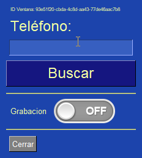
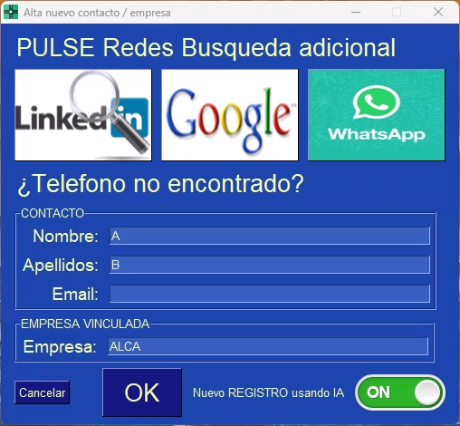

# 🎯 Teamleader PBX with AI - Complete Guide

The integration of **Teamleader PBX** with artificial intelligence completely transforms your phone communications, allowing you to improve time and resource management with full automation.

---

## 🚀 What does Teamleader PBX do?

### Main Features

Teamleader PBX is a **Windows desktop application** that runs in the background and automates your entire call flow:

- 📞 **Automatic call detection**: Without manual intervention
- 🎙️ **Audio recording**: High quality full call recording
- 🤖 **AI transcription**: Automatic structured summaries
- 📊 **Teamleader synchronization**: Automatic file opening
- 📝 **Note creation**: Automatic registration in CRM
- 🔍 **Contact search**: By phone number

### How it Works?

```
Incoming/outgoing call
        ↓
PBX detects automatically
        ↓
Searches contact/company in Teamleader
        ↓
Opens file in browser
        ↓
Starts audio recording
        ↓
On hangup, transcribes with AI
        ↓
Creates automatic note in Teamleader
```

!!! success "Final Result"
    You have a complete record of each call with structured summary, key points, decisions made, and next steps, all without writing a single word manually.

---

## 🤖 Transcription with Artificial Intelligence

### What is OpenRouter?

**OpenRouter** is the service that provides artificial intelligence to transcribe your calls. PBX uses advanced models like **Google Gemini 2.5** to:

- 🎧 **Transcribe audio**: Convert voice to text with high accuracy
- 📋 **Generate summaries**: Extract the most important points
- 🎯 **Identify decisions**: Capture commitments and agreements
- ✅ **Extract actions**: Detect next steps and responsible parties
- 🏷️ **Assign tags**: Automatically categorize calls

### Information Generated by AI

Each transcribed call generates a structured summary with:

#### 1. Executive Summary
Brief description of the call in 2-3 sentences that capture the essence of the conversation.

**Example**:
> "Client calls to inquire about monthly gardening budget. Has a 200m² garden and maximum budget €200/month. Interested in weekly service on Friday mornings."

#### 2. Key Points
The main topics discussed during the call.

**Example**:
- Client has a 200m² garden in the northern area
- Needs monthly maintenance (mowing, pruning, cleaning)
- Preference for weekly service (Friday mornings)
- Maximum budget: €200/month

#### 3. Decisions Made
Agreements and commitments reached.

**Example**:
- Send budget within 24h (Ana, tomorrow 10:00)
- Include weekly service instead of biweekly
- First free visit for evaluation

#### 4. Next Steps
Concrete actions to perform, including responsible party and date.

**Example**:
- Send budget (Ana, tomorrow 10:00)
- Schedule evaluation visit (Juan, Friday 19/03 10:00)
- Follow-up call (Ana, Monday 22/03 15:00)

#### 5. Objections or Concerns
Doubts or concerns expressed by the client.

**Example**:
- Price concern: "Is there a discount for annual payment?"
- Competition: "Another company charged me €150"

#### 6. Contact Information
Personal data mentioned during the call.

**Example**:
- **Name**: Juan García López
- **Phone**: +34 612 345 678
- **Email**: juan.garcia@email.com
- **Address**: Calle Mayor 123, 28001 Madrid

#### 7. Automatic Tags
Keywords to categorize and search calls later.

**Example**:
`[budget, scheduled visit, interested, gardening]`

---

## 💰 AI Transcription Costs

### OpenRouter Pricing Model

Costs are based on **token consumption** (text fragments processed by the AI).

| Model | Cost per 1M tokens | Cost per call (5 min) | Cost per 100 calls |
|--------|---------------------|---------------------------|------------------------|
| **Gemini 2.5 Flash Lite** | $0.07 | $0.02 - $0.03 | $2 - $3 |
| **Gemini 2.5 Flash** | $0.15 | $0.04 - $0.06 | $4 - $6 |
| **GPT-4o** | $2.50 | $0.15 - $0.20 | $15 - $20 |

!!! tip "Recommendation"
    The **Gemini 2.5 Flash Lite** model offers the best quality/price balance for daily use. GPT-4o is only necessary for critical high-importance meetings.

### Expense Control

You can set a **monthly spending limit** in OpenRouter:

1. Log in to [https://openrouter.ai/](https://openrouter.ai/)
2. Navigate to "Settings" → "Billing"
3. Set "Monthly spending limit": $10, $20, $50, etc.
4. You'll receive an alert when you reach 80% of the limit

!!! example "Calculation example"
    A company with **50 calls/week** (200 calls/month):
    - **Gemini 2.5 Flash Lite model**: ~$4-6/month
    - **Time savings**: 10 hours/month in manual notes
    - **ROI**: The cost of AI is recovered with time saved

---

## ⚙️ System Requirements

### Operating System
- **Windows 10 or higher** (Windows 11 recommended)
- **Disk space**: Minimum 50 MB
- **RAM**: Minimum 2 GB (4 GB recommended)
- **Internet connection**: For API integration

### Available Integrations

#### Teamleader Integration
- ✅ Contact synchronization
- ✅ Company synchronization
- ✅ Automatic note creation
- ✅ Search by phone number
- ✅ Automatic file opening

#### OpenRouter Integration
- ✅ Voice to text transcription
- ✅ Automatic call summaries
- ✅ Key point extraction
- ✅ Decision and action identification
- ✅ Tag generation

#### Android Integration (Optional)
- ✅ Automatic call detection
- ✅ Pairing with JustRemotePhone app
- ✅ Real-time notifications
- ✅ Works in background

---

## 🎯 User Interface

### System Tray Icon

After installation, you'll see the PBX icon in the bottom right corner of Windows:


**Icon colors**:
- 🟢 **Green**: System ready, waiting for calls
- 🔴 **Red**: Active recording
- 🟡 **Yellow**: Processing AI

### Left Button - Quick Search

Left click on the icon opens the search screen:



**Usage**:
1. Enter a phone number
2. Click on "Search"
3. If the contact exists in Teamleader, their file will open
4. If it doesn't exist, the registration form will open

??? info "📖 Registration Guide"
    For detailed instructions on how to create new contacts/companies, see:
    [Creating New Records](../../es/castellano/creacion-nuevo-registros-teamleader.md)



### Right Button - Complete Menu

Right click on the icon shows the options menu:


#### Menu Options

##### 🔍 Search
Opens the manual search screen (same function as left click)

##### 📞 Last Phone
Uses the last phone number entered manually or captured with the Android app

##### ⚙️ Configuration
Opens the web configuration interface with multiple sections:
- **Language**: Spanish, English, French
- **Teamleader API**: Configure OAuth2 credentials
- **OpenRouter AI**: Configure API key and model
- **Recording**: Internal mode or OBS Studio
- **Android Pairing**: Configure connection

??? info "📖 Configuration Guide"
    For complete configuration details, see:
    [Configuration Screen](../../es/castellano/pantalla-configuracion-centralita-teamleader.md)

##### 🎨 Appearance
Customize PBX colors with almost 50 available themes:
- **DarkBlue16**, **DarkGrey16**, **DarkBlack1** (dark themes)
- **LightGreen**, **LightBlue**, **LightGrey** (light themes)
- **HotDogStand** (retro style)

##### ❌ Exit
Closes the application in a controlled manner

---

## 🔄 Complete Call Flow

### Scenario: Incoming Call from Existing Client

```
1️⃣ PHONE RINGS
   Client: +34 612 345 678
```

```
2️⃣ PBX DETECTS CALL
   • Status: OffHook (phone off hook)
   • Number automatically identified
```

```
3️⃣ SEARCH IN TEAMLEADER
   • Search contact by phone
   • Search company by phone
   • ✅ Found: Juan García López
```

```
4️⃣ AUTOMATIC FILE OPENING
   • Browser opens Teamleader file
   • User sees complete client history
   • Latest notes, deals, relevant information
```

```
5️⃣ RECORDING START
   • Icon turns RED (recording)
   • Audio saved in high quality
```

```
6️⃣ CONVERSATION
   • User talks to client with full context
   • No need to search for information manually
```

```
7️⃣ PHONE HANGUP
   • Status: OnHook (phone on hook)
   • Recording stopped
```

```
8️⃣ AI TRANSCRIPTION
   • Audio sent to OpenRouter
   • Gemini 2.5 Flash Lite model processes
   • Generates structured summary (30-60 seconds)
```

```
9️⃣ NOTE CREATION IN TEAMLEADER
   • Note created automatically in client file
   • Includes: summary, key points, decisions, next steps
   • Note URL saved in PBX
```

```
🔟 USER NOTIFICATION
   • Balloon tip: "✅ Note created in Teamleader"
   • Icon returns to GREEN (ready for next call)
```

!!! success "Result"
    The user hasn't written ANYTHING manually. The entire process has been automatic from when the phone rang to when the note was created.

---

## 💡 Advantages and Disadvantages

### ✅ Advantages

| Advantage | Description |
|---------|-------------|
| **Time savings** | Eliminates manual notes (~10 min/call) |
| **No carrier change** | Works with your current carrier |
| **Full automation** | Automatic detection, recording and transcription |
| **Perfect integration** | Native synchronization with Teamleader |
| **Structured summaries** | Organized and easy to consult information |
| **Fast search** | Find any call in seconds |
| **Higher productivity** | Agents can prepare before answering |
| **Better customer service** | Full context of each client |

### ⚠️ Limitations

| Limitation | Solution |
|------------|----------|
| **Only compatible with Android** for automatic detection | Use manual number entry for iOS |
| **Requires internet connection** | For AI transcription and CRM sync |
| **OpenRouter cost** | ~$0.02-0.03 per call (2-3 cents) |
| **Only available on Windows** | No Mac or Linux version currently |

!!! info "iOS Alternative"
    If you use iPhone, you can manually enter the number in PBX after the call. The system will search in Teamleader and create the note automatically.

---

## 🎓 Use Cases

### Case 1: Service Company with 5 Agents

**Problem**: Agents lose 2-3 minutes searching for client information before each call.

**Solution**: PBX automatically opens the client file before the agent answers.

**Results**:
- Savings of 2-3 min per call = ~30 hours/month
- Better prepared agents for conversations
- 15% increase in conversion rate

### Case 2: Call Center with 100 Daily Calls

**Problem**: Operators don't write notes after each call due to lack of time.

**Solution**: PBX transcribes and creates notes automatically.

**Results**:
- 100% of calls with detailed record
- Better client follow-up
- Instant historical information retrieval

### Case 3: SME with Single User

**Problem**: Owner doesn't have time to write notes after each call.

**Solution**: PBX automates the entire process without intervention.

**Results**:
- Owner focuses on serving clients
- Complete record of all interactions
- Increased professionalism

---

## 🔧 Troubleshooting

### Problem: PBX doesn't detect calls

**Cause**: Android pairing not configured or JustRemotePhone app not running.

**Solution**:
1. Verify JustRemotePhone is running on Windows
2. Verify the app on Android is running
3. Make a test call

??? info "📖 Pairing Guide"
    See: [App-Call-remote - Complete Guide](../../es/castellano/App-Call-remoto.md)

### Problem: Transcription is poor quality

**Cause**: Poor audio quality or environmental noise.

**Solution**:
1. Use a headset with quality microphone
2. Make calls in quiet environment
3. Switch to GPT-4o model for higher accuracy

### Problem: Note not created in Teamleader

**Cause**: Teamleader API not configured or connection lost.

**Solution**:
1. Verify OAuth2 credentials in configuration
2. Re-authorize the application if necessary
3. Check internet connection

---

## 📞 Support and Resources

### Technical Support

- **Website**: [https://alca.co/](https://alca.co/)
- **Email**: soporte@alcatic.com
- **Hours**: Monday to Friday, 9:00 - 18:00 (CET)

### Additional Resources

- **Complete documentation**: [PBX Wiki](https://wertymsd.github.io/Centralita_Teamleader)
- **Video tutorials**: [YouTube Channel](https://www.youtube.com/@alcatic)
- **Quick start guide**: [Quick Start](inicio-rapido-centralita-teamleader.md)
- **API configuration**: [Teamleader API](../../es/castellano/api-teamleader.md)

---

## 🚀 Next Steps

Once Teamleader PBX is installed:

1. **Make test calls**
   - Verify detection works
   - Check transcription quality
   - Validate notes are created in Teamleader

2. **Customize configuration**
   - Adjust AI model according to needs
   - Customize transcription prompts
   - Configure themes and colors

3. **Train your team**
   - Teach agents to use the system
   - Share best practices
   - Collect feedback for improvements

---

## ✅ Conclusion

**Teamleader PBX with AI** transforms your company's call management:

- ✅ **Full automation**: From detection to note in Teamleader
- ✅ **AI transcription**: Structured summaries without writing anything
- ✅ **Time savings**: ~10 minutes per call
- ✅ **Better customer service**: Full context before answering
- ✅ **Complete record**: No call without documentation

With a small monthly investment in OpenRouter (~$2-6 for 200 calls), your company can significantly increase productivity and professionalism in call management.

!!! success "Ready to start?"
    Download Teamleader PBX and start optimizing your calls in less than 20 minutes:
    [**📥 Download Now**](link-descarga-software-centralita-teamleader.md)
