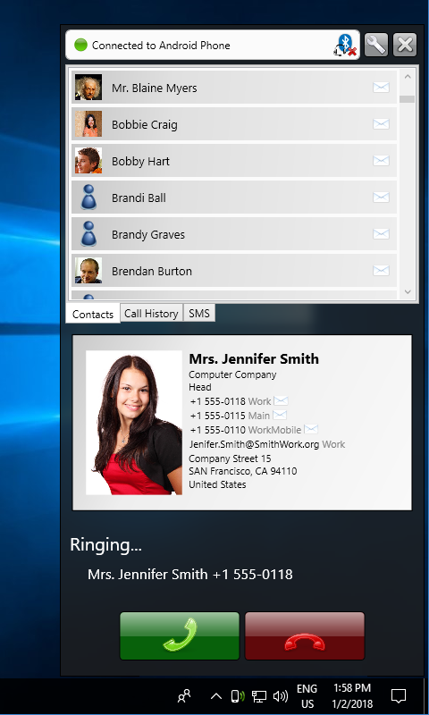
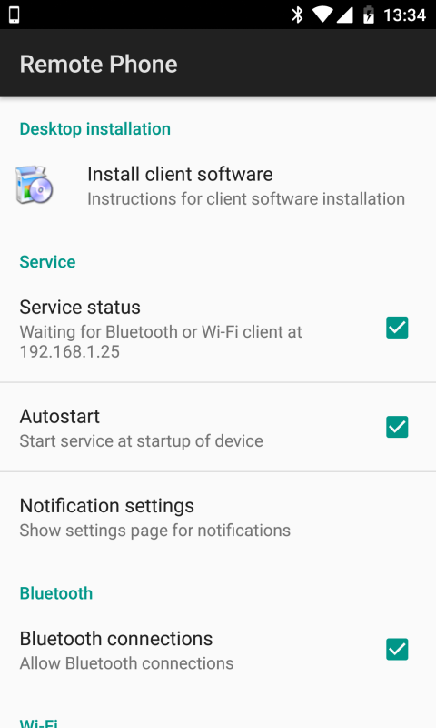

# 🚀 Quick Start - Teamleader PBX

This guide will take you step-by-step through the installation and initial configuration of Teamleader PBX. In less than 10 minutes, you'll have the system running and ready to optimize your calls.

---

## 📋 Prerequisites

Before you begin, make sure you meet the following requirements:

### Operating System
- **Windows 10 or higher** (Windows 11 recommended)
- **Disk space**: Minimum 50 MB
- **RAM**: Minimum 2 GB (4 GB recommended)
- **Internet connection**: For API integration

### Required Accounts
- [x] Active **Teamleader Focus** account
- [x] Teamleader API credentials (see step 2)

---

## Step 1: Download and Install

### 1.1 Download the Application

!!! example "Free Download"
    Download the latest version of Teamleader PBX:

    Request the current installer from your provider or installation administrator. Confirm the package version and origin before running it.

    *(Approximate size: ~15 MB)*

### 1.2 Install

1. **Unzip the file** `.zip` in a folder of your choice
   - Recommended: `C:\Program Files\CentralitaIA\`
   - Avoid folders with spaces or special characters

2. **Run the installer**
   - Double click on `Setup_Centralita_IA_Teamleader.exe`
   - Follow the installation wizard steps

3. **Finish installation**
   - Check "Run application" when finished
   - Click on "Finish"


### 1.3 Verify Installation

After installation, you should see the PBX icon in the **system tray** (bottom right corner):


!!! success "✅ Installation Completed"
    If you see the icon in the system tray, the installation has been completed successfully.

---

## Step 2: Configure Teamleader API

!!! warning "⚠️ Required"
    Without Teamleader API credentials, the application will not be able to sync contacts or create notes automatically.

### 2.1 Obtain OAuth2 Credentials

1. **Access Teamleader Marketplace**
   - Visit: [https://marketplace.focus.teamleader.eu/es/es/gestion](https://marketplace.focus.teamleader.eu/es/es/gestion)
   - Log in with your Teamleader account

2. **Create a new integration**
   - Click on "**+ New integration**"
   - Fill in the fields:
     - **Name**: Teamleader PBX
     - **Description**: Automatic telephony integration
     - **Application type**: Web application

3. **Configure Redirect URIs**
   - In "**Validate Redirect URIs**" add exactly:
   ```
   http://127.0.0.1:5000/callback
   ```

    !!! danger "Important"
        Copy the URI exactly without spaces or additional characters.

4. **Configure OAuth Scopes**
   - Check the following permissions:
     - ✅ `contacts:read`
     - ✅ `contacts:write`
     - ✅ `companies:read`
     - ✅ `companies:write`
     - ✅ `notes:write`
     - ✅ `deals:read`
     - ✅ `deals:write`

   

5. **Save credentials**
   - Note down the following data:
     - **Client ID**: `xxxxxxxx-xxxx-xxxx-xxxx-xxxxxxxxxxxx`
     - **Client Secret**: `xxxxxxxxxxxxxxxxxxxxxxxxxxxxxxxxxxxxxxxx`

    !!! tip "Tip"
        Save these credentials in a safe place. You'll need them in the next step.

??? info "📹 Watch Video Tutorial"
    If you prefer a visual guide, check out our video:
    [API REGISTRATION FOR TEAMLEADER - YouTube](https://www.youtube.com/watch?v=NtNTKFzflws)

### 2.2 Configure Credentials in PBX

1. **Open configuration**
   - Right click on the PBX icon in the system tray
   - Select "**Configuration**"

2. **API Tab**
   - Navigate to the "**API**" tab
   - Copy and paste the credentials:
     - **Client ID**: Paste the noted value
     - **Client Secret**: Paste the noted value

3. **Authorize the application**
   - Click on "**Authorize Teamleader**"
   - A browser window will open
   - Log in to Teamleader (if necessary)
   - Click on "**Authorize**"

4. **Verify connection**
   - If everything is correct, you'll see a message: "**✅ Successful connection with Teamleader**"
   - Tokens will be saved automatically

!!! success "✅ API Configured"
    Your PBX is now connected with Teamleader and can sync contacts automatically.

---

## Step 2.5: Configure OpenRouter (AI Transcription)

!!! info "ℹ️ What is OpenRouter?"
    **OpenRouter** is a service that provides access to advanced Artificial Intelligence models (like Google Gemini) to automatically transcribe your phone calls and generate structured summaries with key points, decisions, and next steps.

### 2.5.1 Why do you need OpenRouter?

Without OpenRouter, PBX **will not be able to**:
- ❌ Transcribe calls automatically
- ❌ Generate structured summaries
- ❌ Extract key points and decisions
- ❌ Create detailed notes in Teamleader

!!! tip "💡 AI Advantage"
    With OpenRouter, each call is transcribed and summarized automatically, saving you hours of manual notes and ensuring no important detail is missed.

### 2.5.2 Obtain OpenRouter API Key

1. **Create account on OpenRouter**
   - Visit: [https://openrouter.ai/](https://openrouter.ai/)
   - Click on "Sign Up" or "Register"
   - Fill in your details (name, email, password)

2. **Verify email**
   - Check your inbox
   - Click on the verification link

3. **Obtain API Key**
   - Log in to OpenRouter
   - Navigate to "Settings" → "API Keys"
   - Click on "Create new key"
   - Copy the generated API Key

    !!! danger "⛔ Save your API Key securely"
        The API Key is like a password. Do not share it with anyone.

### 2.5.3 Configure OpenRouter in PBX

1. **Open configuration**
   - Right click on the PBX icon
   - Select "**Configuration**"

2. **Artificial Intelligence Tab**
   - Navigate to the "**AI**" or "**Artificial Intelligence**" tab

3. **Configure API Key**
   - Paste the OpenRouter API Key
   - Select the model: `google/gemini-2.5-flash-lite` (recommended)

4. **Customize prompt** (optional)
   - You can customize the AI instructions
   - For example: "Transcribe the call and focus on decisions made and next steps"

5. **Save configuration**
   - Click on "Save"
   - You'll see: "✅ OpenRouter configured correctly"

!!! success "✅ AI Configured"
    Your PBX will now automatically transcribe all calls with artificial intelligence.

### 2.5.4 Available AI Models

| Model | Quality | Cost | Speed | Recommended for |
|--------|---------|-------|-----------|------------------|
| **google/gemini-2.5-flash-lite** | High | Low | ⚡ Very fast | ✅ Daily use (recommended) |
| **google/gemini-2.5-flash** | Very high | Medium | ⚡ Fast | Important calls |
| **openai/gpt-4o** | Excellent | High | 🐌 Slow | Critical meetings |

??? info "💰 OpenRouter Costs"
    OpenRouter costs are based on consumption:
    - **Gemini 2.5 Flash Lite**: ~$0.07 per 1 million tokens
    - **Average call (5 min)**: ~200-300 tokens
    - **Cost per call**: ~$0.02 - $0.03 (2-3 US cents)
    - **100 calls/month**: ~$2-3

    You can set a monthly spending limit in OpenRouter to control costs.

---

## Step 3: Android-Windows Pairing (Optional)

!!! abstract "ℹ️ Optional - Requires Third-Party App"
    This step is **optional** but **recommended** if you want automatic call detection from your Android phone.

### 3.1 What is pairing?

Pairing allows PBX to automatically detect incoming and outgoing calls from your Android phone, without manual intervention.

**Requirements:**
- Android device 6.0 or higher
- **JustRemotePhone** app installed
- Both devices on the same WiFi network

### 3.2 Install Pairing App

1. **Download app**
   - Visit: [https://www.justremotephone.com/v6.10/CallCenter.msi](https://www.justremotephone.com/v6.10/CallCenter.msi)
   - Download and install on your Windows

2. **Install Android app**
   - On your Android, search for "**JustRemotePhone**" on Google Play
   - Install the app

3. **Pair devices**
   - Open the app on Windows
   - Open the app on Android
   - Follow the pairing steps (a code will be displayed)

??? info "📖 Detailed Pairing Guide"
    For step-by-step instructions with screenshots, see:
    [App-Call-remote - Complete Guide](../../es/castellano/App-Call-remoto.md)




### 3.3 Verify Pairing

1. **Make a test call**
   - Call from your Android to any number
   - PBX should detect the call automatically

2. **Verify notification**
   - You should see a notification on Windows: "📞 Call detected: +34 XXX XXX XXX"
   - The Teamleader file should open automatically

!!! success "✅ Pairing Completed"
    Your PBX now automatically detects calls from your Android.

---

## Step 4: Register License

!!! done "📝 Required for Full Use"
    Registration is free and necessary to activate all features.

### 4.1 Registration Form

1. **Open form**
   - Visit: [https://forms.office.com/r/5k9k54cugV](https://forms.office.com/r/5k9k54cugV)

2. **Fill in details**
   - Full name
   - Company
   - Email
   - Number of licenses needed
   - Use case

3. **Submit form**
   - Click on "Submit"
   - You'll receive your license by email within 24-48 hours

### 4.2 Activate License

1. **Open configuration**
   - Right click on the PBX icon
   - Select "**Configuration**"

2. **License Tab**
   - Navigate to the "**License**" tab
   - Paste the license key received by email

3. **Activate**
   - Click on "**Activate license**"
   - You'll see a message: "**✅ License activated correctly**"

!!! success "✅ Registration Completed"
    Your PBX is fully registered and ready to use.

---

## ✅ Final Verification

### Installation Checklist

Before you start using PBX, verify that all steps are completed:

- [ ] **Application installed** (icon visible in system tray)
- [ ] **Teamleader API configured** (OAuth2 credentials)
- [ ] **OpenRouter configured** (API Key and AI model)
- [ ] **Android pairing completed** (optional but recommended)
- [ ] **License registered and activated**
- [ ] **Stable internet connection**

### First Test Call

1. **Make a call**
   - Call a test number
   - Or receive a call on your Android

2. **Verify behavior**
   - ✅ PBX detects the call
   - ✅ Teamleader file opens
   - ✅ Recording starts
   - ✅ Note is created in Teamleader after hanging up

!!! success "🎉 Congratulations!"
    Your Teamleader PBX is fully configured and ready to optimize your calls.

---

## 🎓 Next Steps

Now that you have PBX installed and configured, we recommend:

1. **Customize configuration**
    - [Advanced Configuration](../../es/castellano/pantalla-configuracion-centralita-teamleader.md)
   - Adjust language, theme, active modules

2. **Learn advanced features**
   - [AI Transcription](centralita-crm-ia-teamleader.md)
    - [Contact Management](../../es/castellano/creacion-nuevo-registros-teamleader.md)

3. **Consult technical documentation**
   - [Technical Documentation](../technical/arquitectura.md)

---

## ❓ Need Help?

### Technical Support

- **Website**: [https://alca.co/](https://alca.co/)
- **Email**: soporte@alcatic.com
- **Hours**: Monday to Friday, 9:00 - 18:00 (CET)

### Additional Resources

- **Complete documentation**: [PBX Wiki](https://wertymsd.github.io/Centralita_Teamleader)
- **Video tutorials**: [YouTube Channel](https://www.youtube.com/@alcatic)
- **GitHub**: [Official Repository](https://github.com/wertyMSD/Centralita_Teamleader)

---

## 📊 Time Summary

| Step | Estimated Time | Difficulty |
|------|----------------|------------|
| 1. Download and install | 3 minutes | ⭐ Easy |
| 2. Configure Teamleader API | 5 minutes | ⭐⭐ Medium |
| 2.5. Configure OpenRouter | 3 minutes | ⭐ Easy |
| 3. Pair Android (optional) | 5 minutes | ⭐⭐ Medium |
| 4. Register license | 2 minutes | ⭐ Easy |
| **Total** | **18 minutes** | |

!!! tip "Tip"
    If you have any doubts during installation, don't hesitate to consult our detailed guides or contact support.
