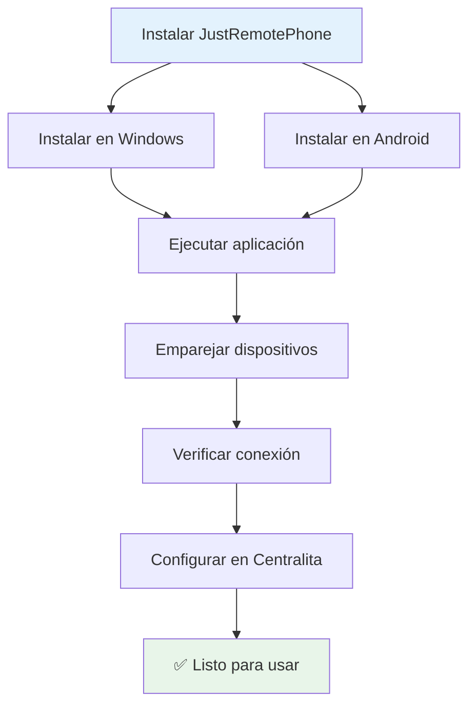
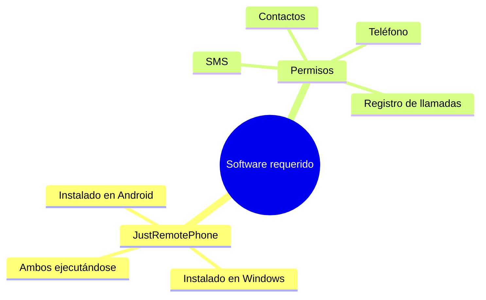
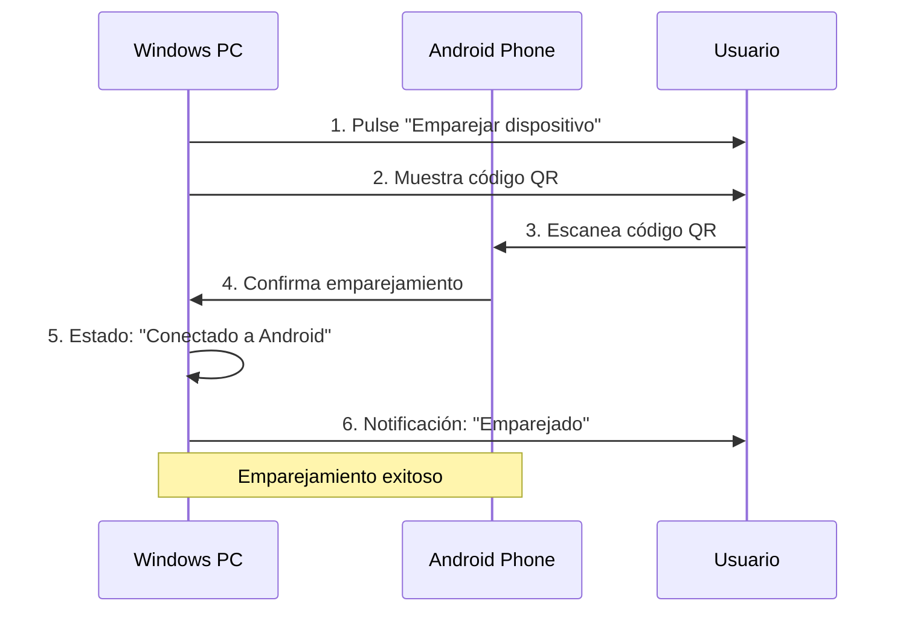
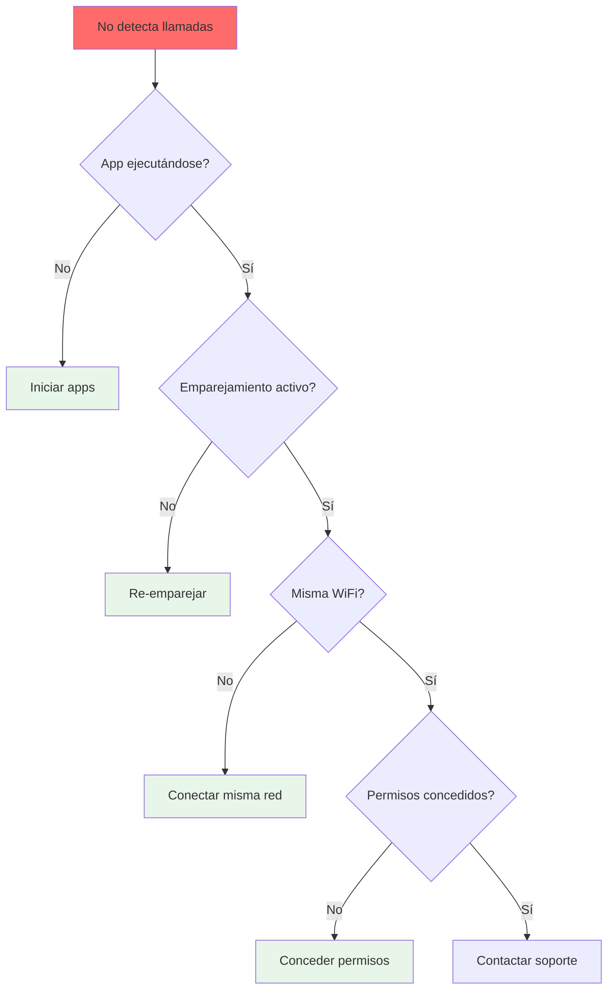
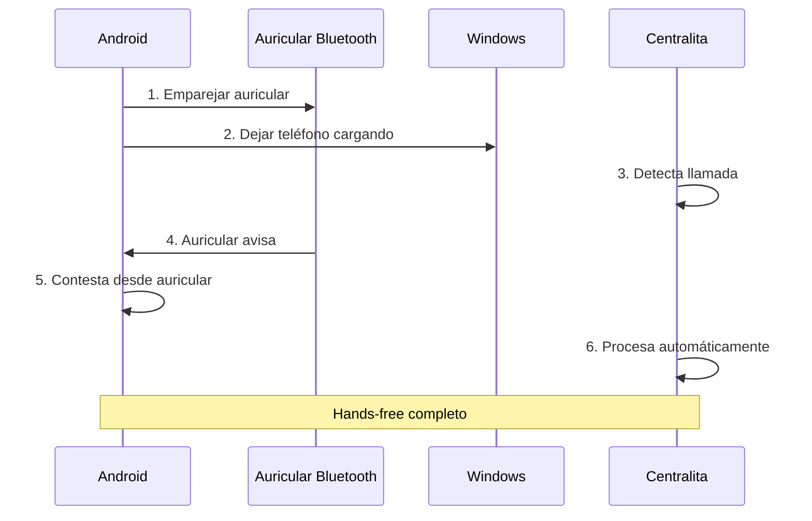
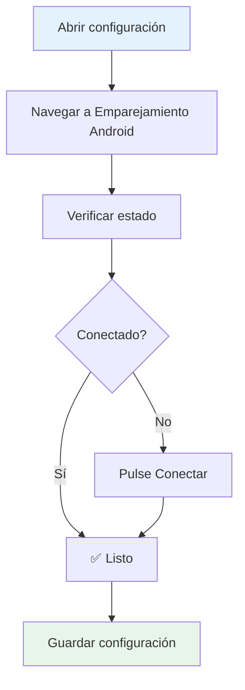
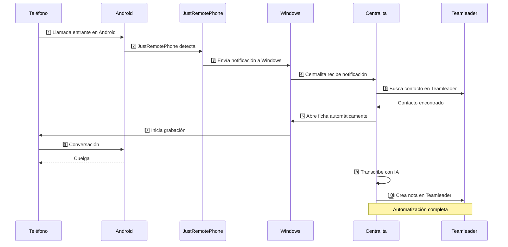
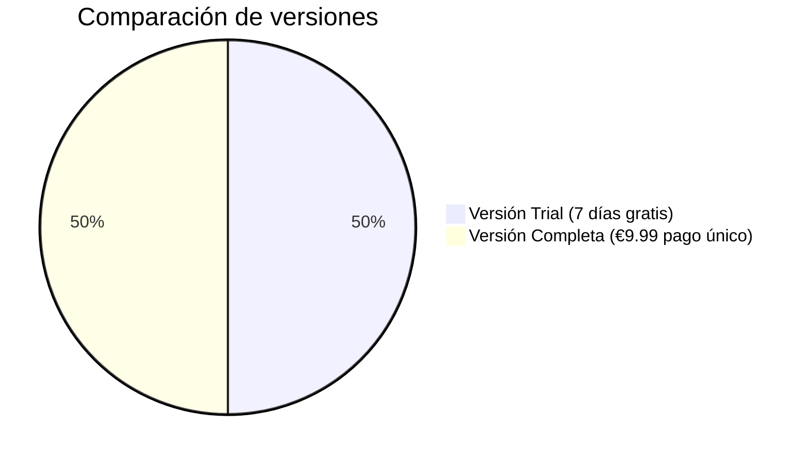

# 📱 App Call Remoto - Emparejar Android con Windows

**JustRemotePhone** es la aplicación que permite a Centralita Teamleader detectar automáticamente las llamadas entrantes y salientes desde tu teléfono Android, sin intervención manual.

!!! success "🎯 Objetivo de esta guía"
    Al finalizar, tendrás:
    - ✅ JustRemotePhone instalado en Windows y Android
    - ✅ Dispositivos emparejados
    - ✅ Detección automática de llamadas funcionando
    - ✅ Centralita Teamleader conectada con tu Android

---

## 🗺️ Mapa del Emparejamiento

---

## :information_source: ¿Qué es JustRemotePhone?

**JustRemotePhone** es una aplicación de terceros que conecta tu teléfono Android con tu PC con Windows a través de Wi-Fi o Bluetooth, permitiendo:

-   :material-phone-in-talk: **Detección automática de llamadas**

    Entrantes y salientes

-   :material-message: **Gestión de SMS**

    Leer y enviar mensajes desde el PC

-   :material-contacts: **Sincronización de contactos**

    Acceder a la agenda del teléfono

-   :material-headphones: **Uso con auricular Bluetooth**

    Dejar el teléfono en la estación

!!! info "Ideal para Centralita"
    En combinación con Centralita Teamleader, JustRemotePhone permite que el sistema detecte automáticamente cuándo recibes o realizas una llamada, sin que tengas que introducir el número manualmente.

---

## :checklist: Requisitos Previos

### :devices: Dispositivos

| Elemento | Requisito |
|---------|-----------|
| **Teléfono móvil** | Android 6.0 o superior |
| **PC** | Windows 10 o Windows 11 |
| **Conectividad** | Wi-Fi (misma red) o Bluetooth |
| **Auricular** | Bluetooth recomendado (opcional) |

### :software: Software

- ✅ Aplicación JustRemotePhone en Android
- ✅ Aplicación JustRemotePhone en Windows
- ✅ Ambos dispositivos ejecutándose

---

## :desktop_windows: Paso 1: Instalar en Windows

### :download: Descargar Aplicación Windows

1. **Visita la web oficial**
   - URL: [https://www.justremotephone.com/](https://www.justremotephone.com/)

2. **Descarga el instalador**
   - Haga clic en "Download for Windows"
   - Archivo: `CallCenter.msi`

3. **Ejecuta el instalador**
   - Doble clic en `CallCenter.msi`
   - Sigue los pasos del asistente
   - Finaliza la instalación

!!! tip "Consejo"
    Instala la aplicación en una carpeta de fácil acceso, preferiblemente en `C:\Program Files\JustRemotePhone\`.

---

## :smartphone: Paso 2: Instalar en Android

???+ info "Opciones de instalación"

=== "📱 Versión de Prueba GRATIS (7 días)"

1. **Abra Google Play** en su Android
2. **Busque "Remote Phone Call Trial"**
   - O acceda directamente: [Remote Phone Call Trial - Google Play](https://play.google.com/store/apps/details?id=justPhone.remotePhoneTrial&hl=es_HN)
3. **Instale la aplicación**
4. **Pruebe durante 7 días** antes de comprar

=== "💳 Versión Completa de Pago (~€9.99 pago único)"

1. **Abra Google Play** en su Android
2. **Busque "Remote Phone Call"**
   - O acceda directamente: [Remote Phone Call - Google Play](https://play.google.com/store/apps/details?id=justPhone.remotePhone&hl=es&gl=US)
3. **Compre la aplicación** (~€9.99 pago único)

!!! warning "⚠️ Importante sobre la Licencia"
    La licencia está **vinculada a la cuenta de Google** que uses para la compra.

    **Recomendación**: Usa una cuenta de Google que puedas compartir en varios terminales si deseas usar la app en múltiples dispositivos.

---

## :link: Paso 3: Emparejar Dispositivos

### :monitor: 3.1 Iniciar Aplicación en Windows

1. **Ejecute JustRemotePhone** en Windows
2. **Verá la pantalla principal**
   - Estado: "Esperando conexión"

### :phone_android: 3.2 Iniciar Aplicación en Android

1. **Ejecute JustRemotePhone** en su Android
2. **Permita los permisos solicitados**
   - Acceso a contactos
   - Acceso a registro de llamadas
   - Acceso a SMS
   - Acceso a teléfono

### :qr_code: 3.3 Emparejar Mediante Código QR

1. **En Windows**, haga clic en "Emparejar dispositivo"
2. **Se generará un código QR** en pantalla
3. **En Android**, selecciona "Escanear código QR"
4. **Escanea el código** desde su Android
5. **Confirme el emparejamiento** en ambos dispositivos

!!! success "✅ Emparejamiento Completado"
    Verás en Windows: "Conectado a [Nombre de tu Android]"
    Verás en Android: "Conectado a [Nombre de tu PC]"

---

## :verified: Paso 4: Verificar Funcionamiento

### :phone: Test de Detección de Llamadas

1. **Realice una llamada** desde su Android
   - Llame a cualquier número (puede ser corto)

2. **Verifique que Windows detecta la llamada**
   - Debería ver una notificación en Windows
   - JustRemotePhone mostrará: "Llamada entrante: +34 XXX XXX XXX"

3. **Verifique que Centralita detecta la llamada**
   - Si Centralita está ejecutándose, también debería detectarla
   - Se abrirá automáticamente la ficha de Teamleader

!!! tip "Consejo"
    Si Centralita no detecta la llamada, verifica que:
    - Centralita está ejecutándose en segundo plano
    - El emparejamiento con JustRemotePhone está activo
    - Has configurado el emparejamiento en Centralita

---

## :troubleshooting: Solución de Problemas

### :material-phone-off: Problema: No se detectan las llamadas

**Causas posibles**:

1. Aplicación JustRemotePhone no ejecutándose
2. Dispositivos no emparejados
3. Red WiFi diferente
4. Permisos denegados en Android

**Soluciones**:
1. Verifica que JustRemotePhone está **ejecutándose en ambos dispositivos**
2. Reinicia la aplicación en Windows y Android
3. Verifica que ambos dispositivos están en la **misma red WiFi**
4. Revisa los permisos de la app en Android:
   - Ajustes → Aplicaciones → JustRemotePhone → Permisos
   - Asegúrate de que todos los permisos estén concedidos

### :material-sync-problem: Problema: Emparejamiento falla

**Causa**: Código QR caducado o conexión inestable.

**Solución**:
1. Genera un nuevo código QR en Windows
2. Escanea rápidamente (dentro de 2 minutos)
3. Asegúrate de que la pantalla del Android esté encendida

### :material-battery-alert: Problema: Aplicación se cierra en Android

**Causa**: Optimización de batería cerrando la app.

**Solución**:
1. Ve a Ajustes → Batería → Optimización de batería
2. Busca JustRemotePhone
3. Selecciona "No optimizar"
4. Esto permite que la app se ejecute en segundo plano

---

## :video: Tutoriales en Video

### :play_circle: Video Oficial de JustRemotePhone

??? info "📺 Ver Video Completo"
    [Remote Phone Call - PC dialer for mobile phones - YouTube](https://youtu.be/7zBI8Gr4Kmg)

    **Duración**: 5 minutos
    **Contenido**:
    - Instalación en Windows y Android
    - Emparejamiento de dispositivos
    - Gestión de llamadas y SMS
    - Uso con auricular Bluetooth

---

## :tips_and_updates: Consejos de Uso

### :headphones: 1. Uso con Auricular Bluetooth

**Ideal para dejar el teléfono en la estación**:

1. Empareja tu auricular Bluetooth con el Android
2. Deja el teléfono cargando en la estación
3. Contesta las llamadas desde el auricular
4. JustRemotePhone y Centralita detectarán la llamada automáticamente

**Ventajas**:
- ✅ Manos libres
- ✅ Teléfono siempre cargado
- ✅ No necesitas tocar el Android

### :battery_charging_full: 2. Optimización de Batería

**Para evitar que la app se cierre en Android**:
- Añade JustRemotePhone a "Aplicaciones sin optimizar"
- Desactiva ahorro de energía para la app
- Mantén la pantalla encendida durante emparejamiento inicial

### :wifi: 3. Conexión Estable

**Para mantener conexión estable**:
- Usa siempre la misma red WiFi
- Evita cambiar de red mientras usas la app
- Mantén ambos dispositivos encendidos
- Reinicia la app si pierdes conexión

---

## :integration_instructions: Integración con Centralita Teamleader

### :settings: Configuración en Centralita

Una vez emparejados los dispositivos con JustRemotePhone:

1. **Abre configuración de Centralita**
   - Clic con el botón derecho en el icono de Centralita
   - Seleccionar "Configuración"

2. **Navega a "Emparejamiento Android"**
   - Sección de emparejamiento

3. **Verifica estado**
   - Debería mostrar: "Conectado a JustRemotePhone"
   - Si muestra "Desconectado", click en "Conectar"

4. **Guarda configuración**
   - Haga clic en "Guardar"

!!! success "✅ Integración Completada"
    Ahora Centralita detectará automáticamente todas las llamadas que realices o recibas en tu Android.

### :play_circle: Flujo Completo

---

## :question_answer: Preguntas Frecuentes

### :money_off: ¿Es gratuita JustRemotePhone?

**Tiene 2 versiones**:

- **Versión Trial**: GRATIS durante 7 días
- **Versión Completa**: ~€9.99 pago único (sin suscripción mensual)

### :apple: ¿Funciona con iPhone?

**No**. JustRemotePhone **solo funciona con Android**.

!!! info "Alternativa para iPhone"
    Si usas iPhone, puedes introducir manualmente el número en Centralita después de la llamada. El sistema buscará en Teamleader y creará la nota automáticamente.

### :usb: ¿Necesito cable USB?

**No es necesario**. JustRemotePhone funciona vía:

-   :material-wifi: **Wi-Fi** (Recomendado, más estable)

-   :material-bluetooth: **Bluetooth** (Alternativa, menos alcance)

### :devices: ¿Puedo usarlo con varios PCs?

**Sí, pero necesitas una licencia por PC**:
- La licencia está vinculada a tu cuenta de Google
- Puedes instalar en múltiples Android con la misma cuenta
- Pero necesitas emparejar cada PC por separado

### :battery_full: ¿Consume mucha batería?

**Consumo moderado**:

| Estado | Consumo |
|--------|---------|
| Uso normal | ~2-3% de batería por hora |
| En segundo plano | ~1% por hora |
| Recomendado | Mantener cargado durante uso intensivo |

---

## :headset: Soporte

Si tienes problemas con JustRemotePhone:

| Recurso | Contacto |
|---------|----------|
| **Web oficial** | [https://www.justremotephone.com/](https://www.justremotephone.com/) |
| **Soporte** | A través de su web oficial |

!!! info "Soporte de Centralita"
    Para problemas específicos de integración con Centralita Teamleader:
    - Email: soporte@alcatic.com
    - Web: [https://alca.co/](https://alca.co/)

---

## :checklist: ✅ Conclusión

**JustRemotePhone** + **Centralita Teamleader** = Automatización total

- ✅ **Detección automática** de llamadas entrantes y salientes
- ✅ **Sin intervención manual** - No necesitas introducir números
- ✅ **Integración perfecta** con Teamleader
- ✅ **Transcripción IA** automática de todas las llamadas
- ✅ **Uso con auricular Bluetooth** para máxima comodidad

Con ambos sistemas configurados, tu flujo de llamadas será 100% automático, permitiéndote enfocarte en la conversación mientras Centralita gestiona todo el resto.

!!! success "¿Listo para configurar el emparejamiento?"
    [**Volver a Inicio Rápido**](inicio-rapido-centralita-teamleader.md){ .md-button .md-button--primary }
