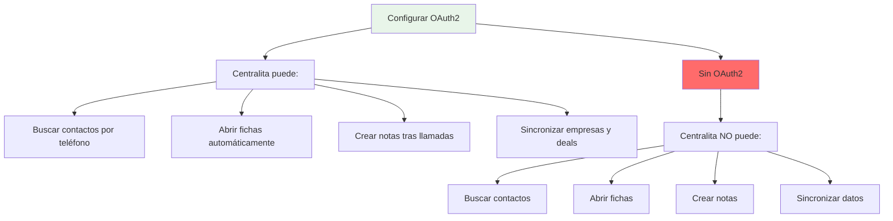
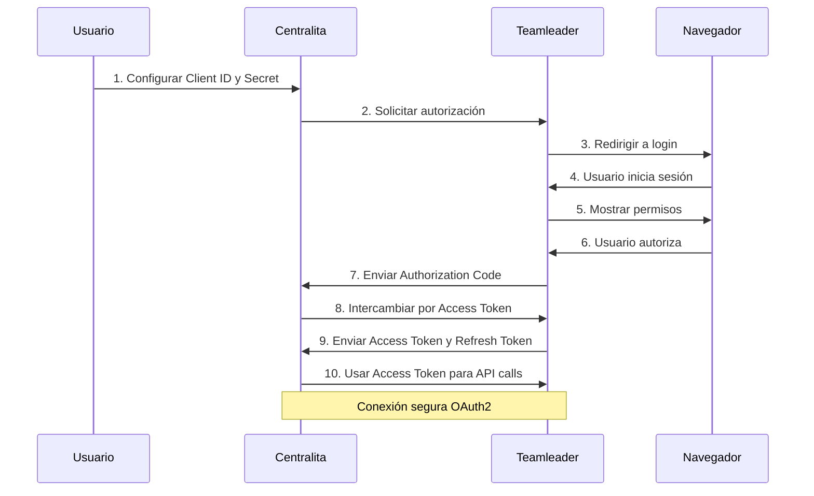
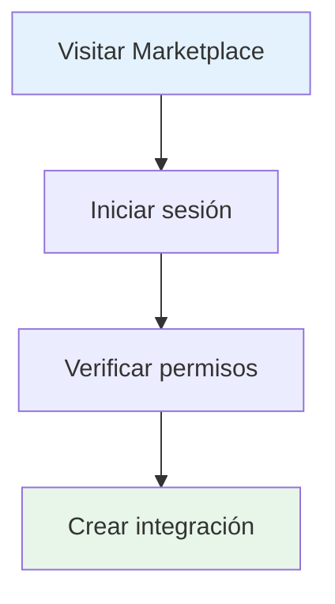
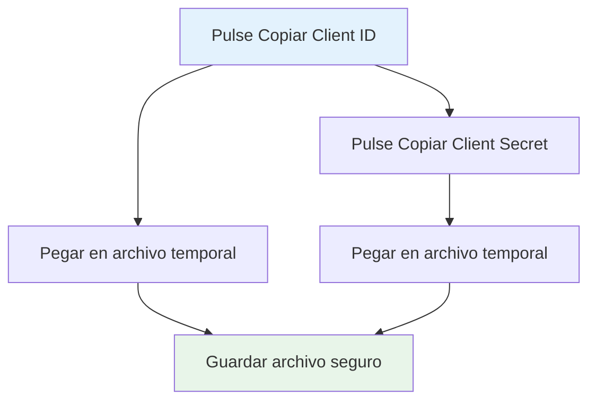
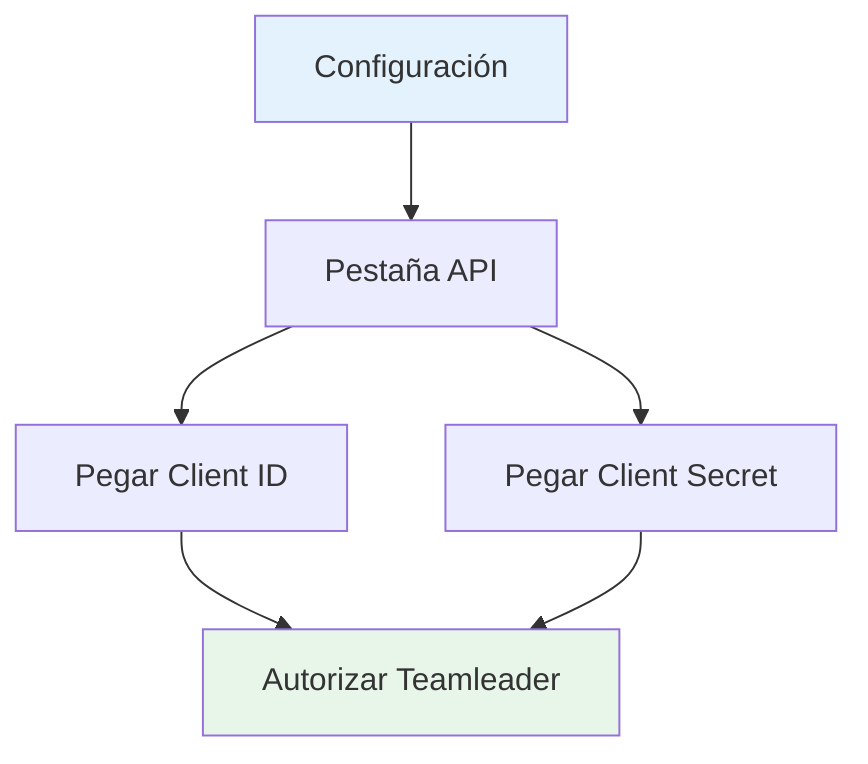
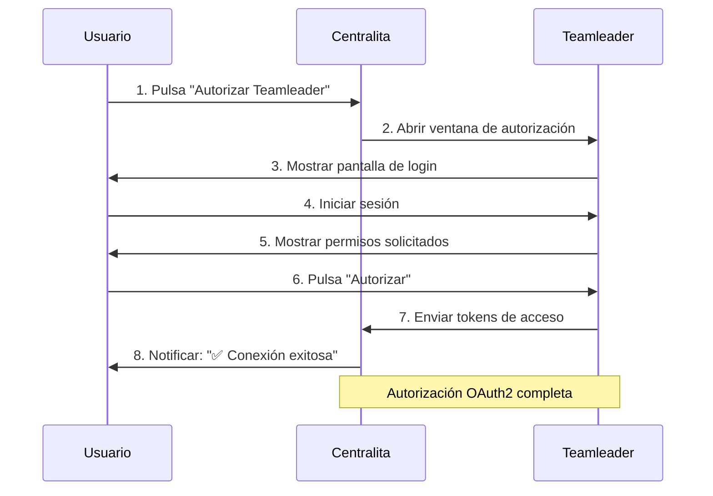
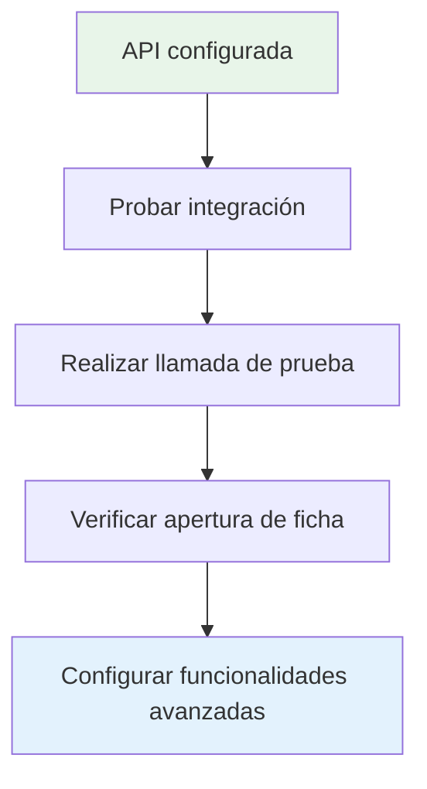

# 🔑 Configurar API de Teamleader

Esta guía te explica paso a paso cómo configurar la integración con la API de Teamleader Focus para que Centralita pueda sincronizar contactos, empresas y crear notas automáticamente.

!!! success "🎯 Objetivo de esta guía"
    Al finalizar, tendrás:
    - ✅ Integración creada en Teamleader Marketplace
    - ✅ Credenciales OAuth2 obtenidas
    - ✅ Centralita conectada con Teamleader
    - ✅ Sincronización de contactos funcionando

---

## 📋 ¿Qué es OAuth2?

**OAuth2** es un protocolo de autorización seguro que permite a Centralita acceder a tu cuenta de Teamleader sin necesidad de compartir tu usuario y contraseña.

### :material-lock: ¿Por qué necesitas configurarlo?



Sin las credenciales OAuth2, Centralita no podrá:
- ❌ Buscar contactos por número de teléfono
- ❌ Abrir automáticamente fichas de Teamleader
- ❌ Crear notas tras las llamadas
- ❌ Sincronizar empresas y deals

!!! warning "⚠️ Requerido"
    La configuración de API es **obligatoria** para el funcionamiento de Centralita Teamleader.

---

## 🔄 Flujo OAuth2 Completo



---

## :app-registration: Paso 1: Crear Integración en Teamleader

### 1.1 Acceder al Marketplace



1. **Visita el Marketplace de Teamleader**
   - URL: [https://marketplace.focus.teamleader.eu/es/es/gestion](https://marketplace.focus.teamleader.eu/es/es/gestion)

2. **Inicia sesión**
   - Usa tu cuenta de administrador de Teamleader
   - Verifica que tienes permisos para gestionar integraciones

### 1.2 Crear Nueva Integración

1. **Haga clic en "Nueva integración"**
   - Botón ubicado en la esquina superior derecha

2. **Rellenar datos básicos**

| Campo | Valor a introducir |
|-------|-------------------|
| **Nombre** | Centralita Teamleader |
| **Descripción** | Integración de telefonía automática con IA |
| **Tipo** | Aplicación web |

!!! tip "Consejo"
    El nombre puede ser cualquiera, pero te recomendamos usar "Centralita Teamleader" para identificarlo fácilmente.

---

## :redirect: Paso 2: Configurar URIs de Redirección

### 2.1 ¿Qué es una URI de Redirección?

Es la URL a la que Teamleader redirigirá tras autorizar la aplicación. Centralita escuchará en esta dirección para recibir el código de autorización.

### 2.2 Configurar la URI

1. **Buscar sección "Validar URIs de redirección"**
   - Está dentro de la configuración OAuth2

2. **Añadir la siguiente URI exactamente**:

```ini
http://127.0.0.1:5000/callback        # (1)
```
1.  NO añadir espacios al final
2.  NO cambiar mayúsculas/minúsculas
3.  NO añadir barras adicionales (`/`)
4.  Copiar y pegar exactamente la URI anterior

!!! danger "⛔ Importante"
    - **NO** añadir espacios al final
    - **NO** cambiar mayúsculas/minúsculas
    - **NO** añadir barras adicionales (`/`)
    - Copia y pega exactamente la URI anterior

3. **Haga clic en "Añadir"**
   - Verificarás la URI en la lista de URIs permitidas

??? question "¿Por qué 127.0.0.1?"
    `127.0.0.1` es la dirección **localhost** (tu propio ordenador). Centralita creará un servidor temporal en tu máquina para recibir la autorización, por lo que la conexión no sale de tu ordenador y es completamente segura.

---

## :shield: Paso 3: Configurar OAuth Scopes

### 3.1 ¿Qué son los Scopes?

Los **scopes** son permisos que autorizas a Centralita para realizar acciones específicas en tu cuenta de Teamleader.

### 3.2 Scopes Requeridos

Marque **exactamente** los siguientes scopes:

| Scope | Descripción | ¿Para qué sirve? |
|-------|-------------|------------------|
| `contacts:read` | Leer contactos | Buscar clientes por teléfono |
| `contacts:write` | Escribir contactos | Crear nuevos contactos |
| `companies:read` | Leer empresas | Buscar empresas por teléfono |
| `companies:write` | Escribir empresas | Crear nuevas empresas |
| `notes:write` | Crear notas | Crear notas tras llamadas |
| `deals:read` | Leer deals | Ver oportunidades de venta |
| `deals:write` | Escribir deals | Actualizar oportunidades |

!!! warning "⚠️ Scopes Mínimos Requeridos"
    Como mínimo, necesitas: `contacts:read`, `companies:read`, `notes:write`

### 3.3 Guardar Configuración

1. **Revisar todos los campos**
   - Verifica que la URI es correcta
   - Verifica que los scopes están marcados

2. **Haga clic en "Guardar"**
   - La integración se creará en Teamleader

---

## :key: Paso 4: Obtener Credenciales

Tras guardar, Teamleader generará las credenciales OAuth2:

### 4.1 Credenciales Generadas

Verás una pantalla con los siguientes datos:

```http
Client ID: xxxxxxxx-xxxx-xxxx-xxxx-xxxxxxxxxxxx       # (1)
Client Secret: xxxxxxxxxxxxxxxxxxxxxxxxxxxxxxxxxxxxxxxx  # (2)
```
1.  Identificador único de tu aplicación
2.  Contraseña de la aplicación (¡NO COMPARTIR!)

!!! done "📝 Anota Estas Credenciales"
    Guarda estos datos en un lugar seguro:
    - **Client ID**: Identificador único de tu aplicación
    - **Client Secret**: Contraseña de la aplicación

    !!! danger "⛔ NUNCA compartas estas credenciales"
        El **Client Secret** es como una contraseña. No lo compartas con nadie ni lo subas a repositorios públicos.

### 4.2 Copiar Credenciales



1. **Haga clic en "Copiar"** junto a cada campo
2. **Pegar en un archivo de texto** temporal
   - Bloc de notas, Notepad++, etc.
   - Lo necesitarás en el siguiente paso

---

## :integration_instructions: Paso 5: Configurar en Centralita

### 5.1 Abrir Configuración de Centralita

1. **Haga clic con el botón derecho** en el icono de Centralita en la bandeja del sistema
   - Icono en la esquina inferior derecha de Windows

2. **Seleccionar "Configuración"**
   - Se abrirá la interfaz web en tu navegador

### 5.2 Pestaña API



1. **Navegar a la pestaña "API"**
   - Está en el menú lateral izquierdo

2. **Pegar las credenciales**

| Campo | Acción |
|-------|--------|
| **Client ID** | Pegar el valor anotado |
| **Client Secret** | Pegar el valor anotado |

!!! tip "Consejo"
    Usa `Ctrl+V` para pegar rápidamente.

### 5.3 Autorizar la Aplicación



1. **Haga clic en "Autorizar Teamleader"**
   - Botón azul en la parte inferior

2. **Se abrirá una nueva pestaña del navegador**
   - URL de Teamleader: `https://app.teamleader.eu/...`

3. **Inicia sesión** (si es necesario)
   - Usa tu cuenta de Teamleader

4. **Revisa los permisos solicitados**
   - Teamleader mostrará lo que Centralita podrá hacer

5. **Haga clic en "Autorizar"**
   - Botón verde en la parte inferior

### 5.4 Verificar Conexión

Tras autorizar, serás redirigido a Centralita:

```ini
✅ Conexión exitosa con Teamleader
Tokens guardados correctamente        # (1)
```
1.  La autorización queda guardada automáticamente para no repetir el proceso en cada uso

!!! success "✅ Configuración Completada"
    Tu Centralita ahora está conectada con Teamleader y puede:
    - Buscar contactos y empresas
    - Abrir fichas automáticamente
    - Crear notas tras las llamadas

---

## :troubleshooting: Solución de Problemas

### :material-alert: Problema: "URI de redirección no válida"

**Causa**: La URI configurada en Teamleader no coincide exactamente con `http://127.0.0.1:5000/callback`

**Solución**:
1. Verifica que no hay espacios al final
2. Verifica que es `http://` (no `https://`)
3. Verifica que es `127.0.0.1` (no `localhost`)

### :material-block: Problema: "Error de autorización"

**Causa**: Los scopes no están configurados correctamente

**Solución**:
1. Vuelve a Teamleader Marketplace
2. Verifica que todos los scopes requeridos están marcados
3. Guarda y vuelve a autorizar

### :material-key-off: Problema: "Client Secret inválido"

**Causa**: El Client Secret está incompleto o tiene caracteres extra

**Solución**:
1. Copia nuevamente el Client Secret desde Teamleader
2. Verifica que no hay espacios ni saltos de línea
3. Pega nuevamente en Centralita

### :material-wifi-off: Problema: "Conexión timeout"

**Causa**: Centralita no puede recibir el callback en el puerto 5000

**Solución**:
1. Verifica que ningún otro programa usa el puerto 5000
2. Desactiva firewall temporalmente para probar
3. Verifica que estás en la misma red que Teamleader

---

## :video_camera: Tutorial en Video

??? info "📺 Ver Video"

    [REGISTRO API PARA TEAMLEADER - YouTube](https://www.youtube.com/watch?v=NtNTKFzflws)

    **Duración**: 5 minutos
    **Idioma**: Español

---

## :lock: Seguridad y Privacidad

### :shield: Tus Datos Están Seguros

- ✅ **Sin credenciales compartidas**: Centralita no guarda tu usuario/contraseña de Teamleader
- ✅ **Conexión encriptada**: Todo el tráfico usa HTTPS
- ✅ **Tokens seguros**: Los tokens OAuth2 se guardan cifrados en tu equipo
- ✅ **Sin terceros**: Tus datos no se envían a ningún servidor intermedio

### :list: Permisos Mínimos

Centralita **solo** solicita los permisos necesarios para funcionar:

| Permiso | Para qué sirve |
|---------|----------------|
| Leer contactos | Para buscar por teléfono |
| Crear notas | Para registrar llamadas |
| Leer empresas | Para buscar clientes empresariales |

!!! tip "Consejo de Seguridad"
    Si en algún momento deseas revocar el acceso:
    1. Ve a Teamleader Marketplace
    2. Busca "Centralita Teamleader"
    3. Haga clic en "Revocar acceso"

---

## :book: Recursos Adicionales

### :material-api: Documentación de Teamleader

- [OAuth2 Guide](https://developer.teamleader.eu/#/oauth2)
- [API Reference](https://developer.teamleader.eu/#/introduction)
- [Scopes Documentation](https://developer.teamleader.eu/#/oauth2/scopes)

### :headset: Soporte

- **Problemas con la API**: Contacta con [Soporte AlcaTic](https://alca.co/)
- **Problemas con Teamleader**: Contacta con [Soporte Teamleader](https://www.teamleader.eu/es/soporte/)

---

## :checklist: Checklist de Configuración

Antes de finalizar, verifica:

- [ ] Integración creada en Teamleader Marketplace
- [ ] URI de redirección configurada: `http://127.0.0.1:5000/callback`
- [ ] Scopes requeridos marcados:
  - [ ] `contacts:read`
  - [ ] `companies:read`
  - [ ] `notes:write`
- [ ] Credenciales copiadas y guardadas:
  - [ ] Client ID anotado
  - [ ] Client Secret anotado
- [ ] Credenciales pegadas en Centralita
- [ ] Aplicación autorizada en Teamleader
- [ ] Conexión verificada exitosa

!!! success "🎉 ¡Felicidades!"
    Tu Centralita Teamleader está completamente integrada con Teamleader Focus.

---

## :next_step: Próximos Pasos

Ahora que la API está configurada:



1. **Probar la integración**
   - Realiza una llamada de prueba
   - Verifica que se abre la ficha de Teamleader

2. **Configurar funcionalidades avanzadas**
   - [Transcripción con IA](centralita-crm-ia-teamleader.md)
   - [Gestión de contactos](creacion-nuevo-registros-teamleader.md)

3. **Personalizar la configuración**
   - [Configuración avanzada](pantalla-configuracion-centralita-teamleader.md)

---

## :question: Preguntas Frecuentes

### :material-help: ¿Puedo usar la misma integración para varios equipos?

No. Cada instalación de Centralita necesita su propia integración en Teamleader. Si tienes múltiples usuarios, crea una integración por cada uno.

### :material-update: ¿Con qué frecuencia debo renovar las credenciales?

**Nunca**. Las credenciales OAuth2 no expiran. Los tokens de acceso se renuevan automáticamente sin intervención del usuario.

### :material-restrict: ¿Puedo limitar los permisos después de autorizar?

Sí. Puedes revocar scopes específicos desde Teamleader Marketplace, pero ten en cuenta que Centralita podría dejar de funcionar correctamente.

### :material-key: ¿Qué pasa si cambio mi contraseña de Teamleader?

**Nada**. La autorización OAuth2 es independiente de tu contraseña. Cambiar tu contraseña no afecta la conexión de Centralita.

---

## :phone: Soporte

Si tienes problemas durante la configuración:

| Tipo | Contacto |
|------|----------|
| **Email** | soporte@alcatic.com |
| **Web** | [https://alca.co/](https://alca.co/) |
| **Horario** | Lunes a Viernes, 9:00 - 18:00 (CET) |

!!! tip "Consejo"
    Para una resolución más rápida, incluye capturas de pantalla de los errores que encuentres.
