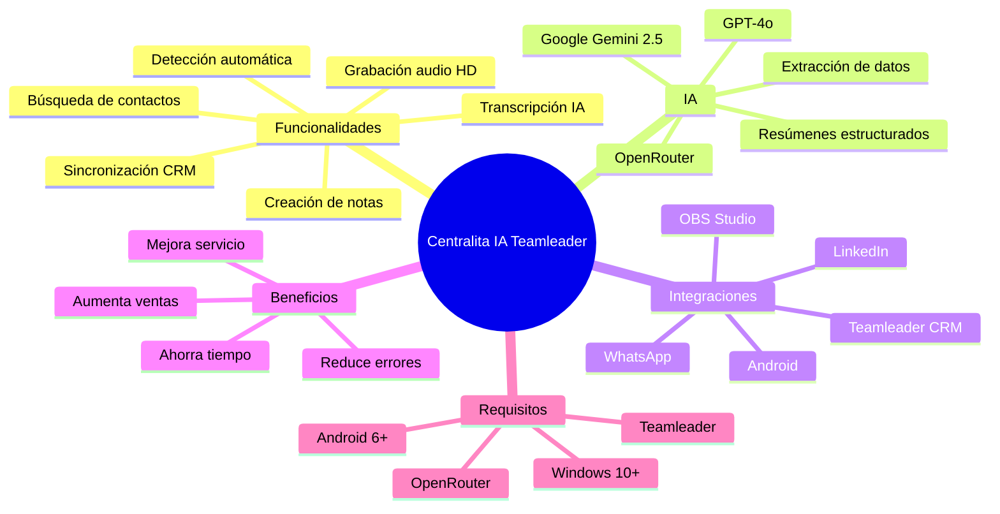
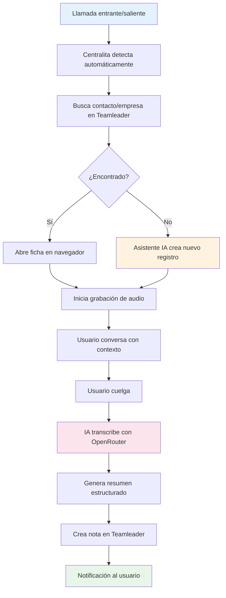
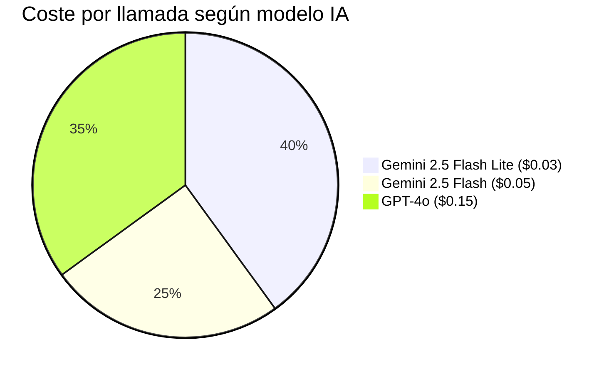
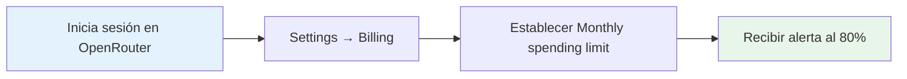
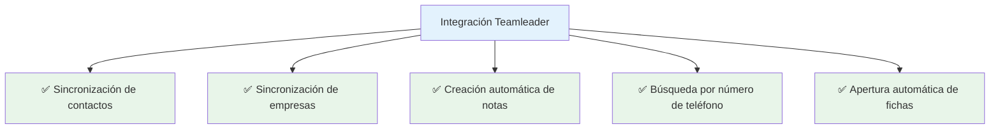
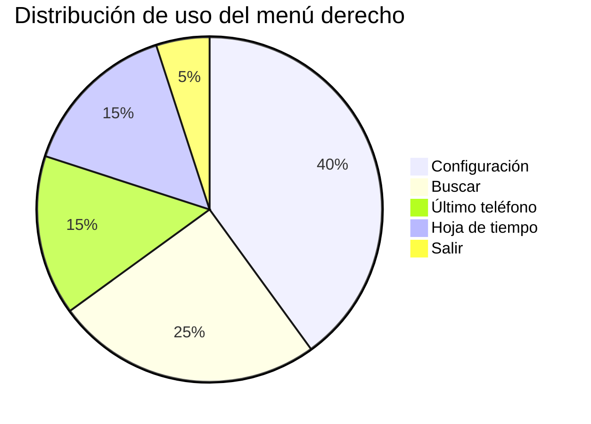
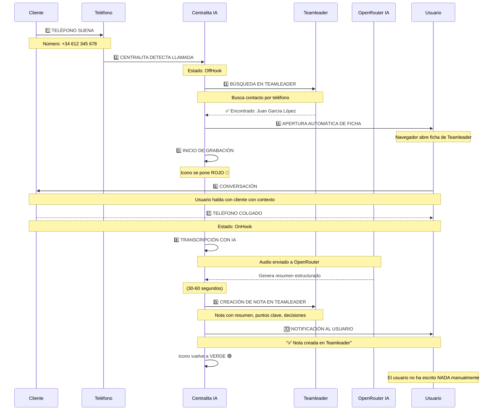
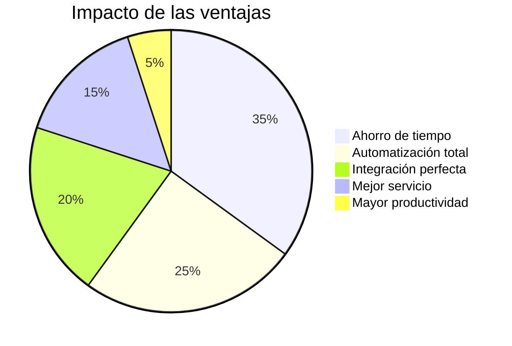
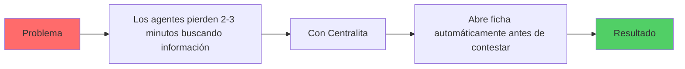
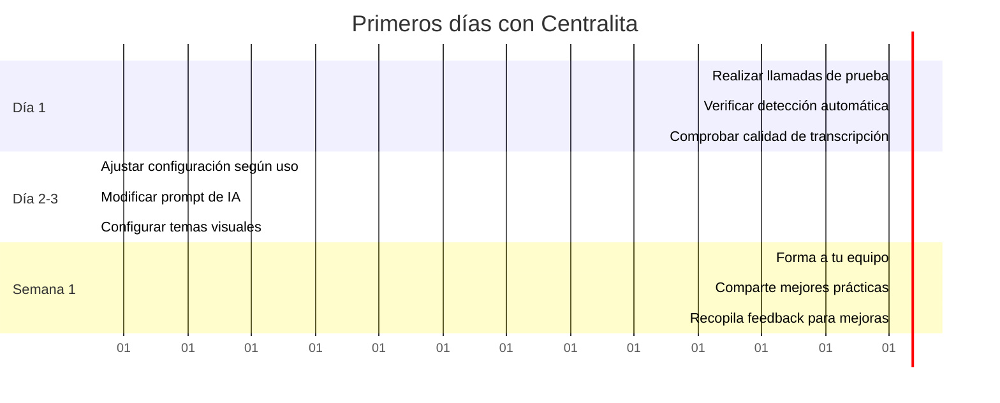

# 🎯 Centralita Teamleader con IA - Guía Completa

La integración de **Centralita Teamleader** con inteligencia artificial transforma completamente tus comunicaciones telefónicas, permitiéndote mejorar la gestión del tiempo y los recursos con automatización total.

!!! success "🚀 Resultado Final"
    Tienes un registro completo de cada llamada con resumen estructurado, puntos clave, decisiones tomadas y siguientes pasos, todo sin escribir una sola palabra manualmente.

---

## 🗺️ Mapa Mental del Sistema

---

## 🎬 ¿Qué hace Centralita Teamleader?

### :rocket: Funcionalidades Principales

Centralita Teamleader es una aplicación de **escritorio para Windows** que se ejecuta en segundo plano y automatiza todo el flujo de tus llamadas:

-   :material-phone-in-talk: **Detección automática de llamadas**

    Sin intervención manual

-   :material-mic: **Grabación de audio**

    Alta calidad de llamada completa

-   :material-brain: **Transcripción con IA**

    Resúmenes automáticos estructurados

-   :material-crm: **Sincronización con Teamleader**

    Apertura automática de fichas

-   :material-note-add: **Creación de notas**

    Registro automático en el CRM

-   :material-search: **Búsqueda de contactos**

    Por número de teléfono

### :play_circle: ¿Cómo Funciona?

!!! success "Resultado Final"
    El usuario no ha escrito NADA manualmente. Todo el proceso ha sido automático desde que sonó el teléfono hasta que se creó la nota.

---

## 🤖 Transcripción con Inteligencia Artificial

### :material-api: ¿Qué es OpenRouter?

**OpenRouter** es el servicio que proporciona la inteligencia artificial para transcribir tus llamadas. Centralita utiliza modelos avanzados como **Google Gemini 2.5** para:

-   :material-headphones: **Transcribir audio**

    Convertir voz a texto con alta precisión

-   :material-text-fields: **Generar resúmenes**

    Extraer los puntos más importantes

-   :material-check-circle: **Identificar decisiones**

    Capturar compromisos y acuerdos

-   :material-arrow-right: **Extraer acciones**

    Detectar siguientes pasos y responsables

-   :material-tag: **Asignar etiquetas**

    Categorizar llamadas automáticamente

### :material-list-alt: Información que Genera la IA

Cada llamada transcrita genera un resumen estructurado con:

#### 1. Resumen Ejecutivo

Breve descripción de la llamada en 2-3 frases que captura la esencia de la conversación.

!!! example "Ejemplo"
    > "Cliente llama para consultar presupuesto de jardinería mensual. Tiene jardín de 200m² y presupuesto máximo €200/mes. Interesado en servicio semanal los viernes por la mañana."

#### 2. Puntos Clave

Los temas principales discutidos durante la llamada.

!!! example "Ejemplo"
    - Cliente tiene jardín de 200m² en zona norte
    - Necesita mantenimiento mensual (corte, poda, limpieza)
    - Preferencia por servicio semanal (viernes por la mañana)
    - Presupuesto máximo: €200/mes

#### 3. Decisiones Tomadas

Acuerdos y compromisos alcanzados.

!!! example "Ejemplo"
    - Enviar presupuesto en 24h (Ana, mañana 10:00)
    - Incluir servicio semanal en lugar de quincenal
    - Primera visita gratis para evaluación

#### 4. Siguientes Pasos

Acciones concretas a realizar, incluyendo responsable y fecha.

!!! example "Ejemplo"
    - Enviar presupuesto (Ana, mañana 10:00)
    - Agendar visita de evaluación (Juan, viernes 19/03 10:00)
    - Llamada de seguimiento (Ana, lunes 22/03 15:00)

#### 5. Objeciones o Preocupaciones

Dudas o preocupaciones expresadas por el cliente.

!!! example "Ejemplo"
    - Preocupación por precio: "¿Hay descuento por anualidad?"
    - Competencia: "Otra empresa me cobró €150"

#### 6. Información de Contacto

Datos personales mencionados durante la llamada.

!!! example "Ejemplo"
    - **Nombre**: Juan García López
    - **Teléfono**: +34 612 345 678
    - **Email**: juan.garcia@email.com
    - **Dirección**: Calle Mayor 123, 28001 Madrid

#### 7. Etiquetas Automáticas

Palabras clave para categorizar y buscar llamadas posteriormente.

!!! example "Ejemplo"
    `[presupuesto, visita agendada, interesado, jardinería]`

---

## 💰 Costes de la Transcripción IA

### :material-chart-bar: Modelo de Precios de OpenRouter

Los costes se basan en el **consumo de tokens** (fragmentos de texto procesados por la IA).

| Modelo | Coste por 1M tokens | Coste por llamada (5 min) | Coste por 100 llamadas |
|--------|---------------------|---------------------------|------------------------|
| **Gemini 2.5 Flash Lite** | $0.07 | $0.02 - $0.03 | $2 - $3 |
| **Gemini 2.5 Flash** | $0.15 | $0.04 - $0.06 | $4 - $6 |
| **GPT-4o** | $2.50 | $0.15 - $0.20 | $15 - $20 |

!!! tip "Recomendación"
    El modelo **Gemini 2.5 Flash Lite** ofrece el mejor equilibrio calidad/precio para uso diario. GPT-4o solo es necesario para reuniones críticas de alta importancia.

### :material-account-balance: Control de Gastos

Puedes establecer un **límite de gasto mensual** en OpenRouter:

1. Inicia sesión en [https://openrouter.ai/](https://openrouter.ai/)
2. Navega a "Settings" → "Billing"
3. Establece "Monthly spending limit": $10, $20, $50, etc.
4. Recibirás una alerta cuando alcances el 80% del límite

!!! example "Ejemplo de cálculo"
    Una empresa con **50 llamadas/semana** (200 llamadas/mes):
    - **Modelo Gemini 2.5 Flash Lite**: ~$4-6/mes
    - **Ahorro de tiempo**: 10 horas/mes en notas manuales
    - **ROI**: El coste de la IA se recupera con el tiempo ahorrado

---

## ⚙️ Requisitos del Sistema

### :monitor: Sistema Operativo

| Requisito | Mínimo | Recomendado |
|-----------|--------|-------------|
| **Sistema operativo** | Windows 10 | Windows 11 |
| **Espacio en disco** | 50 MB | 100 MB |
| **Memoria RAM** | 2 GB | 4 GB o superior |
| **Conexión a internet** | Para integración con APIs | 10 Mbps o superior |

### :connection_box: Integraciones Disponibles

#### Integración con Teamleader

#### Integración con OpenRouter

-   :material-text-fields: **Transcripción de voz a texto**

    Alta precisión

-   :material-summarize: **Resumen automático de llamadas**

    Estructurado y accionable

-   :material-lightbulb: **Extracción de puntos clave**

    Información importante

-   :material-check-circle: **Identificación de decisiones y acciones**

    Seguimiento automático

-   :material-tag: **Generación de etiquetas**

    Categorización inteligente

#### Integración con Android (Opcional)

- ✅ Detección automática de llamadas
- ✅ Emparejamiento con aplicación JustRemotePhone
- ✅ Notificaciones en tiempo real
- ✅ Funciona en segundo plano

---

## 🎯 Interfaz de Usuario

### :monitor: Icono en la Bandeja del Sistema

Tras la instalación, verás el icono de Centralita en la esquina inferior derecha de Windows:

**Colores del icono**:

| Color | Estado | Significado |
|-------|--------|-------------|
| 🟢 **Verde** | Sistema listo | Esperando llamadas |
| 🔴 **Rojo** | Grabación activa | Llamada en curso |
| 🟡 **Amarillo** | Procesando IA | Transcribiendo |

### :search: Botón Izquierdo - Búsqueda Rápida

El clic izquierdo sobre el icono abre la pantalla de búsqueda:

**Uso**:
1. Introduce un número de teléfono
2. Haga clic en "Buscar"
3. Si el contacto existe en Teamleader, se abrirá su ficha
4. Si no existe, se abrirá el formulario de alta

??? info "📖 Guía de Altas"
    Para instrucciones detalladas sobre cómo crear nuevos contactos/empresas, consulta:
    [Creación de Nuevos Registros](creacion-nuevo-registros-teamleader.md)

### :menu: Botón Derecho - Menú Completo

El clic con el botón derecho sobre el icono muestra el menú de opciones:

#### Opciones del Menú

##### :search: Buscar

Abre la pantalla de búsqueda manual (misma función que click izquierdo)

##### :phone: Último Teléfono

Usa el último teléfono introducido manualmente o capturado con la aplicación Android

##### :settings: Configuración

Abre la interfaz web de configuración con múltiples secciones:

???+ info "Secciones de configuración"

=== "🌐 Configuración general"
- **Idioma**: Español, Inglés, Francés
- **Tema visual**: 50 temas disponibles
- **Módulos activos**: Activar/desactivar funcionalidades

=== "🔑 API Teamleader**
- **Configurar credenciales OAuth2**
- **Tokens de acceso**

=== "🤖 IA OpenRouter**
- **Configurar API key**
- **Modelo de IA**

=== "🎙️ Grabación**
- **Modo interno o OBS Studio**
- **Configurar rutas de grabación**

=== "📱 Emparejamiento Android**
- **Configurar conexión**

??? info "📖 Guía de Configuración"
    Para detalles completos de configuración, consulta:
    [Pantalla de Configuración](pantalla-configuracion-centralita-teamleader.md)

##### :palette: Aspecto

Personaliza los colores de Centralita con casi 50 temas disponibles:

| Tema | Tipo |
|------|------|
| **DarkBlue16**, **DarkGrey16**, **DarkBlack1** | Oscuros ✅ Más populares |
| **LightGreen**, **LightBlue**, **LightGrey** | Claros |
| **HotDogStand** | Especial (retro) |

##### :logout: Salir

Cierra la aplicación de forma controlada

---

## 🔄 Flujo Completo de una Llamada

### :material-phone: Escenario: Llamada Entrante de Cliente Existente

!!! success "Resultado"
    El usuario no ha escrito NADA manualmente. Todo el proceso ha sido automático desde que sonó el teléfono hasta que se creó la nota.

---

## 💡 Ventajas y Desventajas

### :check_circle: ✅ Ventajas

| Ventaja | Descripción |
|---------|-------------|
| **Ahorro de tiempo** | Elimina notas manuales (~10 min/llamada) |
| **Sin cambio de operador** | Funciona con tu operador actual |
| **Automatización total** | Detección, grabación y transcripción automáticas |
| **Integración perfecta** | Sincronización nativa con Teamleader |
| **Resúmenes estructurados** | Información organizada y fácil de consultar |
| **Búsqueda rápida** | Encuentra cualquier llamada en segundos |
| **Mayor productividad** | Los agentes pueden prepararse antes de contestar |
| **Mejor servicio al cliente** | Contexto completo de cada cliente |

### :warning: ⚠️ Limitaciones

| Limitación | Solución |
|------------|----------|
| **Solo compatible con Android** para detección automática | Usar entrada manual de número para iOS |
| **Requiere conexión a internet** | Para transcripción IA y sincronización CRM |
| **Coste de OpenRouter** | ~$0.02-0.03 por llamada (2-3 céntimos) |
| **Solo disponible en Windows** | No hay versión Mac o Linux actualmente |

!!! info "Alternativa para iOS"
    Si usas iPhone, puedes introducir manualmente el número en Centralita después de la llamada. El sistema buscará en Teamleader y creará la nota automáticamente.

---

## :business_center: Casos de Uso

### :material-store: Caso 1: Empresa de Servicios con 5 Agentes

**Problema**: Los agentes pierden 2-3 minutos buscando información del cliente antes de cada llamada.

**Solución**: Centralita abre automáticamente la ficha del cliente antes de que el agente conteste.

**Resultado**:
- Ahorro de 2-3 min por llamada = ~30 horas/mes
- Agentes mejor preparados para las conversaciones
- Aumento del 15% en tasa de conversión

### :headphones: Caso 2: Call Center con 100 Llamadas Diarias

**Problema**: Los operarios no escriben notas después de cada llamada por falta de tiempo.

**Solución**: Centralita transcribe y crea notas automáticamente.

**Resultado**:
- 100% de llamadas con registro detallado
- Mejor seguimiento de clientes
- Recuperación de información histórica instantánea

### :person: Caso 3: PYME con Un Solo Usuario

**Problema**: El propietario no tiene tiempo para escribir notas después de cada llamada.

**Solución**: Centralita automatiza todo el proceso sin intervención.

**Resultado**:
- Propietario se enfoca en atender clientes
- Registro completo de todas las interacciones
- Profesionalidad aumentada

---

## :troubleshooting: Solución de Problemas

### :material-phone-off: Problema: Centralita no detecta las llamadas

**Causa**: Emparejamiento Android no configurado o app JustRemotePhone no ejecutándose.

**Solución**:
1. Verifica que JustRemotePhone está ejecutándose en Windows
2. Verifica que la app en Android está ejecutándose
3. Realiza una llamada de prueba

??? info "📖 Guía de Emparejamiento"
    Consulta: [App-Call-remoto - Guía Completa](App-Call-remoto.md)

### :material-headphones: Problema: La transcripción es de mala calidad

**Causa**: Audio de mala calidad o ruido ambiental.

**Solución**:
1. Usa un auricular con micrófono de calidad
2. Realiza llamadas en entorno silencioso
3. Cambia a modelo GPT-4o para mayor precisión

### :material-sync-disabled: Problema: No se crea la nota en Teamleader

**Causa**: API de Teamleader no configurada o conexión perdida.

**Solución**:
1. Verifica credenciales OAuth2 en configuración
2. Re-autoriza la aplicación si es necesario
3. Comprueba conexión a internet

---

## :phone: Soporte y Recursos

### :material-support: Soporte Técnico

- **Web**: [https://alca.co/](https://alca.co/)
- **Email**: soporte@alcatic.com
- **Horario**: Lunes a Viernes, 9:00 - 18:00 (CET)

### :material-library-books: Recursos Adicionales

- **Documentación completa**: [Wiki de Centralita](https://wertymsd.github.io/Centralita_Teamleader)
- **Vídeos tutoriales**: [Canal de YouTube](https://www.youtube.com/@alcatic)
- **Guía de inicio rápido**: [Inicio Rápido](inicio-rapido-centralita-teamleader.md)
- **Configuración API**: [Api Teamleader](api-teamleader.md)

---

## :rocket: Próximos Pasos

Una vez instalada Centralita Teamleader:

1. **Realiza llamadas de prueba**
   - Verifica que la detección funciona
   - Comprueba la calidad de transcripción
   - Valida que las notas se crean en Teamleader

2. **Personaliza la configuración**
   - Ajusta el modelo de IA según necesidades
   - Personaliza los prompts de transcripción
   - Configura temas y colores

3. **Forma a tu equipo**
   - Enseña a los agentes a usar el sistema
   - Comparte mejores prácticas
   - Recopila feedback para mejoras

---

## :checklist: ✅ Conclusión

**Centralita Teamleader con IA** transforma la gestión de llamadas de tu empresa:

- ✅ **Automatización total**: De la detección a la nota en Teamleader
- ✅ **Transcripción con IA**: Resúmenes estructurados sin escribir nada
- ✅ **Ahorro de tiempo**: ~10 minutos por llamada
- ✅ **Mejor servicio al cliente**: Contexto completo antes de contestar
- ✅ **Registro completo**: Ninguna llamada sin documentar

!!! success "¿Listo para empezar?"
    Descarga Centralita Teamleader y comienza a optimizar tus llamadas en menos de 20 minutos:
    [**📥 Descargar Ahora**](link-descarga-software-centralita-teamleader.md){ .md-button .md-button--primary }
