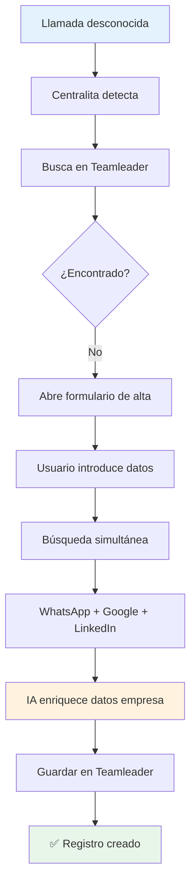
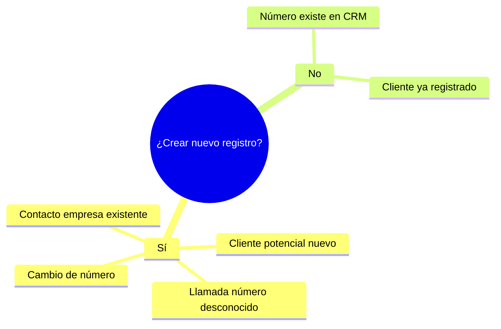
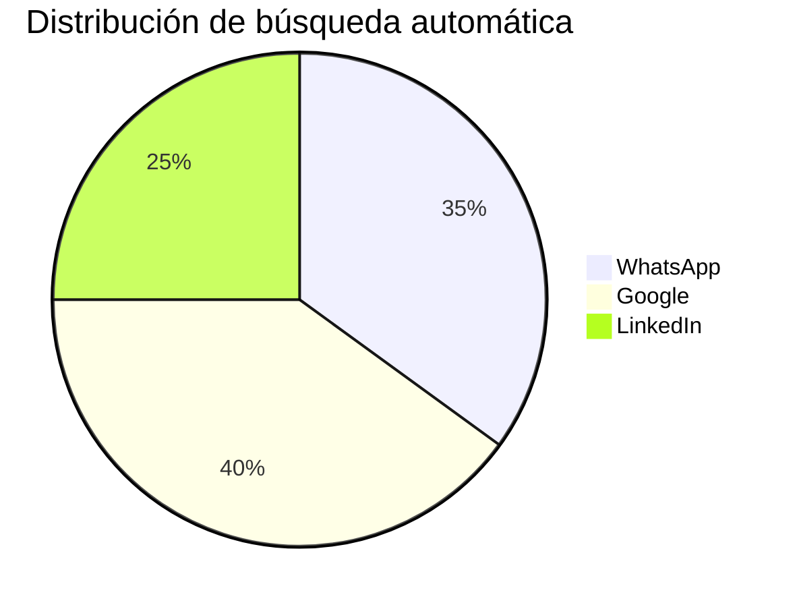
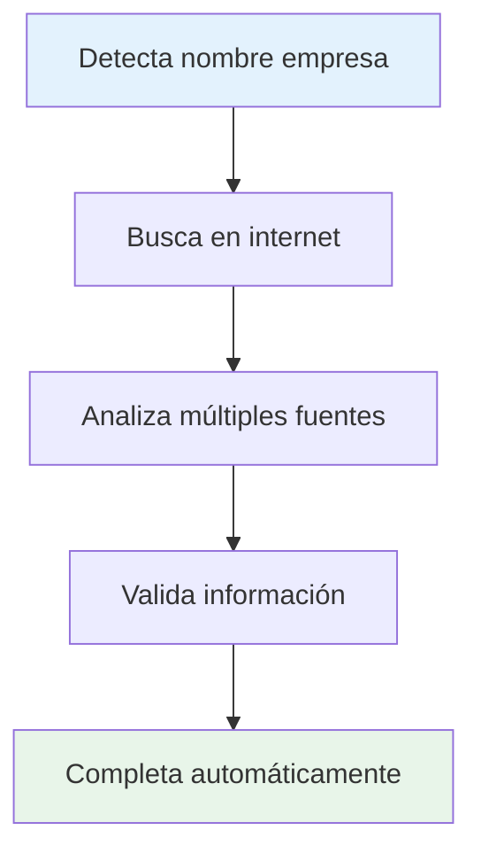
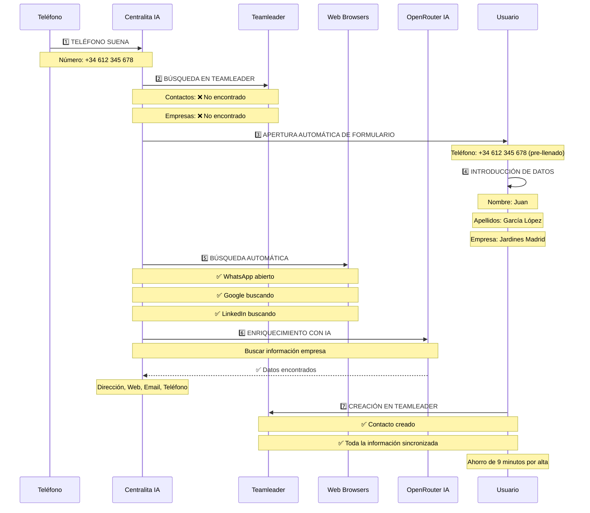
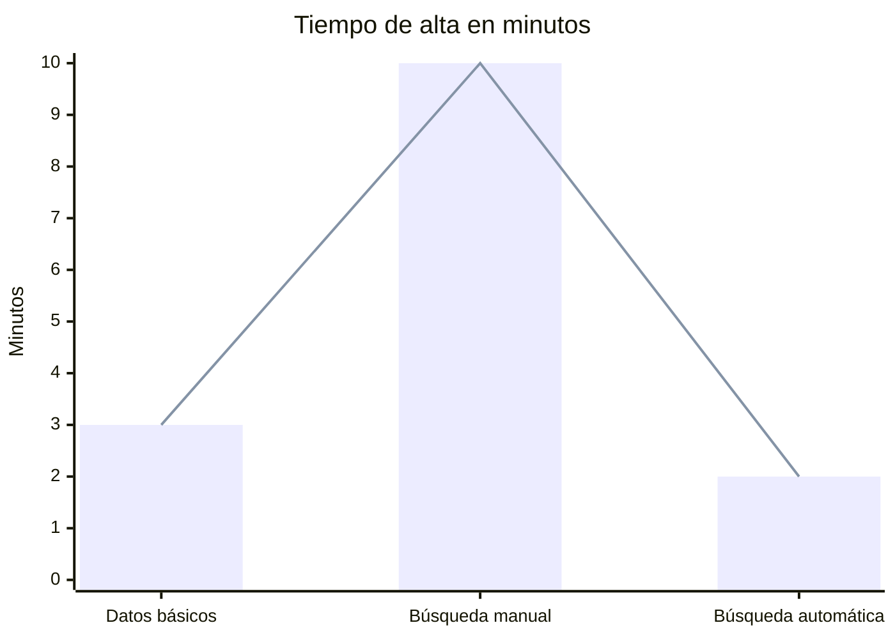
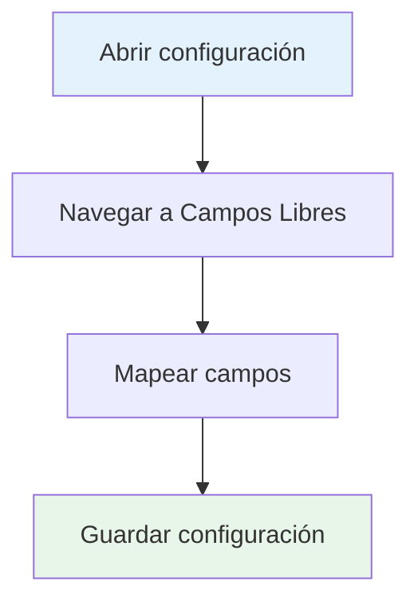
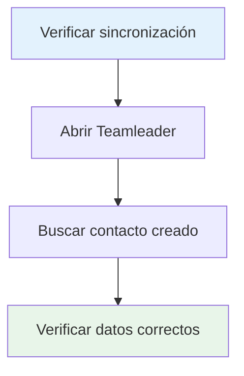

# 📝 Crear Nuevos Registros en Teamleader

Cuando recibes una llamada de un número desconocido, Centralita Teamleader facilita enormemente la creación de nuevos registros en tu CRM, con búsqueda automática de información y enriquecimiento de datos usando inteligencia artificial.

!!! success "🎯 Resultado Final"
    Tu base de datos de Teamleader siempre estará actualizada y enriquecida, sin esfuerzo manual adicional.

---

## 🗺️ Mapa del Proceso de Alta



---

## 🎯 ¿Cuándo Crear un Nuevo Registro?

### :material-phone: Escenarios de Uso

Debes crear un nuevo registro cuando:



<div class="grid cards" markdown>

-   :material-phone-in-talk: **Llamada de número desconocido**

    No existe en tu base de datos

-   :material-plus: **Cliente potencial nuevo**

    Primer contacto con tu empresa

-   :material-sync: **Cambio de número**

    Cliente existente con nuevo teléfono

-   :material-person-add: **Contacto de empresa existente**

    Nueva persona en empresa ya registrada

</div>

!!! info "Flujo Automático"
    Si el número no existe en Teamleader, Centralita **abrirá automáticamente** el formulario de alta al detectar la llamada.

---

## :desktop_windows: Pantalla de Alta de Nuevo Registro

Al recibir una llamada de número desconocido, verás esta pantalla:

### :material-form: Campos Disponibles

#### Información Básica

| Campo | Descripción | Obligatorio |
|-------|-------------|-------------|
| **Teléfono** | Número detectado automáticamente | ✅ Sí |
| **Nombre** | Nombre del contacto | ❌ No |
| **Apellidos** | Apellidos del contacto | ❌ No |
| **Empresa** | Nombre de la empresa | ❌ No |
| **Email** | Dirección de correo electrónico | ❌ No |
| **Cargo** | Puesto en la empresa | ❌ No |
| **Dirección** | Dirección postal completa | ❌ No |

!!! tip "Consejo"
    Rellena la mayor cantidad de información posible. Cuantos más datos proporciones, más precisa será la búsqueda automatizada de información.

---

## :search: Búsqueda Automática de Información

Centralita utiliza **inteligencia artificial** para buscar información automáticamente en internet y enriquecer el registro del nuevo contacto.

### :network: Redes de Búsqueda Adicional



El sistema realiza búsquedas simultáneas en múltiples fuentes:

#### 1. 🟢 WhatsApp

- **Busca**: El número de teléfono en WhatsApp
- **Propósito**: Verificar si el contacto usa WhatsApp
- **Resultado**: Abre perfil de WhatsApp en navegador

#### 2. 🔵 Google

- **Busca**: El número de teléfono y nombre
- **Propósito**: Encontrar información pública del contacto
- **Resultado**: Abre resultados de búsqueda en Google

#### 3. 🔵 LinkedIn

- **Busca**: Nombre y apellidos (si se proporcionan)
- **Propósito**: Encontrar perfil profesional
- **Resultado**: Abre perfil de LinkedIn en navegador

??? example "Ejemplo de búsqueda simultánea"
    Si introduces:
    - **Teléfono**: +34 612 345 678
    - **Nombre**: Juan
    - **Apellidos**: García López

    Centralita abrirá automáticamente 3 pestañas:
    1. `wa.me/34612345678` - Perfil de WhatsApp
    2. `google.com/search?q=+34+612+345+678` - Resultados de Google
    3. `linkedin.com/search/results/people/?keywords=Juan+García+López` - Búsqueda en LinkedIn

---

## :robot: Enriquecimiento con IA

### :material-brain: Búsqueda Automática de Empresas

!!! alert "⚠️ Requiere OpenRouter Configurado"
    Para usar esta funcionalidad, necesitas tener OpenRouter configurado con API key válida.

Si activas el sistema de **IA para búsqueda de empresas**, Centralita realizará automáticamente las siguientes acciones:

#### Funcionamiento de la IA



1. **Detecta el nombre de la empresa** en el campo "Empresa"
2. **Busca en internet** información de la empresa
3. **Completa automáticamente** los siguientes campos:
   - 📍 Dirección postal completa
   - 🌐 Sitio web
   - 📧 Email de contacto
   - 📞 Teléfono adicional
   - 🏢 Sector de actividad
   - 📊 Descripción de la empresa
   - 💼 Información comercial (si está disponible)

??? info "¿Qué datos busca la IA?"
    La IA busca:
    - **Datos de contacto**: Dirección, email, teléfono
    - **Información comercial**: CIF, sector, número de empleados
    - **Presencia online**: Web, redes sociales
    - **Ubicación**: Dirección completa, código postal, ciudad
    - **Descripción**: Actividad principal de la empresa

!!! example "Ejemplo real"
    Introduces en el campo "Empresa": **"AlcaTic Soluciones"**

    La IA busca automáticamente y encuentra:
    - **Dirección**: Calle Innovación 123, 28001 Madrid
    - **Web**: https://alcatic.com
    - **Email**: info@alcatic.com
    - **Teléfono**: +34 911 234 567
    - **Sector**: Tecnología / Software
    - **Descripción**: Empresa especializada en desarrollo de software y automatización de procesos

    Todos estos campos se completan **automáticamente** sin que tengas que buscar nada.

---

## :movie: Proceso Completo de Alta

### :play_circle: Secuencia de Pasos



### :list_alt: Detalle del Proceso

#### Paso 1: Detección de Llamada Desconocida

```
📞 Teléfono suena
   Número: +34 612 345 678
```

#### Paso 2: Búsqueda en Teamleader

```
🔍 Centralita busca en Teamleader
   Contactos: ❌ No encontrado
   Empresas: ❌ No encontrado
```

#### Paso 3: Apertura Automática de Formulario

```
📝 Se abre pantalla de alta
   Teléfono: +34 612 345 678 (pre-llenado)
```

#### Paso 4: Introducción de Datos

```
✍️ Usuario introduce datos conocidos
   Nombre: Juan
   Apellidos: García López
   Empresa: Jardines Madrid
```

#### Paso 5: Búsqueda Automática

```
🌐 Centralita busca en internet
   ✅ WhatsApp abierto
   ✅ Google buscando
   ✅ LinkedIn buscando
```

#### Paso 6: Enriquecimiento con IA

```
🤖 IA busca información de empresa
   ✅ Dirección encontrada
   ✅ Web encontrada
   ✅ Email encontrado
   ✅ Teléfono adicional encontrado
```

#### Paso 7: Creación en Teamleader

```
💾 Usuario guarda
   ✅ Contacto creado en Teamleader
   ✅ Toda la información sincronizada
```

---

## :chart_with_upwards_trend: Ventajas del Sistema de Alta

### :material-compare: Sin IA vs Con IA



| Aspecto | Sin IA | Con IA |
|---------|--------|--------|
| **Tiempo de alta** | 5-10 minutos | 1-2 minutos |
| **Datos del contacto** | Solo los que introduces | Enriquecidos automáticamente |
| **Información empresa** | Manual | Búsqueda y completado automático |
| **Precisión** | Limitada por tu tiempo | Datos verificados de fuentes fiables |
| **Productividad** | Baja | Alta |

### :timer: Ahorro de Tiempo

```mermaid
gantt
    title Comparación de tiempo de alta
    dateFormat X
    axisFormat %S

    section Sin IA
    Buscar empresa en Google       :a1, 0, 300s
    Buscar en LinkedIn             :a2, 0, 180s
    Copiar datos manualmente       :a3, 0, 120s
    Total                          :a4, 0, 600s

    section Con IA
    Introducir nombre empresa       :b1, 0, 30s
    IA busca automáticamente        :b2, 0, 90s
    Total                          :b3, 0, 120s

    style a4 fill:#ff6b6b
    style b3 fill:#51cf66
```

**Sin Centralita**:
- 5 minutos para buscar empresa en Google
- 3 minutos para buscar en LinkedIn
- 2 minutos para copiar datos manualmente
- **Total**: 10 minutos por alta

**Con Centralita + IA**:
- 30 segundos para introducir nombre empresa
- 90 segundos de procesamiento IA
- **Total**: 2 minutos por alta

!!! success "Resultado"
    **Ahorro de 8 minutos por alta**. Si haces 10 altas al día, ahorras **1.3 horas**.

---

## :star: Mejores Prácticas

### :material-1: 1. Introduce Siempre el Nombre de la Empresa

Aunque no conozcas el nombre exacto, introduce cualquier información que tengas:

- "Jardines Madrid" (nombre aproximado)
- "Empresa jardinería zona norte"
- "Cliente que llamó desde Málaga"

La IA usará esta información para buscar la empresa correcta.

### :material-2: 2. Verifica la Información Automática

La IA es muy precisa, pero siempre verifica:

- ✅ La dirección es correcta
- ✅ El email es válido
- ✅ El teléfono adicional es correcto

### :material-3: 3. Completa los Campos Opcionales

Aunque no son obligatorios, ayudan a futuras búsquedas:

- **Cargo**: "Director Comercial", "Gerente", etc.
- **Sector**: "Jardinería", "Hostelería", etc.
- **Notas**: Cómo conociste al cliente, intereses, etc.

### :material-4: 4. Usa la Información de LinkedIn

Si la IA encuentra el perfil de LinkedIn:

- Verifica la foto del contacto
- Confirma el cargo y empresa
- Revisa la experiencia laboral
- **No guardes el perfil de LinkedIn** en Teamleader (privacidad)

---

## :code_blocks: Configuración de Campos Libres

Centralita permite **mapear campos libres personalizados** de Teamleader con la información que la IA encuentra.

### :dataset: ¿Qué son los Campos Libres?

Son campos personalizados que puedes crear en Teamleader para almacenar información específica de tu negocio:

<div class="grid cards" markdown>

-   :material-id-card: **CIF/NIF**

    Número de identificación fiscal

-   :material-business: **Sector**

    Actividad principal del cliente

-   :material-group: **Número de empleados**

    Tamaño de la empresa

-   :material-euro: **Volumen de negocio**

    Cifra de ventas anual

-   :material-edit: **Cualquier otro dato personalizado**

    Según tus necesidades

</div>

### :link: Configurar Mapeo de Campos



1. **Abrir configuración**
   - Clic con el botón derecho en el icono de Centralita
   - Seleccionar "Configuración"

2. **Navegar a "Campos Libres"**
   - Pestaña de configuración avanzada

3. **Mapear campos**
   - Por cada campo libre de Teamleader, selecciona qué información debe guardar la IA:

```text
custom_field_cif       ↔ "CIF encontrado"
custom_field_sector    ↔ "Sector de actividad"
custom_field_empleados ↔ "Número de empleados"
```

4. **Guardar configuración**
   - Haga clic en "Guardar"

!!! tip "Consejo"
    Los campos libres son muy útiles para segmentar tu base de datos y crear listas de marketing personalizadas.

---

## :video: Tutorial en Video

??? info "📺 Ver Video del Proceso Completo"
    [Pulse para ver el video](../../img/Alta_nuevo.mp4)

    **Duración**: 3 minutos
    **Contenido**:
    - Detección de llamada desconocida
    - Apertura automática de formulario
    - Búsqueda en WhatsApp, Google y LinkedIn
    - Enriquecimiento con IA
    - Creación de registro en Teamleader

---

## :question_answer: Preguntas Frecuentes

### :material-help: ¿La búsqueda de empresas es siempre precisa?

**En la mayoría de casos, sí**. La IA utiliza fuentes fiables y contrastadas. Sin embargo, para empresas muy pequeñas o recientes, puede no encontrar información.

### :material-edit: ¿Puedo editar la información que la IA encuentra?

**Sí, absolutamente**. La información que la IA proporciona es una sugerencia. Puedes editar, añadir o eliminar cualquier campo antes de guardar.

### :material-search-off: ¿Qué pasa si la IA no encuentra la empresa?

El sistema te notificará que no se encontró información. Podrás continuar con el alta manualmente usando solo los datos que hayas introducido.

### :material-link-off: ¿Se guarda la información de LinkedIn en Teamleader?

**No**. Centralita **abre** LinkedIn para que puedas verificar la información, pero **no guarda** el perfil de LinkedIn en Teamleader. Esto respeta la privacidad del contacto y los términos de uso de LinkedIn.

### :material-timer: ¿Cuánto tiempo tarda la IA en buscar la información?

**Generalmente 20-40 segundos**. El tiempo depende de:
- La cantidad de información a buscar
- La velocidad de tu conexión a internet
- La disponibilidad de las fuentes de información

### :material-toggle-off: ¿Puedo desactivar la búsqueda automática?

**Sí**. En configuración, puedes desactivar:
- Búsqueda en WhatsApp
- Búsqueda en Google
- Búsqueda en LinkedIn
- Enriquecimiento con IA

---

## :rocket: Próximos Pasos

Una vez creado el nuevo registro:



1. **Verifica la sincronización**
   - Abre Teamleader
   - Busca el contacto creado
   - Verifica que todos los datos están correctos

2. **Realiza la llamada de seguimiento**
   - El contacto ya está en tu base de datos
   - La próxima llamada se detectará automáticamente
   - Se abrirá la ficha completa

3. **Añade información adicional**
   - Registra la primera interacción
   - Añade etiquetas personalizadas
   - Crea un deal si es una oportunidad de venta

---

## :tips_and_updates: Consejos Finales

### :target: Para Maximizar la Precisión de la IA

1. **Introduce nombres completos**: "Juan García López" en lugar de "Juan"
2. **Usa nombres exactos de empresa**: "Jardines Madrid SL" en lugar de "Jardinería"
3. **Verifica la dirección**: La IA puede encontrar direcciones antiguas
4. **Actualiza periódicamente**: La información de las empresas puede cambiar

### :speed: Para Ahorrar Tiempo

1. **Usa plantillas**: Crea plantillas para tipos de clientes comunes
2. **Configura campos libres**: Para información que usas frecuentemente
3. **Aprovecha la IA**: Deja que busque la información automáticamente
4. **Verifica rápidamente**: Un vistazo rápido es suficiente en la mayoría de casos

---

## :checklist: ✅ Conclusión

El sistema de **alta de nuevos registros** de Centralita Teamleader combina:

- ✅ **Detección automática** de números desconocidos
- ✅ **Búsqueda simultánea** en múltiples fuentes (WhatsApp, Google, LinkedIn)
- ✅ **Inteligencia artificial** para enriquecer datos de empresas
- ✅ **Sincronización automática** con Teamleader
- ✅ **Ahorro de tiempo** de hasta 8 minutos por alta

!!! success "Resultado"
    Tu base de datos de Teamleader siempre estará actualizada y enriquecida, sin esfuerzo manual adicional.

¿Listo para crear tu primer registro con IA? [**Volver a Inicio Rápido**](inicio-rapido-centralita-teamleader.md){ .md-button .md-button--primary }
