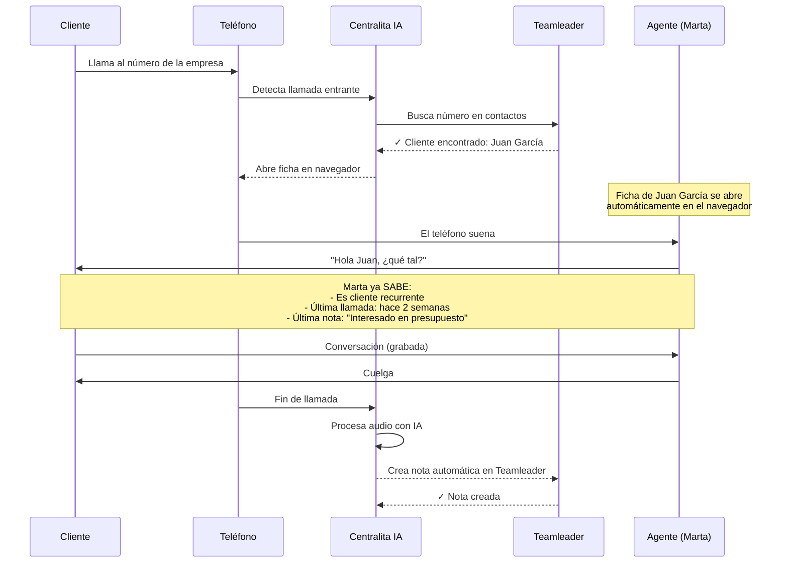
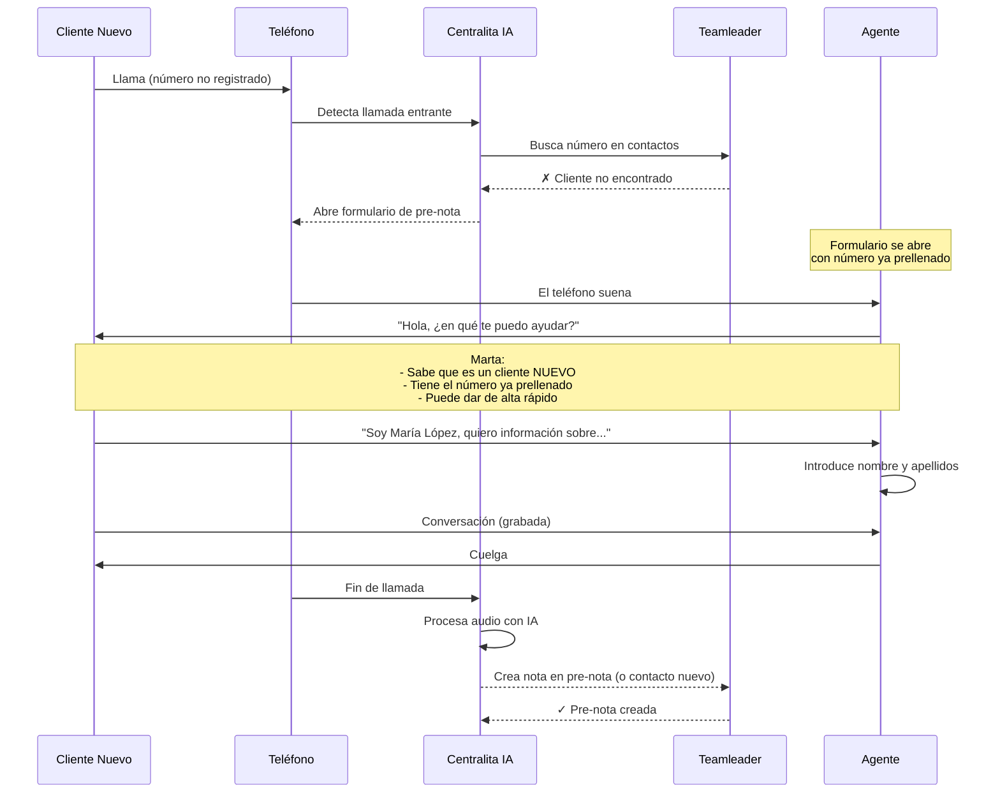
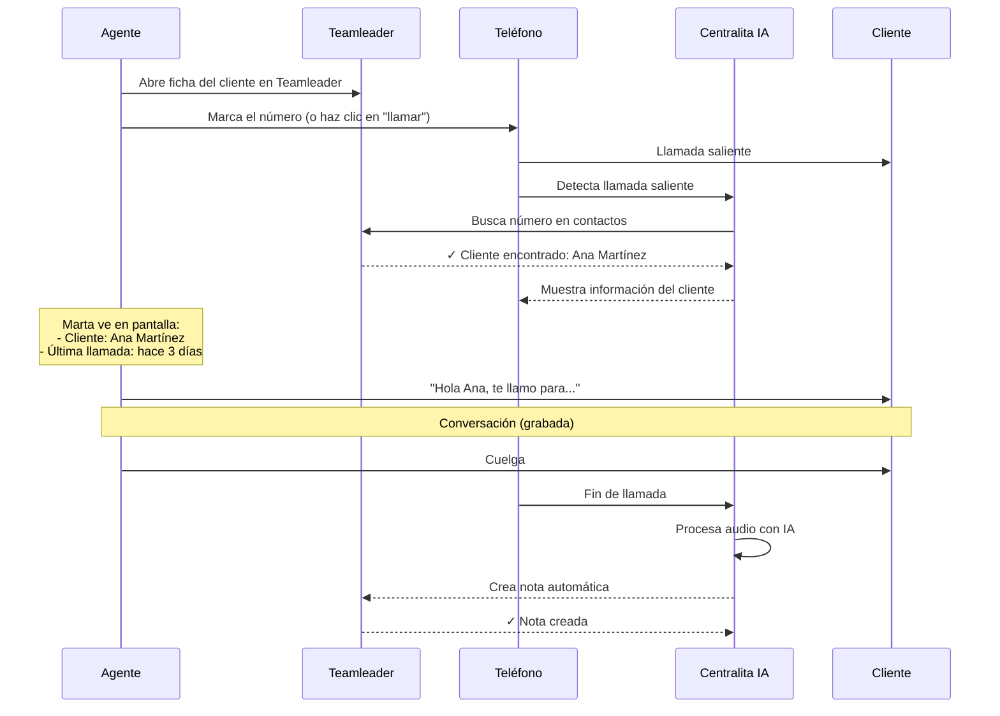
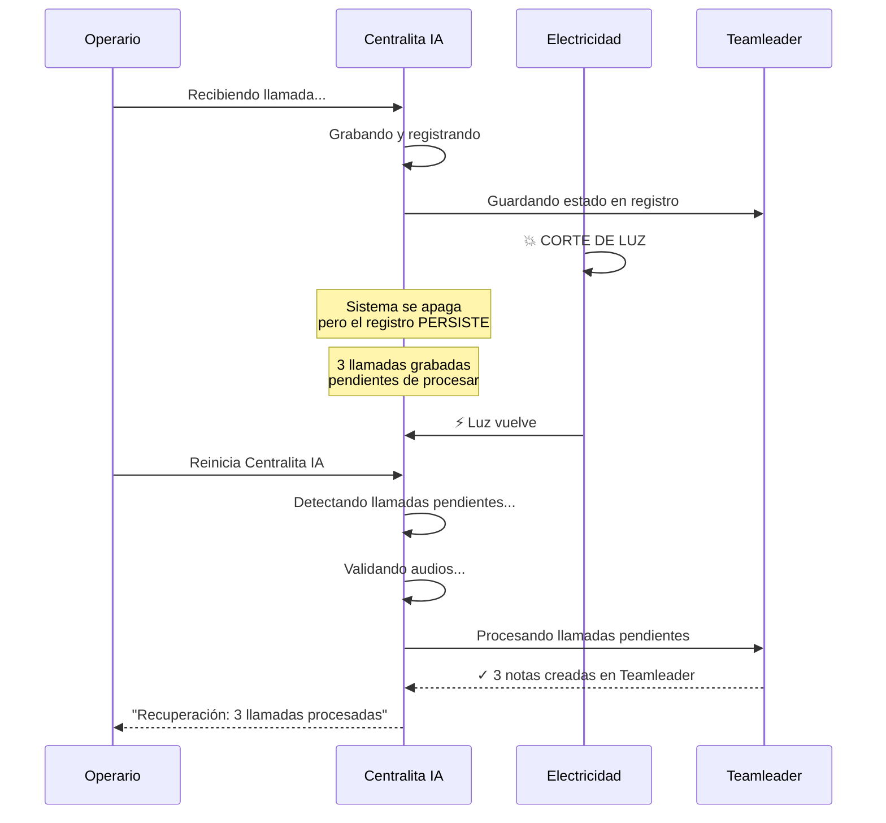
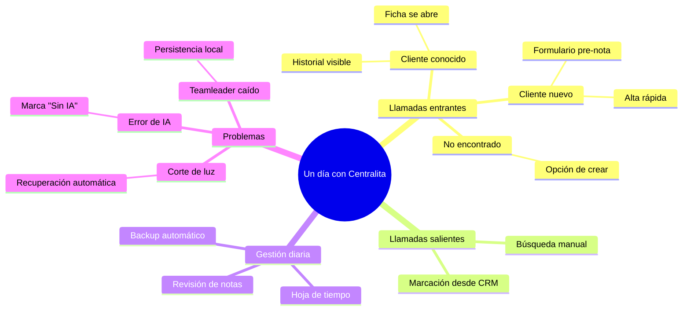

# 📅 Ejemplos del Día a Día

Descubre cómo funciona Centralita IA Teamleader en situaciones reales del día a día. Desde que te levantas hasta que cierras el día.

!!! success "¿Por qué leer esto?"
    Estos no son ejemplos teóricos. Son situaciones REALES que te encontrarás. Lee esto y sabrás exactamente qué hacer en cada caso.

---

## 🌞 Un Día Completo con Centralita IA

Veamos cómo es un día típico de Marta, agente comercial en una empresa de servicios.

```mermaid
gantt
    title Un día con Centralita IA - Marta (Agente Comercial)
    dateFormat  HH:mm
    axisFormat  %H:%M
    section Mañana
    Recepción de llamadas    :09:00, 120min
    -Cliente conocido (3min):09:00, 03min
    -Cliente nuevo (7min)   :09:15, 07min
    -Seguimiento (4min)    :09:30, 04min
    section Mediodía
    Almuerzo               :13:00, 60min
    Revisión de notas IA    :14:00, 30min
    section Tarde
    Llamadas salientes      :15:00, 90min
    -Seguimiento (5min)    :15:00, 05min
    -Presupuesto (8min)    :15:30, 08min
    Cierre de presupuestos  :16:30, 60min
    section Cierre del día
    Revisión del día        :17:30, 30min
```



!!! tip "¿Qué notas del gráfico?"
    - Marta NO pierde tiempo buscando clientes
    - Las notas se crean automáticamente
    - Al final del día, ya todo está en Teamleader
    - Ella puede enfocarse en VENDER

---

## 📞 Situación 1: Llama un Cliente que Ya Existe

La situación más común. El teléfono suena, el cliente es conocido.

### Qué Sucede



=== "📋 Paso a paso"

1. **El teléfono suena**
   - Centralita IA detecta la llamada automáticamente
   - Busca el número en Teamleader (contactos y empresas)

2. **La ficha se abre**
   - Si encuentra al cliente, abre su ficha en el navegador
   - Marta ve la información ANTES de contestar

3. **Marta contesta informada**
   - Sabe quién es el cliente
   - Sabe cuándo lo llamó por última vez
   - Ve las notas de llamadas previas
   - Conoce su historial de compras

4. **La conversación**
   - Se graba automáticamente
   - Marta no tiene que apuntar nada

5. **Al colgar**
   - Centralita IA procesa el audio con IA
   - Crea una nota en Teamleader con:
     - Resumen de la conversación
     - Puntos clave
     - Decisiones tomadas
     - Siguientes pasos

=== "🖥️ Qué ves en pantalla"

**La ficha del cliente se abre automáticamente:**

!!! info "Información que ves"
    - **Nombre del cliente**: Juan García
    - **Empresa**: TechSolutions S.L.
    - **Última llamada**: 15/03/2026 (hace 2 semanas)
    - **Última nota**: "Interesado en servicio mensual, presupuesto €300-400"
    - **Estado**: "En negociación"
    - **Presupuestos**: 2 enviados (1 pendiente de respuesta)

!!! success "Ventaja de contestar informada"
    Marta puede decir: *"Hola Juan, ¿cómo va el presupuesto que te envié hace dos semanas?"*

    En vez de: *"Hola... ¿quién es? Ah, Juan... ¿en qué te puedo ayudar?"*

=== "⚙️ Qué pasa por detrás"

**Proceso automático de Centralita IA:**

1. Detección de llamada entrante (OffHook)
2. Búsqueda del número en Teamleader (API)
3. Apertura de la ficha en el navegador
4. Inicio de grabación de audio
5. Al colgar:
   - Validación del audio
   - Envío a IA para transcripción
   - Creación de nota en Teamleader
   - Actualización del registro de llamadas

!!! tip "Todo automático"
    Marta NO hace NADA manualmente. Todo funciona solo. Ella solo habla con el cliente.

---

## 🆕 Situación 2: Llama un Cliente NUEVO

El teléfono suena, pero el número no está en Teamleader. Es un cliente nuevo.

### Qué Sucede



=== "📋 Paso a paso"

1. **El teléfono suena**
   - Centralita IA detecta la llamada
   - Busca el número en Teamleader

2. **Cliente NO encontrado**
   - Centralita IA detecta que es un cliente nuevo
   - Abre un formulario de "pre-nota" en el navegador
   - El número ya está prellenado

3. **Marta contesta**
   - Sabe que es un cliente nuevo por el formulario que se abrió
   - Solo necesita preguntar el nombre

4. **Alta rápida**
   - Marta introduce: nombre, apellidos, empresa (si aplica)
   - Guarda el formulario

5. **La conversación**
   - Se graba normalmente
   - Se crea una nota asociada a la pre-nota

6. **Al colgar**
   - La IA crea una nota con el resumen
   - Marta puede convertir la pre-nota en un contacto completo más tarde

=== "🖥️ Qué ves en pantalla"

**El formulario de pre-nota se abre:**

!!! info "Formulario prellenado"
    - **Número**: +34 612 345 678 (ya completo)
    - **Nombre**: [Marta escribe] María
    - **Apellidos**: [Marta escribe] López
    - **Empresa**: [opcional] [Marta escribe] TechSolutions S.L.
    - **Notas**: [se completará automáticamente con la IA]

!!! success "Alta en 30 segundos"
    Marta da de alta al cliente nuevo MIENTRAS habla. No pierde tiempo después.

=== "⚙️ Qué pasa por detrás"

**Proceso automático para clientes nuevos:**

1. Búsqueda del número → No encontrado
2. Apertura de formulario de pre-nota con número prellenado
3. Inicio de grabación
4. Al colgar:
   - Procesamiento con IA
   - Creación de nota en la pre-nota
   - La pre-nota puede convertirse en contacto completo después

!!! tip "Pre-nota vs contacto completo"
    La "pre-nota" es un registro temporal. Marta puede completarlo más tarde con más información (dirección, email, etc.) y convertirlo en un contacto oficial de Teamleader.

---

## 📤 Situación 3: Llamas TÚ a un Cliente

Llamada saliente. Marcas un número de Teamleader manualmente.

### Qué Sucede



=== "📋 Paso a paso"

1. **Preparas la llamada**
   - Abres la ficha del cliente en Teamleader
   - Ves el historial previo
   - Haces clic en el número de teléfono para llamar

2. **Centralita IA detecta**
   - Detecta la llamada saliente
   - Busca el número para confirmar el cliente
   - Te muestra la información del cliente

3. **La conversación**
   - Se graba automáticamente
   - No tienes que apuntar nada

4. **Al colgar**
   - La IA crea una nota con el resumen
   - Se guarda en Teamleader

=== "🖥️ Qué ves en pantalla"

**Marta tiene dos opciones:**

!!! info "Opción 1: Llamar desde Teamleader"
    - Abre la ficha del cliente en Teamleader
    - Haz clic en el número de teléfono
    - Tu softphone/móvil marca automáticamente

!!! info "Opción 2: Llamar directamente"
    - Marca el número desde tu teléfono
    - Centralita IA detecta la llamada saliente
    - Busca el número y abre la ficha del cliente

=== "⚙️ Qué pasa por detrás"

**Proceso para llamadas salientes:**

1. Detección de llamada saliente (Connected)
2. Identificación del número marcado
3. Búsqueda en Teamleader
4. Apertura de ficha del cliente
5. Grabación automática
6. Procesamiento con IA al colgar

!!! tip "Llamadas salientes también se graban"
    No importa si la llama entró o salió, Centralita IA la graba y transcribe de la misma forma.

---

## ⚡ Situación 4: Hay un Corte de Luz

Apagón inesperado. La electricidad se va. ¿Qué pasa con las llamadas?

### Qué Sucede



=== "📋 Paso a paso"

1. **Corte de luz**
   - La electricidad se va
   - Centralita IA se apaga inesperadamente

2. **La buena noticia**
   - Antes de apagarse, cada llamada se guardó
   - El registro de llamadas persiste
   - Los audios grabados siguen en tu disco

3. **Electricidad vuelve**
   - Reinicias tu ordenador
   - Inicias Centralita IA

4. **Recuperación automática**
   - Centralita IA detecta llamadas pendientes
   - Valida que los audios son correctos
   - Procesa las llamadas con IA
   - Crea las notas en Teamleader
   - Te notifica qué se recuperó

=== "🖥️ Qué ves en pantalla"

**Al reiniciar Centralita IA:**

!!! info "Mensaje de recuperación"
    ```
    ╔════════════════════════════════════════════════════════╗
    ║   Centralita Teamleader - Recuperando...               ║
    ╠════════════════════════════════════════════════════════╣
    ║   ⏳ Detectando llamadas pendientes...                  ║
    ║   ✓ 3 llamadas encontradas                             ║
    ║   ✓ Validando audios...                                ║
    ║   ✓ 3 audios válidos                                  ║
    ║   📊 Procesando con IA...                              ║
    ║   ✅ Recuperación completada: 3 llamadas                ║
    ╚════════════════════════════════════════════════════════╝
    ```

=== "⚙️ Qué pasa por detrás"

**Sistema de recuperación:**

1. **Persistencia inmediata**
   - Cada llamada se guarda MIENTRAS ocurre
   - No espera al final

2. **Detección de pendientes**
   - Al iniciar, busca llamadas sin transcripción
   - Estado: "Audio finalizado" pero sin "IA disponible"

3. **Validación de calidad**
   - Verifica que los audios existen
   - Comprueba que no estén corruptos
   - Valida duración y tamaño

4. **Procesamiento automático**
   - Envía audios válidos a la IA
   - Crea notas en Teamleader
   - Actualiza el registro

!!! tip "Nada se pierde"
    Con el sistema de recuperación, **NUNCA** pierdes una llamada por un corte de luz. Todo se recupera automáticamente.

---

## 🔍 Situación 5: Quieres Buscar un Número Manualmente

No recuerdas el nombre, pero tienes el número. ¿Cómo buscas?

### Qué Sucede

=== "📋 Paso a paso"

1. **Accede al menú de Centralita IA**
   - Haz clic derecho en el icono de la bandeja de sistema
   - Se abre el menú

2. **Selecciona "Buscar número"**
   - O usa el atajo de teclado (si configuraste uno)

3. **Introduce el número**
   - Escribe el número que tienes
   - Haz clic en "Buscar"

4. **Resultados**
   - Centralita IA busca en Teamleader
   - Muestra coincidencias de contactos
   - Muestra coincidencias de empresas

5. **Abre la ficha**
   - Haz clic en el resultado
   - La ficha se abre en Teamleader

=== "🖥️ Qué ves en pantalla"

**Formulario de búsqueda:**

!!! info "Búsqueda manual"
    ```
    ╔════════════════════════════════════════════════════════╗
    ║   Buscar número de teléfono                           ║
    ╠════════════════════════════════════════════════════════╣
    ║                                                        ║
    ║   Número: [_________________]  🔍 Buscar                ║
    ║                                                        ║
    ║   Resultados:                                           ║
    ║   • Juan García - Contacto                              ║
    ║   • TechSolutions S.L. - Empresa                        ║
    ║                                                        ║
    ╚════════════════════════════════════════════════════════╝
    ```

=== "⚙️ Qué pasa por detrás"

**Proceso de búsqueda:**

1. Búsqueda en Teamleader (API)
2. Filtrado por coincidencia exacta o parcial
3. Presentación de resultados ordenados por relevancia

!!! tip "Útil para números desconocidos"
    Si un número te llama y no sabes quién es, puedes buscarlo manualmente y abrir la ficha aunque ya hayas colgado.

---

## 📚 Situación 6: Recibes 5 Llamadas Seguidas

Pico de llamadas. El teléfono no para. ¿Cómo manejas esto?

### Qué Sucede

=== "📋 Paso a paso"

1. **Llamada 1 entra**
   - Centralita IA detecta y busca el cliente
   - Abre ficha en el navegador
   - Grabación iniciada
   - Contestas y hablas
   - Cuelgas → IA procesa

2. **Llamada 2 entra (inmediatamente)**
   - Centralita IA cierra la ficha anterior
   - Busca el nuevo cliente
   - Abre nueva ficha
   - Grabación iniciada
   - Contestas y hablas
   - Cuelgas → IA procesa

3. **... y así sucesivamente**

4. **Al final del pico**
   - Todas las llamadas están grabadas
   - La IA las está procesando en segundo plano
   - Las notas aparecen en Teamleader cuando estén listas

=== "🖥️ Qué ves en pantalla"

**Gestión de múltiples llamadas:**

!!! info "Fichas que se abren y cierran automáticamente"
    - Cada vez que entra una llamada, la ficha del cliente se abre
    - Cuando entra la siguiente, la anterior se cierra
    - No tienes que gestionar pestañas ni ventanas

!!! success "No te agobias"
    Centralita IA maneja la parte técnica. Tú solo contestas y habla. Todo lo demás es automático.

=== "⚙️ Qué pasa por detrás"

**Sistema de colas de procesamiento:**

1. **Grabación en tiempo real**
   - Cada llamada se graba mientras ocurre

2. **Cola de IA**
   - Las llamadas se encolan para procesamiento con IA
   - Se procesan en paralelo (más de una a la vez)

3. **Persistencia**
   - Cada llamada se guarda inmediatamente
   - Si algo falla, nada se pierde

!!! tip "La IA trabaja en segundo plano"
    Mientras tú hablas con el cliente 3, la IA ya está procesando las llamadas 1 y 2. No tienes que esperar.

---

## 📝 Situación 7: Al Final del Día - Revisión en la Hoja de Tiempo

Es el final del día. ¿Qué hiciste hoy? ¿Qué llamadas hay pendientes?

### Qué Sucede

=== "📋 Paso a paso"

1. **Abre la Hoja de Tiempo**
   - Haz clic derecho en el icono de Centralita IA
   - Selecciona "Hoja de Tiempo"
   - Se abre en el navegador

2. **Revisa las llamadas del día**
   - Verás una lista de todas las llamadas
   - Columnas: número, fichero, entidad, duración, estado, enlace a Teamleader

3. **Estados de las llamadas:**
   - **"Audio finalizado"**: Grabada, pendiente de IA
   - **"IA disponible"**: Procesada con IA, nota en Teamleader
   - **"Sin IA"**: No se pudo procesar (audio muy corto, corrupto, etc.)

4. **Acciones:**
   - Haz clic en el enlace para ver la nota en Teamleader
   - Escucha el audio grabado
   - Revisa el resumen generado por la IA

=== "🖥️ Qué ves en pantalla"

**Hoja de Tiempo:**

!!! info "Lista de llamadas del día"
    | Teléfono | Fichero | Entidad | Duración | Estado | Enlace |
    |----------|---------|---------|----------|---------|--------|
    | +34612345678 | llamada_090915.wav | Juan García | 5:23 | IA disponible | [Ver nota] |
    | +34698765432 | llamada_091230.wav | Ana Martínez | 3:12 | IA disponible | [Ver nota] |
    | +34611223344 | llamada_093045.wav | Cliente nuevo | 7:45 | IA disponible | [Ver nota] |
    | +34655667788 | llamada_101500.wav | TechSolutions | 4:20 | IA disponible | [Ver nota] |

=== "⚙️ Qué pasa por detrás"

**La Hoja de Tiempo es:**

- **Un registro persistente**: Todas las llamadas quedan registradas
- **Una base de datos**: Formato CSV que se puede exportar
- **Una herramienta de auditoría**: Para verificar qué se hizo cada día

!!! tip "Revisión diaria"
    Al final del día, revisa la Hoja de Tiempo para asegurarte de que todo se procesó correctamente. Si ves algo con estado "Sin IA", verifica por qué.

---

## 🔎 Situación 8: El Cliente Pregunta por un Presupuesto Anterior

Cliente llama: "¿Qué pasó con ese presupuesto que me enviaste?"

### Qué Sucede

=== "📋 Paso a paso"

1. **Cliente llama**
   - Centralita IA detecta la llamada
   - Busca el cliente en Teamleader

2. **Ficha se abre**
   - Ves al cliente y su historial
   - Ves las notas de llamadas previas

3. **Buscas en las notas**
   - En la ficha del cliente, buscas "presupuesto"
   - Encuentras la nota: "Enviado presupuesto #1234 por €350, pendiente de respuesta"

4. **Contestas informada**
   - "Te envié el presupuesto el pasado 15 de marzo por €350"
   - "¿Lo recibiste bien?"

=== "🖥️ Qué ves en pantalla"

**Búsqueda en notas:**

!!! info "Notas de Teamleader con contenido de IA**
    ```markdown
    ## Resumen Ejecutivo
    Cliente confirma interés en servicio mensual. Solicita presupuesto para jardín de 200m².

    ## Puntos Clave
    - Cliente tiene jardín de 200m²
    - Necesita mantenimiento mensual
    - Presupuesto máximo: €200/mes

    ## Presupuestos
    - Enviado presupuesto #1234 por €350 (15/03/2026)
    - Pendiente de respuesta
    ```

=== "⚙️ Qué pasa por detrás"

**Búsqueda de contenido:**

- Las notas generadas por IA tienen estructura
- Puedes buscar por palabras clave
- Encuentras rápidamente cualquier conversación anterior

!!! tip "Poder de búsqueda"
    "¿Qué le dije a Juan el 15 de marzo?" → Busca "Juan" y "15/03" o simplemente "presupuesto".

---

## 🗺️ Resumen Visual de Situaciones



---

## 📊 Comparación de Situaciones

| Situación | Frecuencia | Dificultad | ¿Requiere acción manual? |
|-----------|------------|------------|--------------------------|
| Cliente conocido | 🔥🔥🔥🔥🔥 Muy frecuente | Fácil | ❌ No |
| Cliente nuevo | 🔥🔥🔥🔥 Frecuente | Fácil | ✅ Nombre y apellidos |
| Llamada saliente | 🔥🔥🔥🔥 Frecuente | Fácil | ❌ No |
| Corte de luz | 🔥🔥 Poco frecuente | Fácil | ❌ No (automático) |
| Búsqueda manual | 🔥🔥🔥 Ocasional | Fácil | ✅ Número |
| Múltiples llamadas | 🔥🔥🔥🔥 Frecuente | Media | ❌ No |
| Revisión final del día | 🔥🔥🔥🔥🔥 Diaria | Fácil | ✅ Revisión rápida |
| Búsqueda de presupuesto | 🔥🔥🔥 Ocasional | Media | ✅ Búsqueda en notas |

---

## ❓ Preguntas Rápidas

??? question "¿Qué pasa si contesto y el número es desconocido?"
    Centralita IA detecta que es un cliente nuevo y abre el formulario de pre-nota automáticamente. Solo tienes que introducir el nombre.

??? question "¿Puedo escuchar el audio después?"
    Sí, todos los audios se guardan en la carpeta configurada. Desde la Hoja de Tiempo puedes escuchar cualquier llamada.

??? question "¿Cuánto tarda la IA en procesar una llamada?"
    Generalmente entre 30 segundos y 2 minutos, dependiendo de la duración de la llamada y la carga del sistema.

??? question "¿Qué pasa si la IA falla?"
    La llamada queda marcada como "Sin IA" en el registro. Puedes escuchar el audio manualmente y escribir la nota tú mismo.

??? question "¿Puedo editar las notas que genera la IA?"
    Sí, las notas en Teamleader se pueden editar normalmente. La IA genera un borrador que tú puedes ajustar.

??? question "¿Qué pasa si Teamleader no funciona?"
    Las llamadas se siguen grabando y las notas se guardan localmente. Cuando Teamleader vuelva, se sincronizarán automáticamente.

---

## 🚀 ¿Listo para usar Centralita IA en tu día a día?

[ :material-download: Descargar Centralita IA](link-descarga-software-centralita-teamleader.md){ .md-button .md-button--primary }

[ :book: Volver a casos de uso](../tecnica/casos-de-uso.md){ .md-button }

[ :school: Guía de inicio rápido](inicio-rapido-centralita-teamleader.md){ .md-button }
