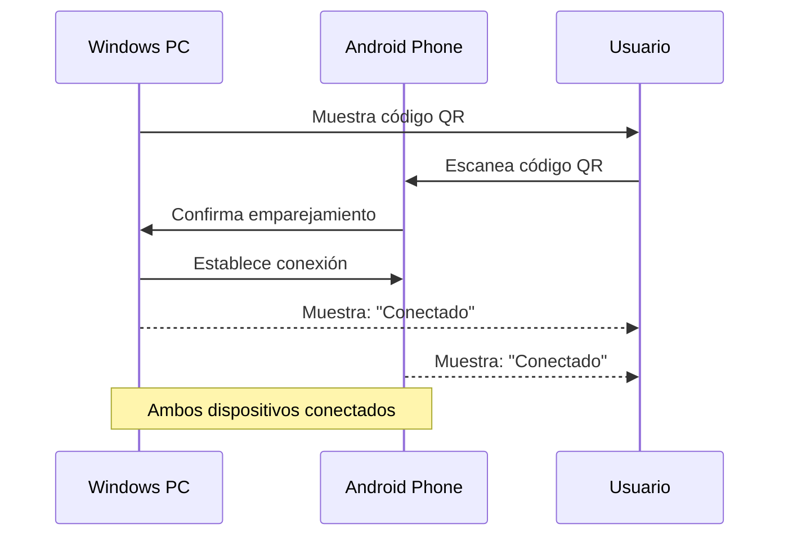
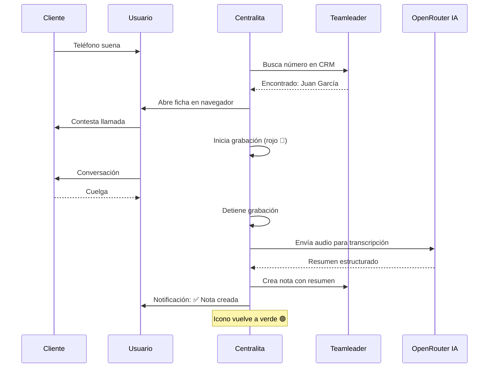

# 🚀 Inicio Rápido - Centralita Teamleader

Configure **Centralita Teamleader** en menos de 5 minutos y comience a automatizar sus llamadas con inteligencia artificial. Esta guía paso a paso le llevará desde la descarga hasta su primera llamada transcrita.

!!! success "🎯 Objetivo"
    Al finalizar esta guía, tendrá:
    - Centralita instalada y ejecutándose
    - Android emparejado (si tiene uno)
    - Teamleader CRM conectado
    - Transcripción IA configurada
    - Primera llamada procesada automáticamente

---

## 📊 Timeline de Instalación

```mermaid
flowchart LR
    A("1. Descarga (2m)") --> B("2. Instalacion (1m)")
    B --> C("3. App Celular (2m)")
    C --> D("4. API Teamleader (1m)")
    D --> E("5. IA OpenRouter (1m)")
    E --> F("6. Llamada de Prueba")
    
    style A fill:#e3f2fd,stroke:#1e88e5,stroke-width:2px
    style B fill:#e3f2fd,stroke:#1e88e5,stroke-width:2px
    style C fill:#fff3e0,stroke:#fb8c00,stroke-width:2px
    style D fill:#e8f5e9,stroke:#43a047,stroke-width:2px
    style E fill:#f3e5f5,stroke:#8e24aa,stroke-width:2px
    style F fill:#e8f5e9,stroke:#43a047,stroke-width:4px
```



---

## 📋 Requisitos Previos

!!! warning "⚠️ Verifique antes de comenzar"
    Asegúrese de cumplir con todos los requisitos para evitar problemas durante la instalación.

### Checklist de Requisitos

| Requisito | Detalle | Necesario | Estado |
|-----------|---------|-----------|--------|
| **Windows** | Windows 10 o superior (Windows 11 recomendado) | ✅ Obligatorio | :material-checkbox-marked-outline: |
| **Espacio** | Mínimo 50 MB en disco | ✅ Obligatorio | :material-checkbox-marked-outline: |
| **Android** | Android 6.0 o superior | ✅ Recomendado | :material-checkbox-marked-outline: |
| **Cuenta Teamleader** | Cuenta activa de Teamleader Focus | ✅ Obligatorio | :material-checkbox-marked-outline: |
| **Cuenta OpenRouter** | Cuenta gratuita en [openrouter.ai](https://openrouter.ai/) | ✅ Recomendado | :material-checkbox-marked-outline: |
| **Internet** | Conexión estable | ✅ Obligatorio | :material-checkbox-marked-outline: |

??? question "¿No tienes cuenta de OpenRouter?"
    [Regístrate gratis en OpenRouter](https://openrouter.ai/){ .md-button .md-button--primary }

    Es gratuito y necesitas una API key para usar la transcripción con IA. El coste es de ~2-3 céntimos por llamada.

---

## 📥 Paso 1: Descargar e Instalar (2 minutos)

### 1.1 Descargar el Instalador

!!! done "Descargar Centralita Teamleader"
    ### [📥 Descargar Setup_Centralita_IA_Teamleader.zip](link-descarga-software-centralita-teamleader.md)

    - Tamaño: ~15 MB
    - Tiempo estimado: 1-3 minutos

!!! tip "Consejo"
    1. Haga clic en el botón de descarga
    2. Guarde el archivo en una carpeta de su preferencia
    3. Recomendado: `Descargas` o `Escritorio`
    4. Nombre del archivo: `Setup_Centralita_IA_Teamleader.zip`

### 1.2 Instalar la Aplicación

??? info "Opciones de instalación"

=== "🪟 Windows 10/11"

1. **Descomprima el archivo ZIP**
   - Clic con el botón derecho → "Extraer todo..."
   - Elija una carpeta de destino

2. **Ejecute el instalador**
   - Doble clic en `Setup_Centralita_IA_Teamleader.exe`
   - Siga los pasos del asistente (Siguiente → Aceptar → Instalar)

3. **Finalice la instalación**
   - Marque "Ejecutar Centralita Teamleader"
   - Haga clic en "Finalizar"

=== "💡 Consejos de instalación"

- Desactive temporalmente el antivirus si bloquea la instalación
- Use una carpeta de fácil acceso (Escritorio)
- Verifique que tiene permisos de administrador

!!! success "✅ Instalación Completada"
    Verá el icono de Centralita en la esquina inferior derecha de Windows (bandeja del sistema).

---

## 📱 Paso 2: Emparejar Teléfono Android (2 minutos)

!!! abstract "⚠️ Opcional pero Muy Recomendado"
    Este paso es opcional pero muy recomendado. Si no tiene Android, puede introducir el número de teléfono manualmente después de cada llamada.

### 2.1 Instalar JustRemotePhone en Android

??? info "Versiones disponibles"

=== "📱 Versión Trial GRATIS (7 días)"

1. **Abra Google Play** en su Android
2. **Busque "Remote Phone Call Trial"**
3. **Instale la aplicación**
4. **Pruebe durante 7 días** antes de comprar

=== "💳 Versión Completa (~€9.99 pago único)"

1. **Abra Google Play** en su Android
2. **Busque "Remote Phone Call"**
3. **Compre la aplicación** (~€9.99 pago único)

!!! warning "⚠️ Importante sobre la licencia"
    La licencia está vinculada a la cuenta de Google que usa para la compra. Recomendación: Usa una cuenta de Google que puedas compartir en varios terminales.

### 2.2 Instalar JustRemotePhone en Windows

```ini
Pasos de instalación JustRemotePhone en Windows

1. Descargue CallCenter.msi desde https://www.justremotephone.com/    # (1)
2. Ejecute el instalador y siga los pasos                           # (2)
3. Verifique que se ejecuta correctamente                           # (3)
```
1.  Directo desde la web oficial del desarrollador
2.  Proceso estándar de instalación Windows
3.  Debería aparecer en la bandeja del sistema

### 2.3 Emparejar Dispositivos

!!! tip "Emparejamiento paso a paso"

1. **Ejecute JustRemotePhone** en Windows y Android
2. **En Windows**, haga clic en "Emparejar dispositivo"
3. **Escaneé el código QR** con su Android
4. **Confirme el emparejamiento** en ambos dispositivos



!!! success "✅ Emparejamiento Completado"
    Asegúrese de que ambos dispositivos estén en la misma red WiFi. Si tiene problemas, consulte la [guía completa de emparejamiento](App-Call-remoto.md).

---

## 🔑 Paso 3: Configurar API de Teamleader (1 minuto)

### 3.1 Crear Integración en Teamleader

!!! warning "⚠️ Requerido"
    Sin configurar la API de Teamleader, Centralita NO podrá buscar contactos ni crear notas.

#### 3.1.1 Acceder al Marketplace

1. **Visite el Marketplace de Teamleader**
   - URL: [https://marketplace.focus.teamleader.eu/es/es/gestion](https://marketplace.focus.teamleader.eu/es/es/gestion)

2. **Inicie sesión** con su cuenta de administrador

3. **Cree una nueva integración**
   - Haga clic en "Nueva integración"
   - Nombre: "Centralita Teamleader"
   - Descripción: "Integración de telefonía automática con IA"
   - Tipo: "Aplicación web"

### 3.2 Configurar URIs de Redirección

???+ question "¿Qué es una URI de Redirección?"
    Es la URL a la que Teamleader redirigirá tras autorizar la aplicación. Centralita escuchará en esta dirección para recibir el código de autorización.

!!! danger "⛔ Importante"
    - **NO** añadir espacios al final
    - **NO** cambiar mayúsculas/minúsculas
    - **NO** añadir barras adicionales (`/`)
    - Copie y pegue exactamente la URI anterior

```ini
URI de redirección (COPIAR EXACTAMENTE):
http://127.0.0.1:5000/callback        # (1)
```
1.  No cambie NADA de esta URI

??? info "¿Por qué 127.0.0.1?"
    `127.0.0.1` es la dirección **localhost** (su propio ordenador). Centralita creará un servidor temporal en su máquina para recibir la autorización, por lo que la conexión no sale de su ordenador y es completamente segura.

### 3.3 Configurar Scopes

!!! tip "Scopes Requeridos"
    Marque los siguientes permisos (mínimos requeridos):

| Scope | Descripción | ¿Para qué sirve? |
|-------|-------------|------------------|
| `contacts:read` | Leer contactos | Buscar clientes por teléfono |
| `companies:read` | Leer empresas | Buscar empresas por teléfono |
| `notes:write` | Crear notas | Crear notas tras llamadas |

!!! info "Recomendación"
    Para funcionalidad completa, marque también: `contacts:write`, `companies:write`, `deals:read`, `deals:write`.

### 3.4 Obtener Credenciales

1. **Haga clic en "Guardar"** en Teamleader
2. **Anote las credenciales** generadas:

```http
Client ID: xxxxxxxx-xxxx-xxxx-xxxx-xxxxxxxxxxxx       # (1)
Client Secret: xxxxxxxxxxxxxxxxxxxxxxxxxxxxxxxxxxxxxxxx  # (2)
tl_access_token: se generará automáticamente            # (3)
```
1.  Lo obtiene al registrar su aplicación en Teamleader
2.  Se genera junto con el client_id
3.  Token de acceso que se renueva automáticamente

!!! warning "⚠️ Guarda estas credenciales"
    El Client Secret es como una contraseña. No lo comparta con nadie.

### 3.5 Configurar en Centralita

??? info "Configurar en Centralita - Paso a paso"

1. **Haga clic con el botón derecho** en el icono de Centralita (bandeja del sistema)
2. **Seleccione "Configuración"**
3. **Navegue a la pestaña "API"**
4. **Pegue las credenciales**:

| Campo | Acción |
|-------|--------|
| **Client ID** | Pegar el valor anotado |
| **Client Secret** | Pegar el valor anotado |

5. **Haga clic en "Autorizar Teamleader"**
6. **Inicie sesión** en Teamleader si se le solicita
7. **Haga clic en "Autorizar"** para conceder permisos

!!! success "✅ Teamleader Configurado"
    Centralita ahora está conectada con Teamleader y puede buscar contactos y crear notas automáticamente.

---

## 🤖 Paso 4: Configurar OpenRouter (IA) - Opcional (1 minuto)

!!! info "💡 ¿Por qué usar IA?"
    Si desea usar la transcripción con IA (muy recomendado):

### 4.1 Obtener API Key de OpenRouter


??? info "Pasos para obtener API Key"

1. **Regístrese en [OpenRouter](https://openrouter.ai/)** si aún no lo ha hecho
2. **Obtenga su API Key** desde "Settings" → "API Keys"
3. **Cree una nueva key** con el botón "Create new key"
4. **Cópiela** (comienza con `sk-or-v1-`)

### 4.2 Configurar en Centralita

1. **Vuelva a Configuración de Centralita** → pestaña "IA"
2. **Pegue su API Key** en el campo correspondiente
3. **Seleccione el modelo de IA**:

| Modelo | Calidad | Coste | Velocidad | Uso Recomendado |
|--------|---------|-------|-----------|------------------|
| **google/gemini-2.5-flash-lite** | Alta | Bajo | ⚡ Muy rápido | ✅ Uso diario |
| **google/gemini-2.5-flash** | Muy alta | Medio | ⚡ Rápido | Llamadas importantes |
| **openai/gpt-4o** | Excelente | Alto | 🐌 Lento | Reuniones críticas |

4. **Haga clic en "Guardar"**

!!! success "✅ OpenRouter Configurado"
    El coste es de ~2-3 céntimos por llamada (2-5 minutos). Para 100 llamadas al mes: ~$2-3. Puede establecer un límite de gasto mensual en OpenRouter.

---

## 📞 Paso 5: Probar con una Llamada

### 5.1 Realizar una Llamada de Prueba

!!! tip "Preparativos"

1. **Asegúrese de que Centralita está ejecutándose**
   - Icono en la bandeja del sistema debe estar verde 🟢

2. **Realice una llamada** desde su Android (o introdúzcala manualmente)

3. **Verifique el proceso**:



| Paso | Qué debe ver | Icono |
|------|--------------|-------|
| 📞 Centralita detecta la llamada | Notificación en Windows | 🟢 → 🟡 |
| 🔍 Busca el contacto en Teamleader | Navegador abre ficha | 🟡 |
| 🎙️ Inicia la grabación | Icono se pone rojo | 🔴 |
| 📝 Al colgar, transcribe con IA | Notificación "Procesando..." | 🟡 |
| ✅ Crea la nota en Teamleader | Notificación "✅ Nota creada" | 🟢 |

!!! success "🎉 ¡Listo! Ya Puede Recibir Llamadas"
    Su Centralita está completamente configurada y lista para automatizar sus llamadas.

---

## ✅ Checklist de Verificación

!!! question "¿Listo para usar?"
    Antes de finalizar, verifique:

- [ ] Centralita instalada y ejecutándose
- [ ] JustRemotePhone instalado en Android y Windows (si tiene Android)
- [ ] Dispositivos emparejados (si tiene Android)
- [ ] Integración creada en Teamleader Marketplace
- [ ] URI de redirección configurada: `http://127.0.0.1:5000/callback`
- [ ] Scopes requeridos marcados en Teamleader
- [ ] Client ID y Client Secret pegados en Centralita
- [ ] Aplicación autorizada en Teamleader
- [ ] OpenRouter configurado (opcional pero recomendado)
- [ ] Llamada de prueba realizada exitosamente

---

## 🔗 Guías Detalladas

??? info "¿Necesita más información o tiene problemas?"

| Tema | Guía Detallada |
|------|----------------|
| **Descargar e instalar** | [Descargar Centralita Teamleader](link-descarga-software-centralita-teamleader.md) |
| **Configurar API Teamleader** | [Configurar API de Teamleader](api-teamleader.md) |
| **Emparejar Android** | [App Call Remoto - Guía Completa](App-Call-remoto.md) |
| **Configuración completa** | [Pantalla de Configuración](pantalla-configuracion-centralita-teamleader.md) |
| **Crear nuevos contactos** | [Creación de Nuevos Registros](creacion-nuevo-registros-teamleader.md) |
| **Guía completa del sistema** | [Centralita Teamleader con IA](centralita-crm-ia-teamleader.md) |

---

## ❓ Preguntas Frecuentes

??? question "¿Puedo usar Centralita sin Android?"
    **Sí**. Puede introducir manualmente el número de teléfono después de cada llamada:
    1. Haga clic con el botón izquierdo en el icono de Centralita
    2. Introduzca el número
    3. Haga clic en "Buscar"
    4. Centralita buscará en Teamleader y creará la nota automáticamente

??? question "¿Es realmente gratuita?"
    **La descarga es 100% gratuita**. Los únicos costes opcionales son:
    - OpenRouter: ~$0.02-0.03 por llamada (2-3 céntimos)
    - JustRemotePhone: ~€9.99 pago único (opcional, solo para detección Android)

??? question "¿Cuánto tarda en configurarse todo?"
    **Tiempo estimado**:
    - Instalación: 2 minutos
    - Emparejar Android: 2 minutos
    - Configurar API Teamleader: 1 minuto
    - Configurar OpenRouter: 1 minuto
    - **Total: ~5-6 minutos**

??? question "¿Puedo instalar en varios PCs?"
    **Sí, sin límite**. Puede instalar en tantos PCs como necesite para uso personal. Para uso empresarial con múltiples usuarios, contacte para licencias multi-usuario.

??? question "¿Qué pasa si cambio mi contraseña de Teamleader?"
    **Nada**. La autorización OAuth2 es independiente de su contraseña. Cambiar su contraseña no afecta la conexión de Centralita.

---

## 📞 Soporte

!!! tip "Consejo"
    Para una resolución más rápida, incluya capturas de pantalla de los errores que encuentre.

| Tipo de soporte | Contacto |
|-----------------|----------|
| **Email** | soporte@alcatic.com |
| **Web** | [https://alca.co/](https://alca.co/) |
| **Horario** | Lunes a Viernes, 9:00 - 18:00 (CET) |

---

## ✅ Conclusión

!!! success "🚀 ¡Listo para Automatizar sus Llamadas!"
    Ha completado la configuración de **Centralita Teamleader** en menos de 5 minutos.

Ahora puede:
- ✅ Detectar automáticamente llamadas entrantes y salientes
- ✅ Buscar contactos y empresas en Teamleader por número de teléfono
- ✅ Abrir fichas automáticamente antes de contestar
- ✅ Grabar llamadas con alta calidad
- ✅ Transcribir llamadas con IA (si configuró OpenRouter)
- ✅ Crear notas automáticamente en Teamleader

[ :material-arrow-right: Guía Completa de Centralita Teamleader con IA](centralita-crm-ia-teamleader.md){ .md-button .md-button--primary }
