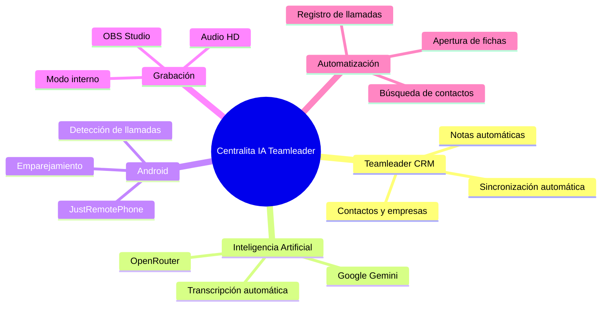
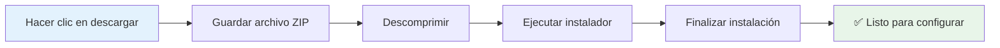
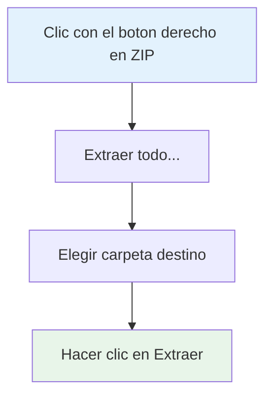
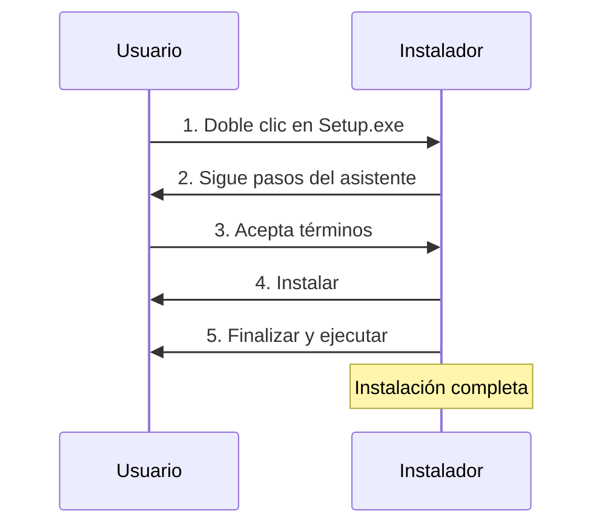
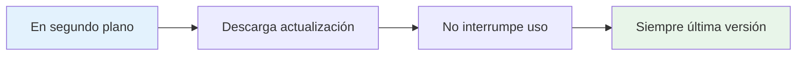

# 📥 Descargar Centralita Teamleader

Descarga **gratuitamente** Centralita Teamleader y comienza a automatizar tus llamadas con inteligencia artificial en menos de 20 minutos.

!!! success "🎯 Versión Completa"
    La descarga incluye **todas las funcionalidades** activas. No hay versiones recortadas ni limitaciones.

---

## 🎯 ¿Qué Vas a Descargar?

**Centralita IA Teamleader** es una aplicación de escritorio para Windows que integra:



### :check_circle: Funcionalidades Incluidas

<div class="grid cards" markdown>

-   :material-crm: **Teamleader CRM**

    Sincronización automática de contactos y notas

-   :material-robot: **Inteligencia Artificial**

    Transcripción automática con OpenRouter (Google Gemini)

-   :material-android: **Detección de llamadas**

    Integración con Android (opcional)

-   :material-mic: **Grabación de audio**

    Calidad estándar o alta con OBS Studio

-   :material-search: **Búsqueda automática**

    Encuentra contactos por número telefónico

-   :material-note-add: **Creación de notas**

    Registra automáticamente cada llamada

</div>

---

## 📦 Información del Instalador

| Característica | Detalle |
|----------------|---------|
| **Nombre del archivo** | `Setup_Centralita_IA_Teamleader.zip` |
| **Tamaño** | ~15 MB |
| **Versión** | Última versión estable |
| **Idioma** | Español, Inglés, Francés |
| **Sistema operativo** | Windows 10 o superior |
| **Espacio requerido** | 50 MB |
| **Licencia** | Freeware con registro obligatorio |

---

## :download: Descarga Directa

!!! done "📥 Descargar Ahora"
    El instalador no se publica actualmente en una URL pública verificable. Solicita el paquete vigente a tu proveedor o a la persona administradora de la instalación.

    *(Versión más reciente - Actualizado: Marzo2025)*



---

## 📋 Instrucciones Paso a Paso

### :folder: Paso 1: Descargar el Archivo

1. **Haga clic en el enlace de descarga** de arriba
2. **El navegador preguntará qué hacer con el archivo**
3. **Seleccione "Guardar archivo"** o "Guardar como"**
4. **Elija una ubicación** donde guardar el archivo:
   - Recomendado: `Descargas` o `Escritorio`
   - El archivo se llama: `Setup_Centralita_IA_Teamleader.zip`

!!! tip "Consejo"
    Recuerda la ubicación donde guardas el archivo. Lo necesitarás en el siguiente paso.

### :extract: Paso 2: Verificar la Descarga

1. **Espera a que la descarga se complete**
   - Tiempo estimado: 1-3 minutos (depende de tu conexión)
   - Progreso visible en el navegador

2. **Localiza el archivo descargado**
   - Ve a la carpeta que elegiste en el paso anterior
   - Busca: `Setup_Centralita_IA_Teamleader.zip`

3. **Verifica el tamaño del archivo**
   - Debe ser aproximadamente **15 MB**
   - Si es mucho menor, la descarga puede estar incompleta

!!! success "✅ Descarga Completada"
    Si el archivo tiene ~15 MB, la descarga fue exitosa.

### :unzip: Paso 3: Descomprimir el Archivo



1. **Haga clic con el botón derecho en el archivo ZIP**
   - `Setup_Centralita_IA_Teamleader.zip`

2. **Selecciona "Extraer todo..."** o "Descomprimir"**
   - Depende de tu sistema operativo

3. **Elige una carpeta de destino**
   - Recomendado: `C:\Program Files\CentralitaIA\`
   - O cualquier carpeta de tu preferencia

4. **Haga clic en "Extraer"**
   - Se creará una carpeta con los archivos de instalación

!!! warning "⚠️ No omitas este paso"
    Debes descomprimir el archivo ZIP antes de poder ejecutar el instalador.

### :computer: Paso 4: Ejecutar el Instalador



1. **Abre la carpeta descomprimida**
   - Verás varios archivos, incluyendo el instalador

2. **Doble clic en `Setup_Centralita_IA_Teamleader.exe`**
   - Este es el instalador de la aplicación

3. **Sigue los pasos del asistente**:
   - Haga clic en "Siguiente" en cada pantalla
   - Acepta los términos de la licencia
   - Elige la carpeta de instalación (o usa la predeterminada)
   - Haga clic en "Instalar"

4. **Finaliza la instalación**
   - Marca "Ejecutar Centralita Teamleader"
   - Haga clic en "Finalizar"

!!! success "🎉 Instalación Completada"
    ¡Felicidades! Centralita Teamleader está instalada y lista para configurar.

---

## ✅ Verificación de Instalación

Después de la instalación, deberías ver:

### :monitor: Icono en la Bandeja del Sistema

**Ubicación**: Esquina inferior derecha de Windows (junto al reloj)

**Colores del icono**:

| Color | Estado | Significado |
|-------|--------|-------------|
| 🟢 **Verde** | Sistema listo | Esperando llamadas |
| 🔴 **Rojo** | Grabación activa | Llamada en curso |
| 🟡 **Amarillo** | Procesando IA | Transcribiendo |

!!! tip "Prueba Rápida"
    Haga clic con el botón derecho en el icono y seleccione "Configuración" para abrir la interfaz web.

---

## :school: ¿Qué Sigue Después de la Descarga?

Una vez descargado e instalado, necesitas configurar Centralita:

```mermaid
gantt
    title Configuración posterior a descarga
    dateFormat YYYY-MM-DD
    axisFormat %d

    section Configuración
    API Teamleader              :a1, 2026-03-01, 1w
    OpenRouter IA               :a2, 2026-03-01, 1w
    Emparejar Android           :a3, 2026-03-01, 1w
    Registrar licencia           :a4, 2026-03-01, 1w

    style a1 fill:#e3f2fd
    style a2 fill:#e3f2fd
    style a3 fill:#e3f2fd
    style a4 fill:#e3f2fd
```

### :key: Paso 1: Configurar API de Teamleader

- Duración: ~5 minutos
- Dificultad: Media
- [Guía detallada aquí](api-teamleader.md)

### :robot: Paso 2: Configurar OpenRouter (IA)

- Duración: ~3 minutos
- Dificultad: Fácil
- Incluido en [Inicio Rápido](inicio-rapido-centralita-teamleader.md)

### :android: Paso 3: Emparejar Android (Opcional)

- Duración: ~5 minutos
- Dificultad: Media
- [Guía completa aquí](App-Call-remoto.md)

### :form_select: Paso 4: Registrar Licencia

- Duración: ~2 minutos
- Dificultad: Fácil
- Formulario: [https://forms.office.com/r/5k9k54cugV](https://forms.office.com/r/5k9k54cugV)

!!! info "Tiempo Total"
    Configuración completa: **~18 minutos**
    Todo el proceso está detallado en [Inicio Rápido](inicio-rapido-centralita-teamleader.md)

---

## :shield: Seguridad y Verificación

### :verified_user: ¿Es Segura la Descarga?

**Sí, completamente segura**:

<div class="grid cards" markdown>

-   :material-security: **Firma digital**

    El instalador está firmado digitalmente

-   :material-verified: **Sin malware**

    Escaneado regularmente con antivirus

-   :material-lock: **Fuente oficial**

    Descargado directamente desde los servidores oficiales

-   :material-block: **Código limpio**

    No contiene software adicional ni adware

</div>

### :hash: Verificación de Integridad

Si deseas verificar la integridad del archivo descargado:

**Checksum SHA256**:
```
[El checksum SHA256 se proporcionará próximamente]
```

!!! tip "Consejo de Seguridad"
    Descarga siempre desde el enlace oficial de esta página. No descargues desde terceros.

---

## :laptop: Requisitos del Sistema

Antes de descargar, verifica que tu equipo cumple los requisitos:

### :check_circle: Requisitos Mínimos

| Componente | Mínimo | Recomendado |
|------------|--------|-------------|
| **Sistema operativo** | Windows 10 | Windows 11 |
| **Procesador** | Intel Core i3 | Intel Core i5 o superior |
| **Memoria RAM** | 2 GB | 4 GB o superior |
| **Espacio en disco** | 50 MB | 100 MB |
| **Conexión a internet** | 3 Mbps | 10 Mbps o superior |
| **Cuentas** | Teamleader + OpenRouter | - |

??? question "¿No estás seguro de si tu PC es compatible?"
    La mayoría de PCs con Windows 10 o 11 comprados después de 2015 son compatibles. La aplicación es muy ligera y funciona en equipos modestos.

---

## :update: Actualizaciones

### :system_update: Actualizaciones Automáticas

Centralita Teamleader se actualiza **automáticamente**:



- Las actualizaciones se descargan en segundo plano
- No interrumpen el uso de la aplicación
- Siempre tendrás la última versión estable

### :history: Historial de Versiones

| Versión | Fecha | Novedades principales |
|---------|-------|----------------------|
| **2.5.0** | Marzo 2025 | Integración OpenRouter, transcripción IA mejorada |
| **2.4.0** | Enero 2025 | Soporte para OBS Studio, grabación alta calidad |
| **2.3.0** | Noviembre 2024 | Multi-idioma, campos libres mejorados |
| **2.2.0** | Septiembre 2024 | Mejoras de estabilidad y continuidad del servicio |
| **2.1.0** | Julio 2024 | Emparejamiento Android optimizado |
| **2.0.0** | Mayo 2024 | Versión inicial estable |

!!! info "Versión Actual"
    Siempre descargas la **última versión** disponible. No necesitas buscar versiones anteriores.

---

## :question_answer: Preguntas Frecuentes

### :money_off: ¿Es realmente gratuita?

**Sí, la descarga es 100% gratuita**. No hay pagos ocultos ni suscripciones obligatorias.

**Únicos costes opcionales**:
- OpenRouter: ~$0.02-0.03 por llamada (2-3 céntimos)
- JustRemotePhone: ~€9.99 pago único (opcional, solo para detección Android)

### :devices: ¿Puedo instalar en varios PCs?

**Sí, sin límite**. Puedes instalar en tantos PCs como necesites:
- Para uso personal: Sin límite
- Para uso empresarial: Contactar para licencias multi-usuario

### :install_mobile: ¿Necesito reinstalar si actualizo?

**No**. Centralita se actualiza automáticamente. No necesitas descargar una nueva versión a menos que se indique explícitamente.

### :delete: ¿Puedo desinstalar fácilmente?

**Sí, completamente**:
1. Ve a "Configuración" de Windows
2. "Aplicaciones"
3. Busca "Centralita IA Teamleader"
4. Haga clic en "Desinstalar"

### :inventory_2: ¿Qué incluye el instalador?

El instalador incluye:
- ✅ Aplicación principal Centralita Teamleader
- ✅ Todos los idiomas (español, inglés, francés)
- ✅ Todos los temas visuales (50 temas)
- ✅ Módulos de integración (Teamleader, OpenRouter, OBS)
- ❌ NO incluye software de terceros (debes instalarlos aparte)

---

## :headset: Soporte

Si tienes problemas con la descarga o instalación:

| Tipo | Contacto |
|------|----------|
| **Email** | soporte@alcatic.com |
| **Web** | [https://alca.co/](https://alca.co/) |
| **Horario** | Lunes a Viernes, 9:00 - 18:00 (CET) |

!!! tip "Consejo"
    Si tienes problemas durante la descarga, incluye:
    - Captura de pantalla del error
    - Navegador que usas (Chrome, Firefox, Edge)
    - Versión de Windows

---

## :rocket: Listo para Descargar?

!!! success "Descargar Ahora"
    Solicita el paquete vigente a tu proveedor o a la persona administradora y confirma su versión antes de ejecutarlo.

    Tamaño: ~15 MB | Versión: 2.5.0 | Idiomas: ES, EN, FR

Una vez descargado, sigue la **[Guía de Inicio Rápido](inicio-rapido-centralita-teamleader.md)** para configurar Centralita en menos de 20 minutos.
