# ⚙️ Pantalla de Configuración - Centralita Teamleader

La pantalla de configuración de Centralita Teamleader te permite personalizar todos los aspectos de la aplicación: idioma, credenciales de API, configuración de inteligencia artificial, opciones de grabación y emparejamiento con dispositivos Android.

!!! success "🎯 Objetivo de esta guía"
    Al finalizar, tendrás:
    - ✅ Configuración de idioma y apariencia personalizada
    - ✅ API Teamleader conectada
    - ✅ OpenRouter IA configurada
    - ✅ Grabación de audio ajustada
    - ✅ Android emparejado

---

## 🗺️ Mapa de Configuración

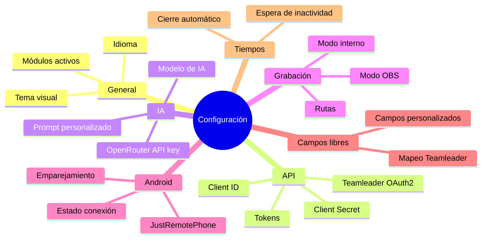

---

## :monitor: Acceder a la Configuración

### :mouse: Método 1: Desde el Icono de Bandeja

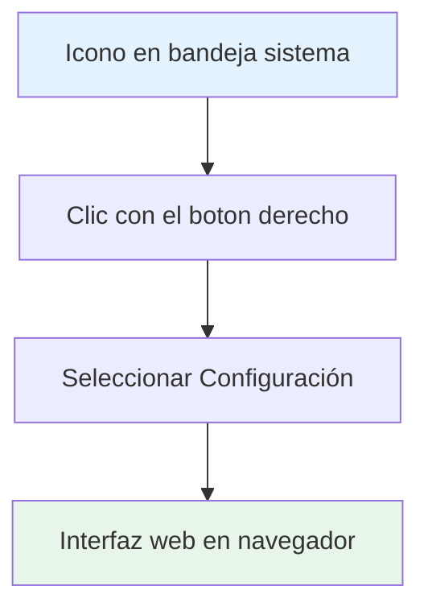

1. **Localiza el icono** de Centralita en la bandeja del sistema
   - Icono en la esquina inferior derecha de Windows

2. **Haga clic con el botón derecho** sobre el icono
   - Se abrirá el menú contextual

3. **Selecciona "Configuración"**
   - Se abrirá la interfaz web en tu navegador

### :search: Método 2: Desde Búsqueda Manual

1. **Haga clic con el botón izquierdo** en el icono de Centralita
2. **Haga clic en "Configuración"** en la pantalla de búsqueda

---

## :web: Sección: Idioma y Apariencia

### :translate: Idioma de la Interfaz

Centralita está disponible en **3 idiomas**:

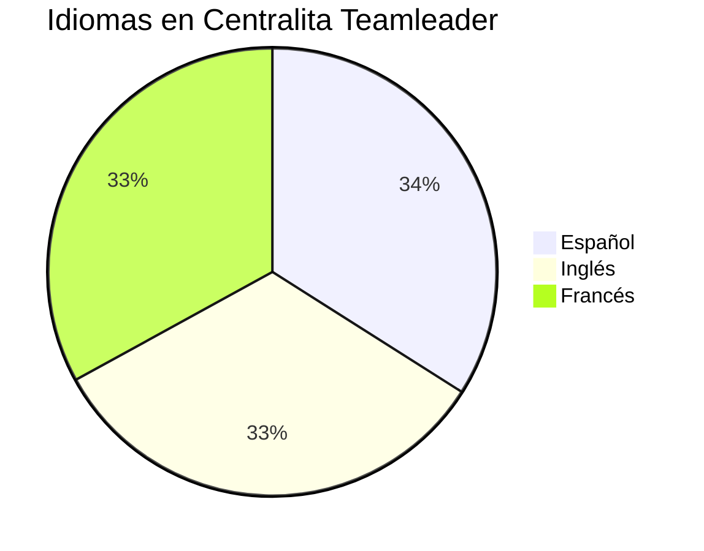

| Idioma | Bandera | Código | Estado |
|--------|--------|--------|--------|
| **Español** | :flag_es: | `es` | ✅ Completo |
| **Inglés** | :flag_gb: | `en` | ✅ Completo |
| **Francés** | :flag_fr: | `fr` | ✅ Completo |

!!! info "Cambio de idioma"
    El cambio de idioma es inmediato. No es necesario reiniciar la aplicación.

### :palette: Tema Visual

Personaliza los colores de Centralita con **casi 50 temas disponibles**:

???+ info "Temas disponibles"

=== "🌑 Temas Oscuros (Recomendados para uso diario)"

| Tema | Descripción |
|------|-------------|
| **DarkBlue16** | Azul oscuro profesional ✅ Más popular |
| **DarkGrey16** | Gris oscuro elegante |
| **DarkBlack1** | Negro absoluto |

=== "☀️ Temas Claros"

| Tema | Descripción |
|------|-------------|
| **LightGreen** | Verde claro |
| **LightBlue** | Azul claro |
| **LightGrey** | Gris claro |

=== "🌈 Temas Especiales"

| Tema | Descripción |
|------|-------------|
| **HotDogStand** | Estilo retro con colores vibrantes |

??? info "¿Cómo cambiar el tema?"
    1. En configuración, sección "Apariencia"
    2. Desplegable "Tema visual"
    3. Selecciona el tema deseado
    4. Haga clic en "Guardar"
    5. El cambio es inmediato

---

## :key: Sección: API de Teamleader

Esta sección contiene las credenciales necesarias para conectar Centralita con tu cuenta de Teamleader Focus.

!!! warning "⚠️ Requerido"
    Sin configurar la API de Teamleader, Centralita no podrá buscar contactos ni crear notas.

### :card_membership: Campos Obligatorios

#### Client ID

- **Descripción**: Identificador único de tu aplicación OAuth2
- **Formato**: `xxxxxxxx-xxxx-xxxx-xxxx-xxxxxxxxxxxx`
- **Obtención**: [Marketplace de Teamleader](https://marketplace.focus.teamleader.eu/es/es/gestion)

#### Client Secret

- **Descripción**: Contraseña de tu aplicación OAuth2
- **Formato**: 40 caracteres alfanuméricos
- **Seguridad**: Mantener en lugar seguro, no compartir

```ini
Configuración API Teamleader

client_id=xxxxxxxx-xxxx-xxxx-xxxx-xxxxxxxxxxxx      # (1)
client_secret=xxxxxxxxxxxxxxxxxxxxxxxxxxxxxxxxxxxxx  # (2)
tl_access_token=se generará automáticamente            # (3)
```
1.  Lo obtienes al registrar tu aplicación en Teamleader
2.  Se genera junto con el client_id
3.  Token de acceso que se renueva automáticamente

### :sync: Botón de Autorización

Haga clic en **"Autorizar Teamleader"** para:

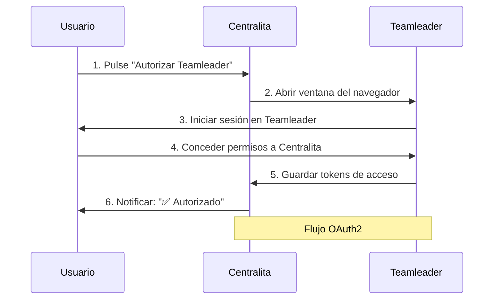

1. Abrir ventana del navegador
2. Iniciar sesión en Teamleader
3. Conceder permisos a Centralita
4. Guardar tokens de acceso automáticamente

??? info "📖 Guía Detallada de API"
    Para instrucciones paso a paso sobre cómo obtener las credenciales:
    [Configurar API de Teamleader](api-teamleader.md)

---

## :robot: Sección: Inteligencia Artificial (OpenRouter)

Configura el servicio de inteligencia artificial para transcripción automática de llamadas.

!!! info "ℹ️ ¿Qué es OpenRouter?"
    OpenRouter proporciona acceso a modelos de IA avanzados (Google Gemini, GPT-4) para transcribir tus llamadas y generar resúmenes estructurados.

### :api-key: API Key

- **Descripción**: Clave de acceso al servicio OpenRouter
- **Formato**: `sk-or-v1-...`
- **Obtención**: [https://openrouter.ai/](https://openrouter.ai/)
- **Coste**: ~$0.02-0.03 por llamada (2-3 céntimos)

???+ danger "⛔ Seguridad de la API Key"
    - NUNCA compartas tu API Key
    - Es como una contraseña de tu cuenta
    - Guárdala en lugar seguro
    - OpenRouter permite establecer límites de gasto mensual

### :model-hub: Modelo de IA

Selecciona el modelo de IA para transcripción:

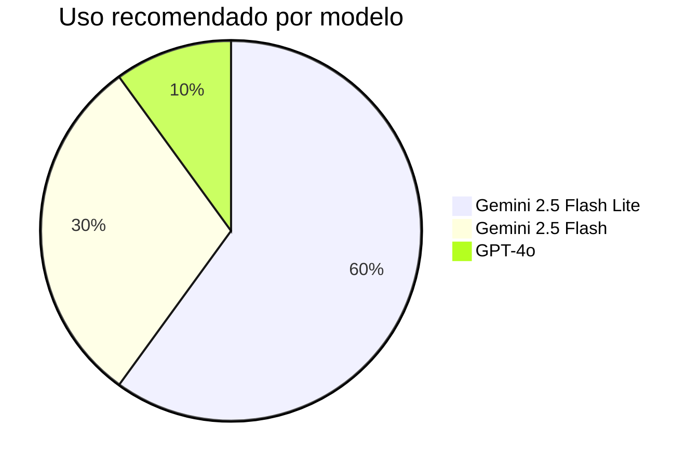

| Modelo | Calidad | Coste | Velocidad | Uso Recomendado |
|--------|---------|-------|-----------|------------------|
| **google/gemini-2.5-flash-lite** | Alta | Bajo | ⚡ Muy rápido | ✅ Uso diario |
| **google/gemini-2.5-flash** | Muy alta | Medio | ⚡ Rápido | Llamadas importantes |
| **openai/gpt-4o** | Excelente | Alto | 🐌 Lento | Reuniones críticas |

!!! tip "Recomendación"
    Usa **Gemini 2.5 Flash Lite** para el día a día. Ofrece el mejor equilibrio calidad/precio.

### :edit_note: Prompt Personalizado

Instrucciones que la IA seguirá al transcribir las llamadas.

???+ info "Ejemplos de prompt"

=== "📝 Prompt predeterminado"

```text
Transcribe la llamada y genera un resumen estructurado con:
- Resumen ejecutivo (2-3 frases)
- Puntos clave discutidos
- Decisiones tomadas
- Siguientes pasos (con responsable y fecha)
- Objeciones o preocupaciones
- Información de contacto mencionada
- Etiquetas automáticas
```

=== "💡 Ejemplo de prompt personalizado"

```text
Transcribe la llamada enfocándote en:
1. Presupuesto del cliente (importe máximo)
2. Plazos de entrega (fechas acordadas)
3. Condiciones de pago (forma y plazo)
4. Siguientes pasos con fechas concretas
```

??? info "A/B Testing de Prompts"
    Centralita permite experimentar con diferentes prompts para optimizar la calidad de las transcripciones. Consulta la documentación técnica para más detalles.

---

## :mic: Sección: Grabación de Audio

Configura cómo Centralita graba las llamadas telefónicas.

### :settings_input_antenna: Modo de Grabación

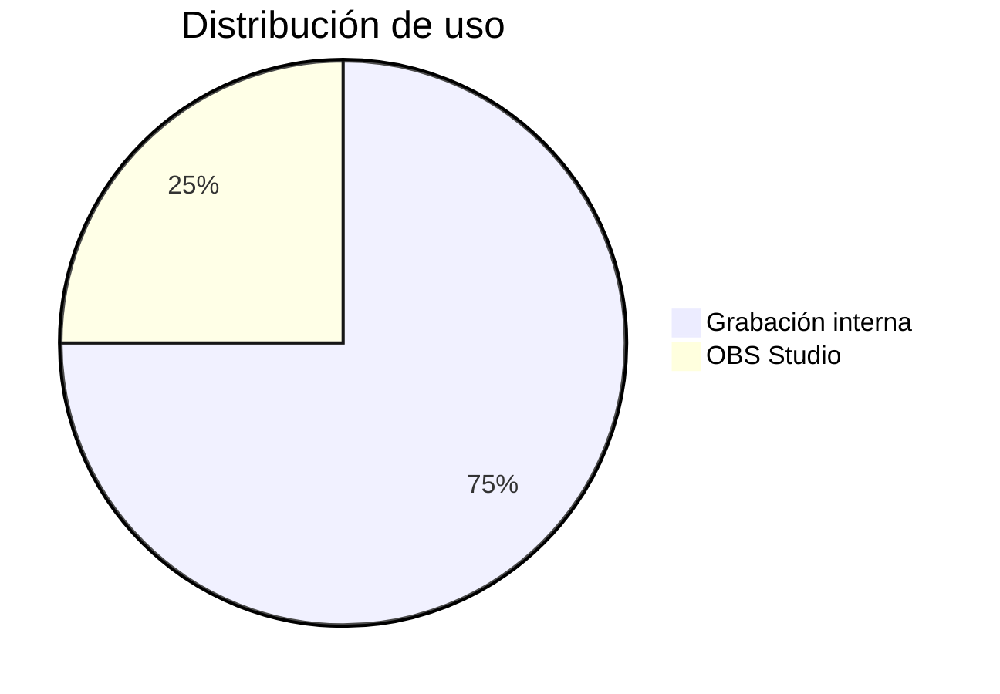

| Modo | Valor | Método | Calidad | Requisitos |
|------|-------|--------|---------|------------|
| **Desactivado** | `0` | No graba | N/A | - |
| **Interna** | `1` | Tarjeta de sonido | Estándar | Ninguno |
| **OBS Studio** | `2` | OBS Studio | Alta | OBS instalado |

#### Modo 1: Grabación Interna (Recomendado)

**Ventajas**:
- ✅ Funciona sin configuración adicional
- ✅ No requiere software extra
- ✅ Bajo consumo de recursos

**Limitaciones**:
- ⚠️ Solo graba micrófono
- ⚠️ No graba audio del sistema (softphones)

**Ideal para**:
- Llamadas de teléfono fijo/móvil
- Usuarios que no necesitan configuración avanzada

#### Modo 2: OBS Studio (Avanzado)

**Ventajas**:
- ✅ Audio de alta calidad
- ✅ Graba ambos lados de la conversación
- ✅ Compatible con softphones VoIP (Zoiper, 3CX)

**Requisitos**:
- OBS Studio instalado y ejecutándose
- Complemento de conexión de OBS configurado
- Puerto 4455 disponible

??? info "📖 Guía de OBS Studio"
    Para configurar OBS Studio, consulta la documentación técnica:
    [Integración OBS Studio](../tecnica/integraciones.md)

### :folder: Ruta de Grabación

Directorio donde se guardarán los archivos de audio:

```ini
Configuración de rutas

dir_rec=D:\centralita_ia\rec\    # (1)
```
1.  Formato de ruta de Windows

- **Formato**: `D:\centralita_ia\rec\` (ejemplo)
- **Requisito**: Debe existir y tener permisos de escritura
- **Organización**: Se crean subcarpetas por fecha

!!! warning "⚠️ Espacio en Disco"
    Calcula aproximadamente 1 MB por minuto de grabación. Para 100 llamadas de 5 minutos al mes: ~500 MB.

---

## :phone_android: Sección: Emparejamiento Android

Configura la detección automática de llamadas desde tu teléfono Android.

!!! abstract "ℹ️ Opcional pero Recomendado"
    Esta sección es opcional pero muy recomendada para automatizar completamente el flujo de llamadas.

### :android: Aplicación JustRemotePhone

Centralita utiliza la aplicación **JustRemotePhone** para conectar tu Android con Windows.

**Requisitos**:
- Dispositivo Android 6.0 o superior
- Aplicación JustRemotePhone instalada en Android y Windows
- Ambos dispositivos en la misma red WiFi

### :connection: Estado del Emparejamiento

| Estado | Descripción | Acción |
|--------|-------------|--------|
| **No emparejado** | No hay conexión Android | Haga clic en "Emparejar" |
| **Conectado** | Android conectado y funcionando | ✅ Listo |
| **Desconectado** | Perdió conexión con Android | Revisar WiFi |

### :touch_app: Botón "Emparejar"

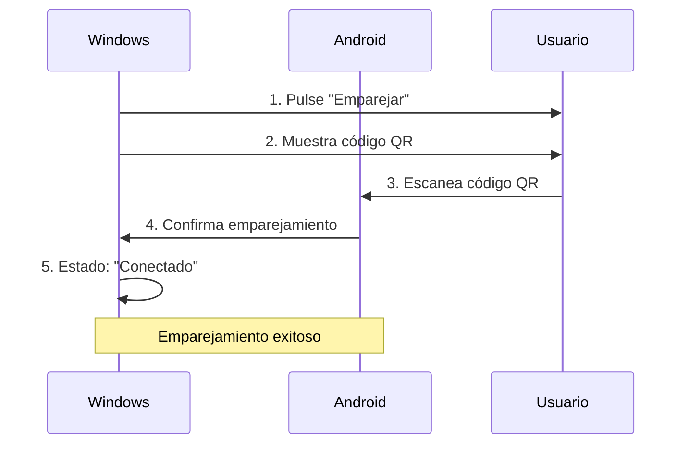

1. **Haga clic en "Emparejar"**
2. **Escanea el código QR** con tu Android
3. **Confirma el emparejamiento** en ambos dispositivos
4. **Verifica conexión**: Estado cambia a "Conectado"

??? info "📖 Guía Completa de Emparejamiento"
    Para instrucciones detalladas paso a paso:
    [App Call Remoto - Guía Completa](App-Call-remoto.md)

---

## :dataset: Sección: Campos Libres de Teamleader

Mapea los campos personalizados de Teamleader con la información que la IA encuentra automáticamente.

### :label: ¿Qué son los Campos Libres?

Son campos personalizados que creas en Teamleader para almacenar información específica:

<div class="grid cards" markdown>

-   :material-id-card: **CIF/NIF**

    Número de identificación fiscal

-   :material-business: **Sector**

    Actividad principal de la empresa

-   :material-group: **Número de empleados**

    Tamaño de la empresa

-   :material-euro: **Volumen de negocio**

    Cifra de ventas anual

-   :material-edit: **Cualquier otro dato personalizado**

    Según tus necesidades

</div>

### :code: Cómo Mapear Campos

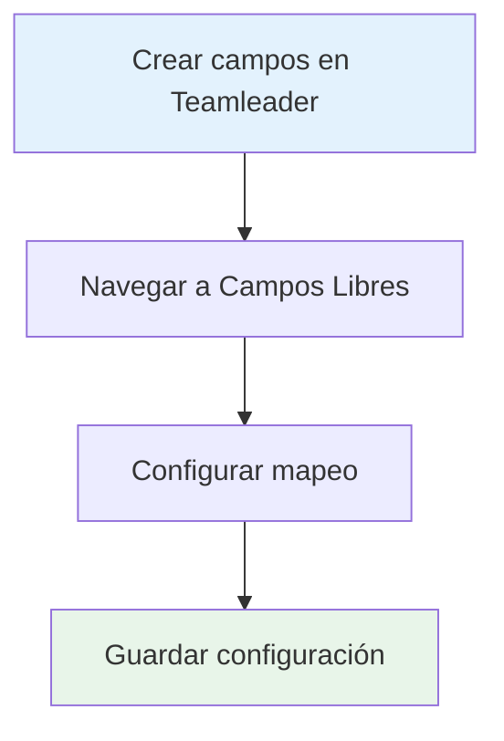

1. **Crear campos en Teamleader**
   - Ve a Configuración → Campos personalizados
   - Crea los campos que necesitas

2. **Mapear en Centralita**
   - En configuración, sección "Campos Libres"
   - Por cada campo de Teamleader, selecciona qué información debe guardar la IA:

```text
custom_field_cif       ↔ "CIF encontrado"
custom_field_sector    ↔ "Sector de actividad"
custom_field_empleados ↔ "Número de empleados"
```

3. **Guardar configuración**
    - Haga clic en "Guardar"

!!! tip "Consejo"
    Los campos libres son muy útiles para segmentar tu base de datos y crear listas de marketing personalizadas.

---

## :schedule: Sección: Tiempos de Espera

### :timer: Cierre Automático de Pantalla

Tiempo de inactividad antes de que Centralita cierre automáticamente las ventanas de alta de nuevos registros.

| Opción | Tiempo | Ideal para |
|--------|--------|------------|
| **Rápido** | 30 segundos | Altas rápidas, muchos registros |
| **Normal** | 2 minutos | Uso estándar |
| **Lento** | 5 minutos | Altas complejas, mucha información |
| **Manual** | Nunca | Cierras manualmente |

!!! info "Recomendación"
    Usa el modo "Normal" (2 minutos) para la mayoría de casos. Si necesitas más tiempo para introducir datos, usa "Lento" (5 minutos).

---

## :save: Guardar y Aplicar Cambios

### :check_circle: Botón "Guardar"

Haga clic en **"Guardar"** para aplicar todos los cambios de configuración:

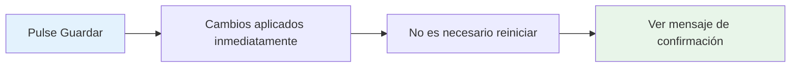

- ✅ Los cambios se aplican inmediatamente
- ✅ No es necesario reiniciar la aplicación
- ✅ Verás un mensaje de confirmación

### :restore: Botón "Restaurar Valores por Defecto"

Restaura toda la configuración a los valores originales de fábrica.

!!! warning "⚠️ Pérdida de Configuración"
    Al restaurar valores por defecto, perderás TODA tu configuración personalizada, incluyendo API keys. Usa con precaución.

---

## :checklist: Resumen de Configuración

### :rule: Configuración Mínima Requerida

Para que Centralita funcione correctamente, necesitas configurar **obligatoriamente**:

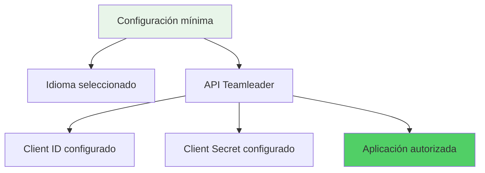

- [ ] **Idioma**: Seleccionar idioma de la interfaz
- [ ] **API de Teamleader**: Client ID y Client Secret
- [ ] **Autorizar Teamleader**: Pulse el botón de autorización

### :star: Configuración Recomendada

Para aprovechar todas las funcionalidades:

<div class="task-list" markdown>

- [ ] **Idioma y tema**: Personalizar interfaz
- [ ] **API de Teamleader**: Configurada y autorizada
- [ ] **OpenRouter**: API key configurada
- [ ] **Modelo IA**: Gemini 2.5 Flash Lite seleccionado
- [ ] **Grabación**: Modo interno (1) u OBS (2)
- [ ] **Emparejamiento Android**: Conectado
- [ ] **Campos libres**: Mapeados

</div>

---

## :build: Solución de Problemas

### :error_outline: Problema: No puedo guardar la configuración

**Causa**: No tienes permisos de escritura en el archivo de configuración.

**Solución**:
1. Cierra Centralita
2. Ejecútela como administrador: clic con el botón derecho → "Ejecutar como administrador"
3. Intenta guardar nuevamente

### :vpn_key: Problema: La API key de OpenRouter no se guarda

**Causa**: Formato incorrecto de la API key.

**Solución**:
1. Verifica que la API key comienza con `sk-or-v1-`
2. Copia directamente desde OpenRouter sin espacios
3. Pega en el campo sin añadir caracteres adicionales

### :wifi_off: Problema: El emparejamiento Android falla

**Causa**: Dispositivos no están en la misma red WiFi.

**Solución**:
1. Verifica que ambos dispositivos usan la misma WiFi
2. Desactiva VPN temporalmente
3. Reinicia la aplicación JustRemotePhone en ambos dispositivos

---

## :verified: Verificación de Configuración

### :test: Test de Conexión Teamleader

Después de configurar la API:

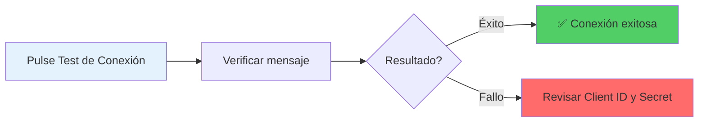

1. **Haga clic en "Test de Conexión"**
2. **Verifica mensaje**: "✅ Conexión exitosa"
3. **Si falla**: Revisa Client ID y Client Secret

### :smart_toy: Test de OpenRouter

Después de configurar la IA:

1. **Haga clic en "Test OpenRouter"**
2. **Verifica mensaje**: "✅ API Key válida"
3. **Si falla**: Revisa API key y conexión a internet

### :phone_android: Test de Emparejamiento

Después de emparejar Android:

1. **Realiza una llamada de prueba**
2. **Verifica que Centralita la detecta**
3. **Check**: Deberías ver notificación en Windows

---

## :school: Próximos Pasos

Una vez configurada Centralita:

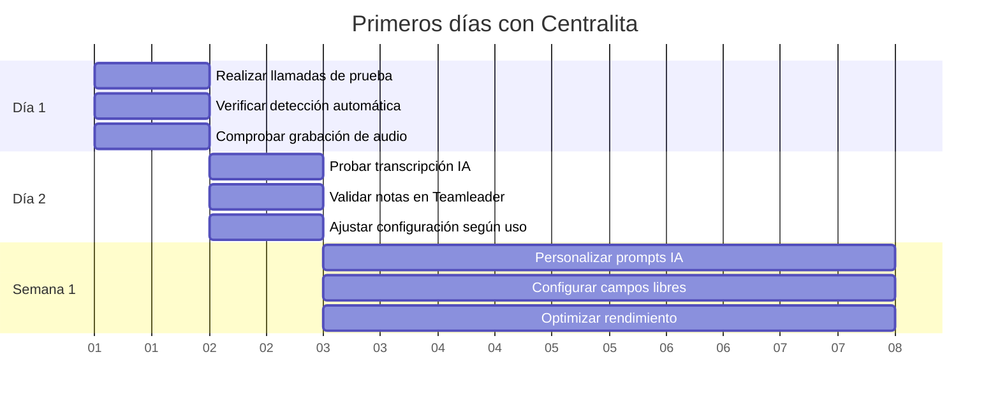

1. **Realiza llamadas de prueba**
   - Verifica detección automática
   - Comprueba grabación de audio
   - Valida transcripción con IA

2. **Ajusta configuración según uso**
   - Modifica prompt de IA si es necesario
   - Cambia tema visual según preferencia
   - Ajusta tiempos de espera

3. **Forma a tu equipo**
   - Enseña a usar la interfaz
   - Comparte mejores prácticas
   - Resuelve dudas iniciales

---

## :phone: Soporte

Si tienes problemas con la configuración:

| Tipo de soporte | Contacto |
|-----------------|----------|
| **Email** | soporte@alcatic.com |
| **Web** | [https://alca.co/](https://alca.co/) |
| **Horario** | Lunes a Viernes, 9:00 - 18:00 (CET) |

!!! tip "Consejo"
    Para una resolución más rápida, incluye capturas de pantalla de la configuración actual.

---

## :checklist: ✅ Conclusión

La pantalla de configuración de Centralita Teamleader te permite:

- ✅ **Personalizar idioma y apariencia**
- ✅ **Conectar con Teamleader** (OAuth2)
- ✅ **Configurar OpenRouter** (transcripción IA)
- ✅ **Ajustar grabación de audio** (interna/OBS)
- ✅ **Emparejar dispositivo Android**
- ✅ **Mapear campos libres** de Teamleader
- ✅ **Controlar tiempos de espera**

Con todo configurado correctamente, Centralita automatizará completamente el flujo de tus llamadas, desde la detección hasta la creación de notas en Teamleader.

!!! success "¿Listo para configurar tu Centralita?"
    [**Volver a Inicio Rápido**](inicio-rapido-centralita-teamleader.md){ .md-button .md-button--primary }
