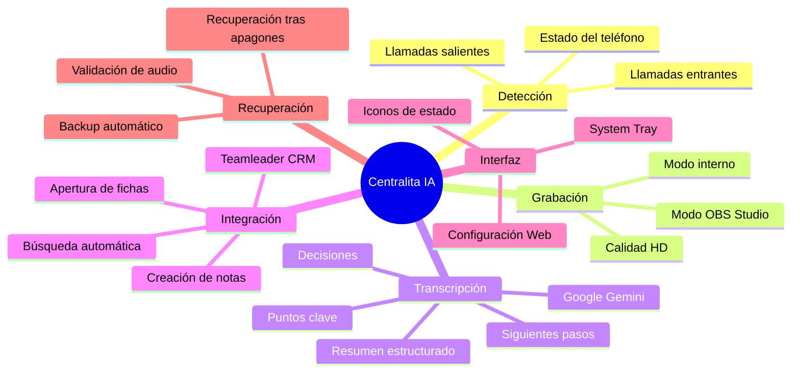
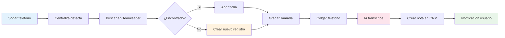
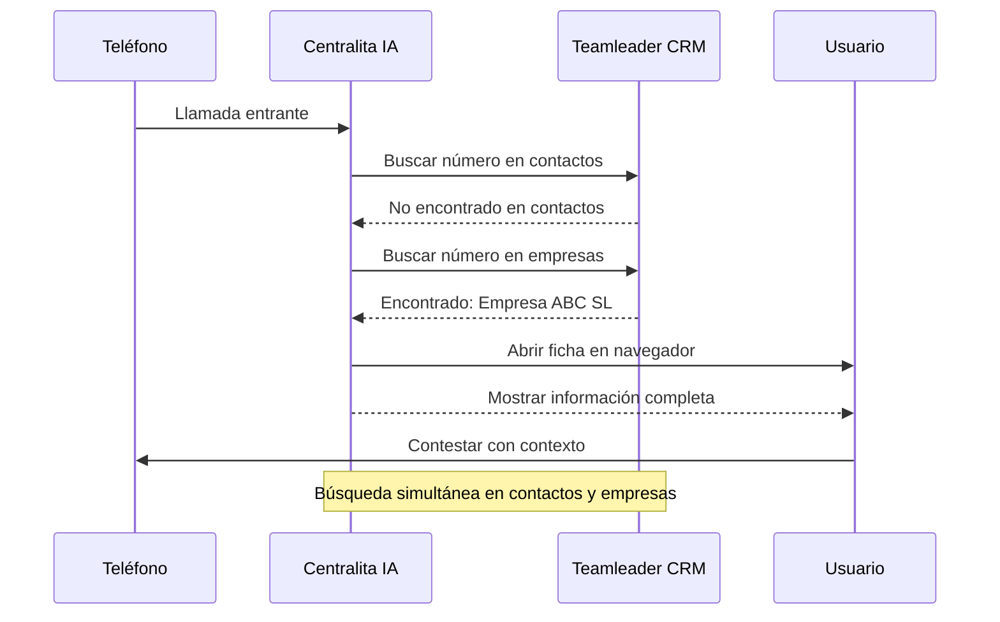
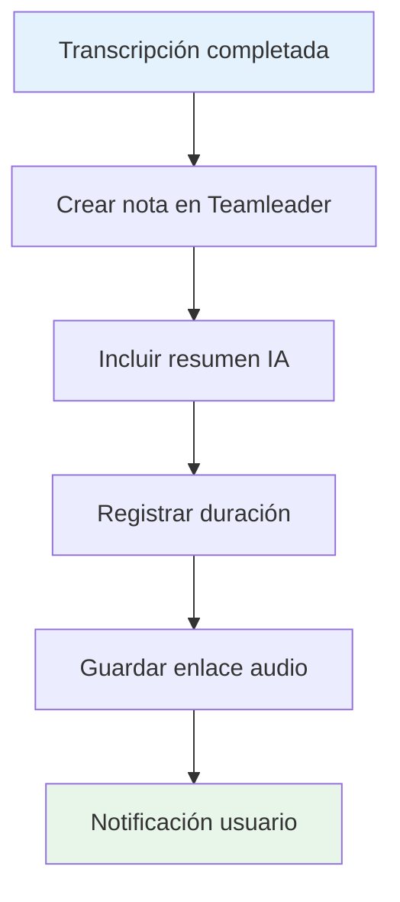
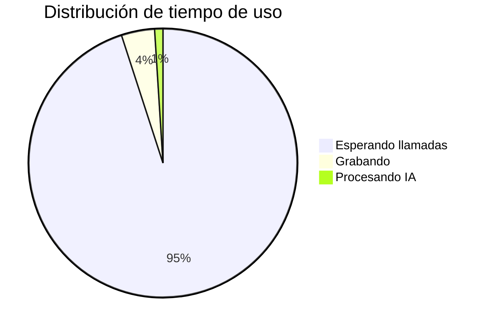
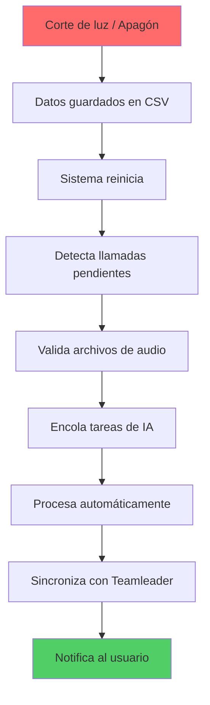
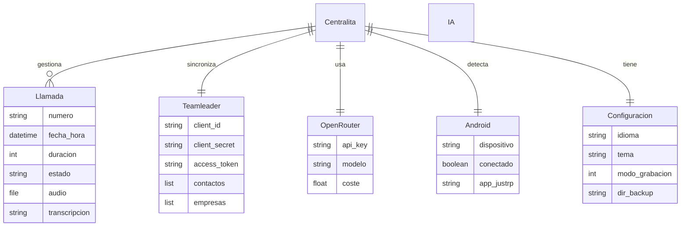

# 🔧 ¿Cómo funciona Centralita IA?

Centralita IA Teamleader es un **sistema de gestión de llamadas con inteligencia artificial** que automatiza todo el proceso de atención telefónica para PYMEs. Funciona en segundo plano, detecta las llamadas automáticamente, las graba, las transcribe y crea notas en tu CRM Teamleader sin que tengas que hacer nada manual.

!!! success "🎯 Automatización Total"
    Desde que suena el teléfono hasta que la nota aparece en Teamleader, no necesitas hacer nada. Centralita IA se encarga de todo el proceso automáticamente.

---

## 🗺️ Mapa Mental del Sistema



---

## 📊 Flujo de Trabajo Automatizado

El sistema sigue este flujo paso a paso cada vez que recibes una llamada:

### :material-clock-fast: El Flujo Completo



!!! info "Sin intervención manual"
    No necesitas presionar ningún botón. El sistema está siempre atento en segundo plano.

---

## 🎙️ Detalle del Flujo de Llamada

### :material-phone: 1. Detección Automática de Llamadas

Centralita IA detecta automáticamente cuando:
- ✅ Recibes una llamada entrante
- ✅ Realizas una llamada saliente
- ✅ El teléfono está conectado o desconectado

!!! tip "Hands-free"
    No necesitas presionar botones ni iniciar ningún proceso. Centralita IA detecta la llamada y arranca el flujo automático.

### :material-magnify: 2. Búsqueda del Cliente en Teamleader

Inmediatamente al detectar una llamada, Centralita IA:



!!! tip "Preparado para contestar"
    Al contestar, ya tienes toda la información del cliente visible en tu pantalla. No pierdes tiempo buscando datos mientras hablas.

### :material-record: 3. Grabación de la Conversación

Centralita IA graba la llamada completa automáticamente:

??? info "Modos de grabación disponibles"

=== "🎤 Grabación Interna"
- Alta calidad de audio para una transcripción precisa
- Audio de ambos lados de la conversación
- Sin interrupciones ni presionar botones
- Ideal para teléfonos físicos

=== "🎬 Grabación con OBS"
- Máxima calidad de audio
- Compatible con softphones VoIP
- Captura audio del sistema
- Requiere configuración adicional

!!! info "Grabación transparente"
    La grabación es imperceptible para el cliente. No afecta la calidad de la llamada.

### :material-brain: 4. Transcripción con Inteligencia Artificial

Cuando colgas el teléfono, la IA:

<div class="grid cards" markdown>

-   :material-text-fields: **Transcripción completa**

    Convierte audio a texto con alta precisión

-   :material-lightbulb: **Puntos clave**

    Extrae los temas principales discutidos

-   :material-check-circle: **Decisiones tomadas**

    Captura acuerdos y compromisos

-   :material-arrow-right: **Siguientes pasos**

    Identifica acciones con fechas y responsables

-   :material-alert: **Objeciones**

    Detecta dudas o preocupaciones del cliente

-   :material-summarize: **Resumen estructurado**

    Genera un resumen con lo más importante

</div>

!!! success "Resumen accionable"
    La IA no solo transcribe: crea un resumen útil con lo que realmente importa para tu negocio.

### :material-crm: 5. Creación Automática de Nota en Teamleader

Finalmente, Centralita IA:



La nota aparece automáticamente en el CRM, lista para que tú o tu equipo la consulten.

---

## 🔄 Estados de una Llamada

```mermaid
stateDiagram-v2
    [*] --> Esperando
    Esperando --> Detectada: Teléfono suena
    Detectada --> Buscando: Buscar en Teamleader
    Buscando --> FichaAbierta: Encontrado
    Buscando --> NuevoRegistro: No encontrado
    FichaAbierta --> Grabando: Contestas
    NuevoRegistro --> Grabando: Introduces datos
    Grabando --> Procesando: Cuelgas
    Procesando --> Transcribiendo: Enviar audio a IA
    Transcribiendo --> CreandoNota: Recibir resumen
    CreandoNota --> Completada: Guardar en Teamleader
    Completada --> Esperando: Sistema listo

    note right of Esperando
        🟢 Icono verde
        Listo para recibir
    end note

    note right of Grabando
        🔴 Icono rojo
        Grabando llamada
    end note

    note right de Procesando
        🟡 Icono amarillo
        Procesando con IA
    end note
```

!!! info "Indicadores visuales"
    - 🟢 **Verde**: Sistema listo, esperando llamadas
    - 🔴 **Rojo**: Grabación activa
    - 🟡 **Amarillo**: Procesando con IA

---

## 🎯 Por qué es importante para tu negocio?

### :material-trending-up: Ahorra tiempo

| Aspecto | Sin Centralita | Con Centralita |
|---------|----------------|---------------|
| **Notas manuales** | ~10 minutos por llamada | Automático (0 minutos) |
| **Búsquedas de clientes** | ~3-5 minutos por llamada | Automático (0 minutos) |
| **Resúmenes perdidos** | Frecuentes | Nunca |

!!! check "Beneficios:"
    - **No más notas manuales**: la IA toma notas por ti
    - **No más búsquedas de clientes**: la ficha aparece automáticamente
    - **No más resúmenes perdidos**: todo queda registrado

### :material-star: Mejora la calidad del servicio

<div class="grid cards" markdown>

-   :material-account-box: **Atención personalizada**

    Tienes toda la información del cliente antes de contestar

-   :material-memory: **Sin olvidos**

    La IA detecta y registra los siguientes pasos

-   :material-history: **Historial completo**

    Todas las llamadas están disponibles para revisar

</div>

### :material-security: Reduce errores

| Problema | Sin Centralita | Con Centralita |
|----------|----------------|---------------|
| **Transcripción precisa** | Depende de memoria | Transcripción automática |
| **Datos actualizados** | Manual, lento | Sincronización automática |
| **Consistencia** | Variable | Mismo nivel para todas |

!!! success "Ventajas:"
    - **Transcripción precisa**: no dependes de recuerdos o notas apresuradas
    - **Datos actualizados**: todo se sincroniza automáticamente con Teamleader
    - **Consistencia**: mismo nivel de registro para todas las llamadas

---

## 💻 Integración con tu sistema

### :monitor: System Tray (Bandeja de Sistema)

Centralita IA funciona desde el área de notificación de Windows:



!!! info "Siempre disponible"
    El sistema funciona en segundo plano sin interrumpir tu trabajo normal.

### :settings: Configuración Web

???+ info "Secciones de configuración"

=== "🌐 Configuración general"
- Idioma: Español, Inglés, Francés
- Tema visual: 50 temas disponibles
- Módulos activos: Activar/desactivar funcionalidades

=== "🔑 Configuración de Teamleader"
- Credenciales OAuth2
- Tokens de acceso
- Scopes y permisos

=== "🤖 Configuración de IA"
- API Key de OpenRouter
- Modelo de IA (Gemini, GPT-4o)
- Prompt de instrucciones

=== "🎙️ Configuración de audio"
- Modo de grabación (interna/OBS)
- Rutas de grabación
- Formato de archivo

### :table: Hoja de Tiempo

Registro completo de todas las llamadas:

| Campo | Descripción |
|-------|-------------|
| **Fecha y hora** | Cuándo fue la llamada |
| **Número telefónico** | Quién llamó |
| **Nombre del cliente** | Encontrado en Teamleader |
| **Duración** | Tiempo de conversación |
| **Estado** | Grabada, transcrita, sincronizada |
| **Enlace** | URL a la nota en Teamleader |

---

## 🛡️ Recuperación ante Imprevistos



!!! warning "Recuperación automática"
    Si hay un corte de luz o el sistema se reinicia, Centralita IA recupera automáticamente todas las llamadas pendientes de procesar.

El sistema guarda el estado de cada llamada en tiempo real. Al volver a iniciar:

- ✅ **Detecta** llamadas pendientes de transcripción
- ✅ **Valida** los audios grabados
- ✅ **Reanuda** el procesamiento con IA automáticamente
- ✅ **Sincroniza** los datos con Teamleader

No pierdes ninguna información por cortes inesperados.

---

## 🔌 Arquitectura Técnica



!!! info "Arquitectura modular"
    El sistema está diseñado con módulos independientes que trabajan juntos pero pueden funcionar por separado.

---

## ✅ ¿Listo para empezar?

!!! success "Comienza hoy mismo"
    La instalación es sencilla y en menos de 10 minutos estarás automatizando la gestión de tus llamadas.

[ :material-download: Descargar Centralita Gratis](../castellano/link-descarga-software-centralita-teamleader.md){ .md-button .md-button--primary }

[ :material-book: Guía de Instalación](../castellano/inicio-rapido-centralita-teamleader.md){ .md-button }

[ :material-settings: Configuración Paso a Paso](../castellano/pantalla-configuracion-centralita-teamleader.md){ .md-button }

---

## 🔗 Recursos Adicionales

??? info "¿Tienes preguntas técnicas?"
    Revisa nuestra sección de [Preguntas Frecuentes](faq-tecnica.md) para respuestas sobre configuración, integración con Teamleader y solución de problemas.

| Documentación | Descripción |
|---------------|-------------|
| [Funcionalidades Principales](funcionalidades-core.md) | Todas las características disponibles |
| [Funcionalidades Avanzadas](funcionalidades-avanzadas.md) | OBS Studio, backup, multi-idioma |
| [Preguntas Frecuentes](faq-tecnica.md) | Solución de problemas comunes |
| [Integraciones](integraciones.md) | OBS Studio y otros sistemas |
