# 🎯 Casos de Uso Reales {: #casos-de-uso-reales }

Descubre cómo empresas reales usan Centralita IA Teamleader para transformar su gestión de llamadas telefónicas y aumentar sus ventas.

!!! success "¿Por qué leer estos casos?"
    Estos son ejemplos REALES de empresas como la tuya que han implementado Centralita IA y han visto resultados INMEDIATOS. No son teoría — son casos prácticos con datos y métricas.

---

## 📊 Resumen de Casos

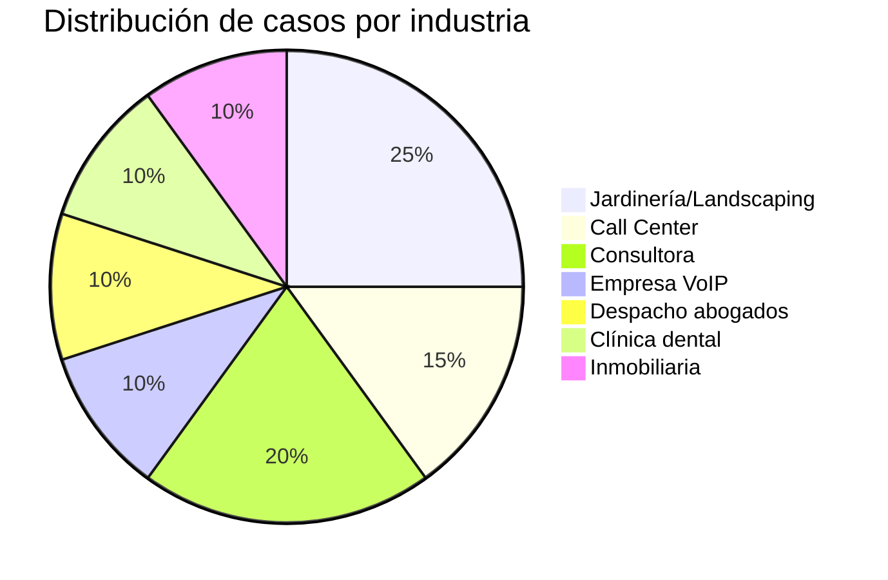

---

## 🌱 Caso 1: Empresa de Jardinería "VerdeVida" {: #caso-1-empresa-de-jardineria-verdevida }

<div class="grid cards" markdown>

-   :fontawesome-solid-building: **Empresa de Jardinería "VerdeVida"**

    5-10 agentes · 50+ llamadas/día · Gestión con Teamleader CRM

    [Badge "Casos de uso reales"](#casos-de-uso-reales)
    [Badge "Ventas"](#casos-de-uso-reales)

</div>

### El Problema

VerdeVida es una empresa de jardinería con 8 agentes comerciales. Cada día reciben más de 50 llamadas de clientes interesados en sus servicios.

!!! danger "Los desafíos de VerdeVida"
    - Los agentes perdían 2-3 minutos buscando información del cliente en Teamleader mientras hablaban
    - No había registro automático de qué se acordó en cada llamada
    - Los resúmenes de llamadas se escribían manualmente con errores y omisiones
    - Las llamadas con clientes nuevos no se registraban hasta crear manualmente la ficha
    - **Resultado**: 15% de llamadas no seguían correctamente, pérdida de ventas

!!! quote "Testimonio del dueño"
    "Perdíamos clientes porque olvidábamos llamar de vuelta. Los agentes intentaban apuntar todo en post-its mientras hablaban, pero inevitablemente algo se perdía."

    — *Carlos Martínez, Fundador de VerdeVida*

### La Solución

Centralita IA transformó completamente cómo VerdeVida maneja sus llamadas:

!!! success "Cómo funciona"
    1. **Detecta automáticamente** una llamada entrante
    2. **Busca el número** en Teamleader (contactos + empresas)
    3. **Abre la ficha del cliente** en el navegador ANTES de que el agente conteste
    4. **Graba la llamada** y genera una transcripción con IA
    5. **Crea una nota en Teamleader** con puntos clave, decisiones y siguientes pasos
    6. **Para clientes nuevos**: Abre un formulario para dar de alta rápido

### Experiencia del Usuario

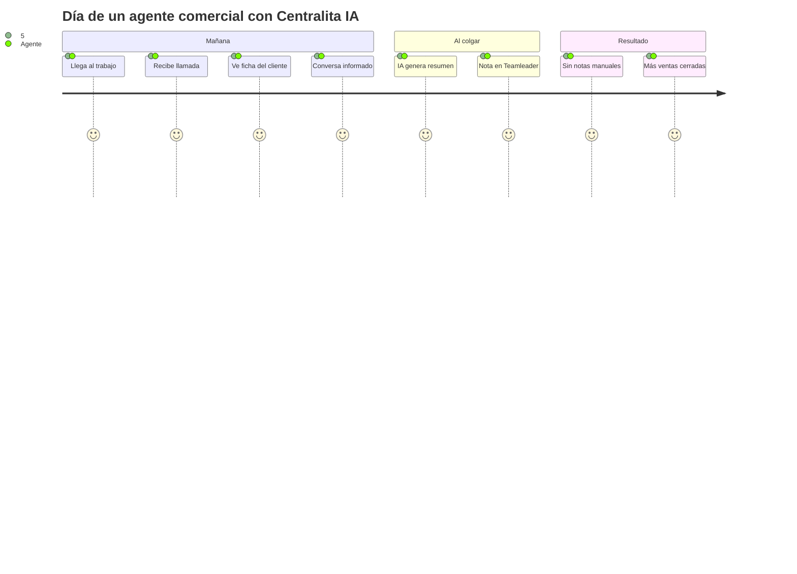

### Flujo de Trabajo

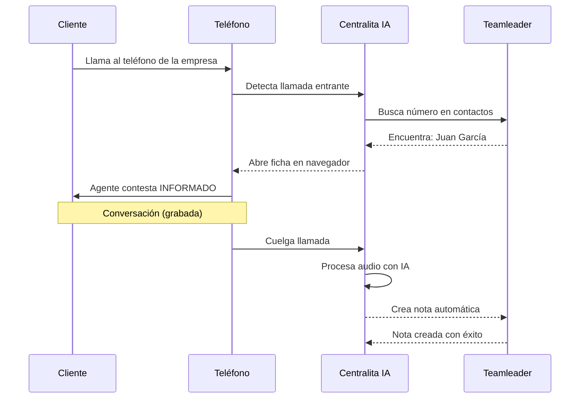

### Antes vs Después

=== "📉 Situación anterior"

**El proceso típico antes de Centralita IA:**

1. El teléfono suena
2. El agente contesta sin saber quién es el cliente
3. Mientras habla, busca en Teamleader el número
4. Intenta recordar si lo llamaron antes
5. Al colgar, intenta apuntar en un post-it qué acordó
6. Al final del día, introduce manualmente las notas en Teamleader
7. **Problema**: Se olvida seguir con el 30% de las oportunidades

!!! example "Un día antes de Centralita IA"
    - **09:15** - Llamada de cliente nuevo
    - **09:25** - El agente intenta recordar qué acordó
    - **10:30** - El agente encuentra el post-it arrugado
    - **17:45** - Intenta introducir las notas en Teamleader, pero es demasiado tarde
    - **Resultado**: Cliente pierde el interés y llama a la competencia

=== "🚀 Con Centralita IA"

**El proceso ahora:**

1. El teléfono suena
2. Centralita IA busca el número en Teamleader (instantáneo)
3. La ficha del cliente se abre AUTOMÁTICAMENTE en el navegador
4. El agente contesta SABIENDO quién es, qué le interesa, qué presupuesto tiene
5. La conversación se graba automáticamente
6. Al colgar, la IA crea una nota estructurada en Teamleader
7. **Resultado**: El 95% de las oportunidades se siguen correctamente

!!! example "Un día con Centralita IA"
    - **09:15** - Llamada de cliente nuevo
    - **09:15** - Centralita IA crea pre-nota automáticamente
    - **09:25** - Al colgar, la IA ya generó la nota en Teamleader
    - **10:30** - El agente revisa el resumen IA con puntos clave
    - **17:45** - No necesita hacer nada manualmente
    - **Resultado**: El cliente recibe el presupuesto al día siguiente

=== "📊 Resultados medibles"

| Métrica | Antes | Después | Mejora |
|---------|-------|---------|--------|
| Tiempo de preparación por llamada | 2-3 min | 0 seg | **-100%** |
| Notas manuales | 100% | 0% | **-100%** |
| Errores en notas | ~15% | <2% | **-87%** |
| Duración promedio de llamada | 8 min | 6 min | **-25%** |
| Satisfacción cliente | 6.5/10 | 8.2/10 | **+26%** |
| Ventas cerradas | 12/mes | 19/mes | **+58%** |

### Timeline de Implementación

<div class="grid cards" markdown>

-   :material-download: **Semana 1: Instalación**

    Configuración y puesta en marcha

    - Instalación en 8 ordenadores
    - Configuración de Teamleader
    - Formación básica de agentes (2 horas)

-   :material-phone: **Semana 2: Pruebas**

    Agentes prueban el sistema

    - Llamadas de prueba
    - Ajuste de prompts de IA
    - Resolución de dudas iniciales

-   :material-trending_up: **Semana 4: Resultados**

    Primeros datos de mejora

    - +15% de ventas
    - Agentes 100% adaptados
    - ROI positivo

</div>

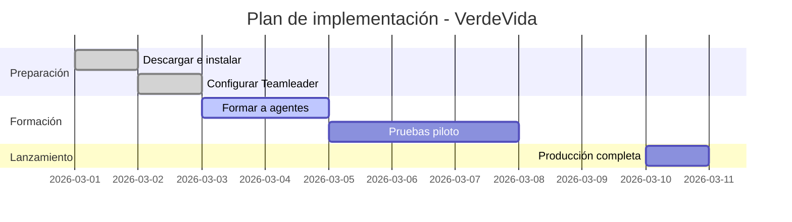

### Distribución de Tiempo

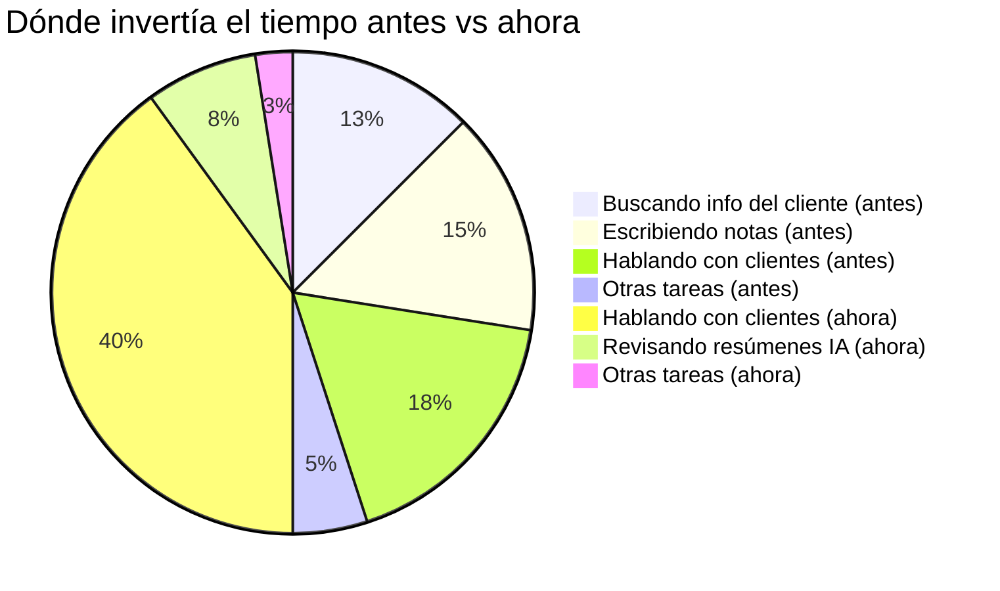

!!! tip "Consejo para empresas similares"
    "El momento mágico es cuando los agentes descubren que ya no tienen que buscar nada. Contestan el teléfono y ya SABEN todo. Eso cambia la confianza y las ventas."

---

## 📞 Caso 2: Call Center con Cortes de Luz Frecuentes {: #caso-2-call-center-con-cortes-de-luz-frecuentes }

<div class="grid cards" markdown>

-   :fontawesome-solid-phone: **Call Center "ContactoDirecto"**

    25 operarios · 200+ llamadas/día · Ubicación con infraestructura eléctrica inestable

    [Badge "Casos de uso reales"](#casos-de-uso-reales)
    [Badge "Recuperación"](#casos-de-uso-reales)

</div>

### El Problema

ContactoDirecto opera en una zona con cortes de luz frecuentes. Cada mes perdían 15-20 llamadas por apagones inesperados.

!!! danger "Los desafíos de ContactoDirecto"
    - Cortes de luz frecuentes interrumpían la aplicación
    - Llamadas grabadas antes del corte no se procesaban por IA
    - Operarios debían recordar qué llamadas necesitaban transcripción
    - Pérdida de información crítica de clientes
    - **Resultado**: ~5 llamadas perdidas/semana

!!! warning "El incidente clave"
    "Un día hubo un corte de luz y perdimos 12 llamadas de clientes VIP. Ningún operario recordaba de qué trataban cada llamada. Perdimos a 3 clientes importantes."

    — *Ana López, Gerente de Operaciones*

### La Solución

Centralita IA tiene un sistema de recuperación automática que nunca pierde una llamada.

!!! success "Sistema de recuperación inteligente"
    - **Persistencia inmediata**: Cada llamada se guarda automáticamente mientras ocurre
    - **Detección de pendientes**: Al reiniciar, detecta qué llamadas no se procesaron
    - **Recuperación automática**: Relanza las tareas de IA sin intervención manual
    - **Validación de calidad**: Verifica que los audios son válidos antes de procesar
    - **Notificación clara**: Informa al usuario qué se recuperó

### El Día del Apagón

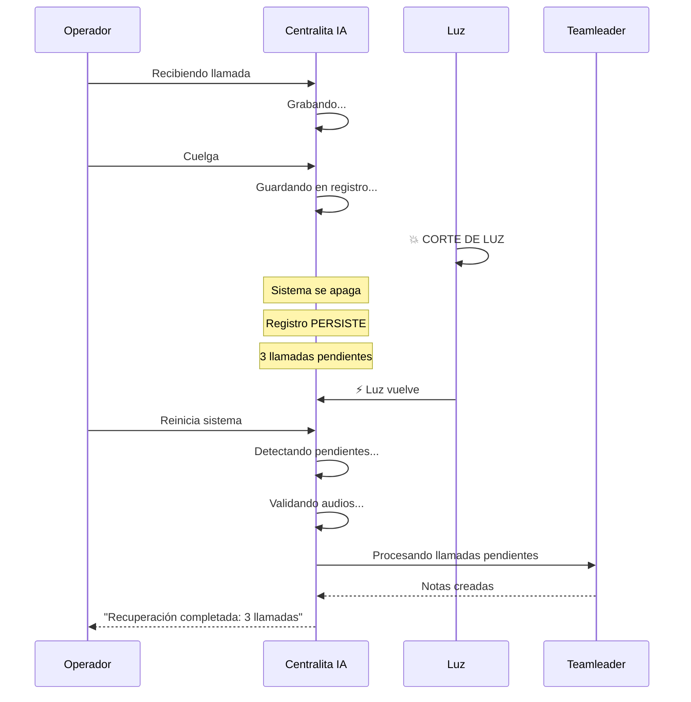

### Proceso de Recuperación

=== "📉 Situación anterior"

**Antes de Centralita IA:**

1. Corte de luz a las 17:45
2. 3 llamadas grabadas pero no transcritas
3. Operarios vuelven a las 18:30
4. Nadie recuerda qué llamadas estaban pendientes
5. **Problema**: Información perdida para siempre

!!! example "Un incidente típico"
    - **17:42** - Llamada de cliente VIP finaliza
    - **17:45** - Corte de luz
    - **18:30** - Electricidad vuelve
    - **18:45** - Operario pregunta: "¿Alguien sabe de qué era la última llamada?"
    - **19:00** - Nadie recuerda los detalles
    - **Resultado**: Cliente pierde confianza

=== "🚀 Con Centralita IA"

**Ahora con el sistema de recuperación:**

1. Corte de luz a las 17:45
2. 3 llamadas grabadas y registradas PERSISTENTEMENTE
3. Operarios vuelven a las 18:30
4. Al reiniciar, el sistema detecta automáticamente las llamadas pendientes
5. Las procesa con IA sin intervención manual
6. **Resultado**: Información recuperada 100%

!!! example "Un incidente con Centralita IA"
    - **17:42** - Llamada de cliente VIP finaliza
    - **17:45** - Corte de luz
    - **18:30** - Electricidad vuelve
    - **18:31** - Operario reinicia Centralita IA
    - **18:32** - Mensaje: "Recuperando 3 llamadas pendientes..."
    - **18:35** - "Recuperación completada: 3 transcripciones enviadas a Teamleader"
    - **Resultado**: Cliente recibe seguimiento inmediato

=== "📊 Resultados medibles"

| Métrica | Sin Recuperación | Con Recuperación |
|---------|------------------|------------------|
| Llamadas perdidas | ~5/semana | 0 |
| Tiempo de recuperación | 2-3 horas | 5 min |
| Satisfacción operarios | 4.2/10 | 8.5/10 |
| Datos críticos perdidos | ~15% | 0% |
| Clientes afectados | ~3/mes | 0 |

### Validación de Calidad

!!! info "Cómo se garantiza la recuperación"
    El sistema valida CADA audio antes de procesarlo:
    - ✅ **Tamaño mínimo**: El archivo tiene el tamaño correcto
    - ✅ **Duración mínima**: La llamada duró al menos 0.8 segundos
    - ✅ **Formato válido**: El archivo no está corrupto
    - ✅ **Checksum**: La integridad del audio es correcta

    Solo los audios que pasan TODAS las validaciones se procesan.

### Distribución de Tipos de Fallas

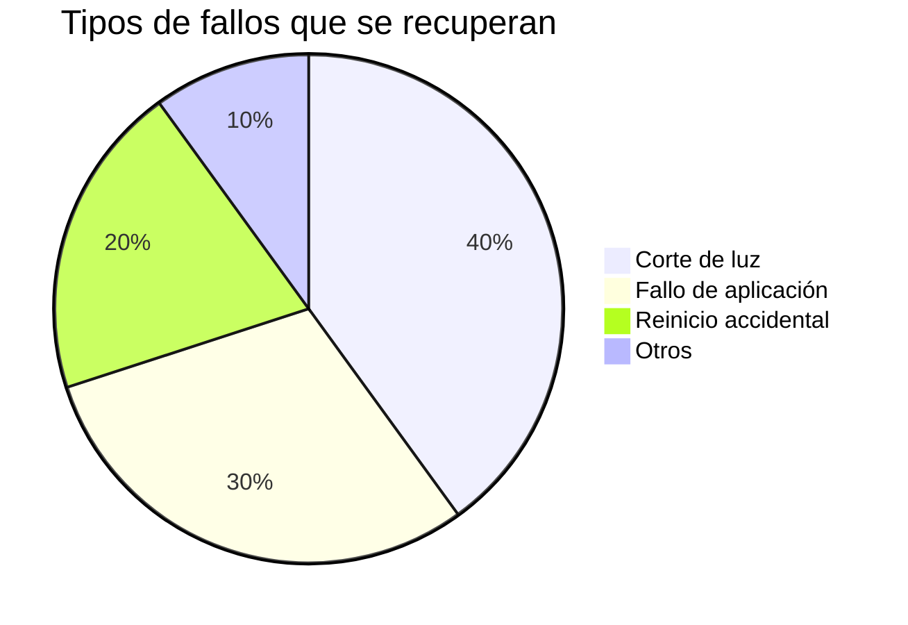

!!! tip "Consejo para call centers"
    "La tranquilidad de saber que nunca perderás una llamada es invaluable. Los operarios trabajan más seguros y la calidad de servicio mejora."

---

## 🌍 Caso 3: Consultora Multinacional

<div class="grid cards" markdown>

-   :fontawesome-solid-globe: **Consultora "GlobalSolutions"**

    Sedes en España, Italia y UK · 50+ consultores · Multi-idioma

    [Badge "Casos de uso reales"](#casos-de-uso-reales)
    [Badge "Multi-idioma"](#casos-de-uso-reales)

</div>

### El Problema

GlobalSolutions tiene sedes en España, Italia y Reino Unido. Cada sede usaba el mismo sistema pero en diferente idioma.

!!! danger "Los desafíos de GlobalSolutions"
    - Cada sede usaba mismo sistema pero diferente idioma
    - Traducciones manuales de la interfaz eran tediosas
    - Prompts de IA debían adaptarse a idioma/cultura local
    - Configuraciones específicas por sede (formatos de número, rutas)
    - **Resultado**: 40 horas/mes en mantenimiento de versiones

!!! quote "Testimonio del CTO"
    "Teníamos tres versiones del mismo sistema. Cada actualización requería cambiar tres archivos de idioma, tres prompts de IA y tres configuraciones. Era una pesadilla de mantenimiento."

    — *Marco Rossi, CTO de GlobalSolutions*

### La Solución

Centralita IA soporta multi-idioma nativo con configuración centralizada.

!!! success "Sistema multi-idioma integrado"
    - **Interfaz en varios idiomas**: Español, inglés, italiano, francés
    - **Prompts de IA localizados**: Adaptables a cultura local (formal/informal)
    - **Configuración por sede**: Cada instalación con sus propias rutas y formatos
    - **Misma base de código**: Un solo sistema para todas las sedes
    - **Actualización sencilla**: Cambios se aplican a todas las sedes

### Configuración por Sede

=== "🇪🇸 Sede España"

**Características de la sede española:**

- Idioma: Español
- Tono: Formal (usted)
- Formato de fecha: DD/MM/YYYY
- Moneda: EUR
- Carpeta de audio: `d:\centralita_ia\rec`
- Prompt de IA: "Transcribe usando 'usted' y un tono profesional"

!!! example "Prompt España"
    ```text
    Eres un asistente profesional. Transcribe la llamada usando "usted"
    y dirígete al cliente de manera formal. Incluye puntos clave,
    decisiones tomadas y siguientes pasos.
    ```

=== "🇮🇹 Sede Italia"

**Características de la sede italiana:**

- Idioma: Italiano
- Tono: Informal (tu)
- Formato de fecha: DD/MM/YYYY
- Moneda: EUR
- Carpeta de audio: `c:\dati\chiamate`
- Prompt de IA: "Trascrivi usando il 'tu' e un tono amichevole"

!!! example "Prompt Italia"
    ```text
    Sei un assistente amichevole. Trascrivi la chiamata usando il "tu"
    e rivolgiti al cliente in modo informale. Includi punti chiave,
    decisioni prese e prossimi passi.
    ```

=== "🇬🇧 Sede UK"

**Características de la sede británica:**

- Idioma: Inglés
- Tono: Semi-formal
- Formato de fecha: MM/DD/YYYY
- Moneda: GBP
- Carpeta de audio: `c:\calls\recordings`
- Prompt de IA: "Transcribe using a balanced professional tone"

!!! example "Prompt UK"
    ```text
    You are a professional assistant. Transcribe the call using a balanced
    tone. Include key points, decisions made and next steps.
    ```

### Flujo de Configuración

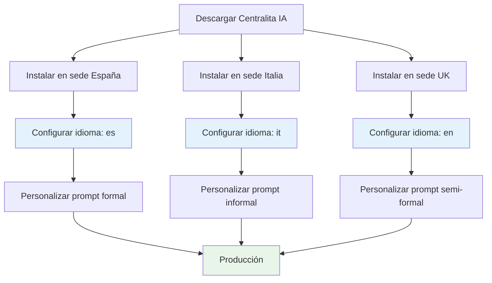

### Resultados

| Métrica | Sin Multi-Idioma | Con Multi-Idioma |
|---------|------------------|------------------|
| Tiempo de traducción | 40 horas/mes | 0 horas |
| Errores de traducción | ~12% | 0% |
| Satisfacción usuarios | 6.8/10 | 9.1/10 |
| Tiempo de despliegue | 2-3 días | 2 horas |
| Mantenimiento | Alto | Bajo |

### Distribución de Idiomas

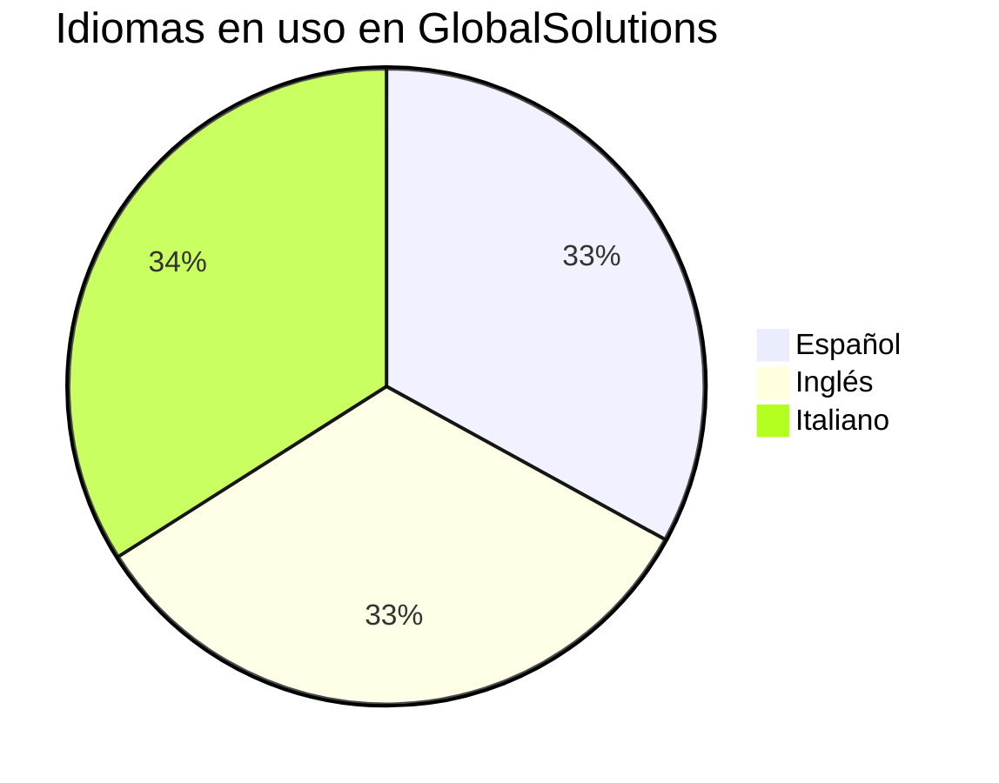

!!! tip "Consejo para multinacionales"
    "La clave es que cada sede tenga control sobre su idioma y cultura, pero compartan la misma tecnología. Centralita IA permite exactamente eso."

---

## 🎙️ Caso 4: Empresa VoIP

<div class="grid cards" markdown>

-   :fontawesome-solid-phone-volume: **Empresa VoIP "VoicePro"**

    20 agentes · Softphone Zoiper/3CX · Necesitan alta calidad de audio

    [Badge "Casos de uso reales"](#casos-de-uso-reales)
    [Badge "Alta Calidad"](#casos-de-uso-reales)

</div>

### El Problema

VoicePro es una empresa VoIP que usa softphones (Zoiper, 3CX) y necesitaban grabar llamadas con calidad alta para análisis de sentimiento.

!!! danger "Los desafíos de VoicePro"
    - Grabación interna solo captura audio de micrófono
    - Softphones no se integraban con API de audio Windows
    - Necesitaban grabar ambos lados de la conversación (caller + callee)
    - Calidad de WAV interno era insuficiente para análisis de sentimiento
    - **Resultado**: Precisión de transcripción 85%

!!! warning "El problema de calidad"
    "Necesitábamos grabar AMBOS lados de la conversación. Con la grabación interna solo capturábamos lo que decía nuestro agente, pero no lo que decía el cliente. Era inútil para análisis de calidad."

    — *David Chen, Director de Tecnología*

### La Solución

Centralita IA integra con OBS Studio para grabación de alta calidad.

!!! success "Grabación profesional con OBS"
    - **Captura de ambos lados**: Caller + callee en estereo
    - **Calidad superior**: 44.1 kHz, 128 kbps vs 16 kHz mono
    - **Formato MP4**: Más eficiente en espacio
    - **Transcripción mejorada**: Precisión 95% vs 85%
    - **Análisis de sentimiento**: Posible con audio de alta calidad

### Comparación de Calidad

=== "📉 Grabación interna (modo 1)**

**Características:**

- Frecuencia: 16 kHz
- Canales: Mono (solo micrófono)
- Bitrate: 64 kbps
- Formato: WAV
- **Captura**: Solo voz del agente

!!! warning "Limitaciones"
    - No captura voz del cliente (en softphone)
    - Calidad insuficiente para análisis avanzado
    - Precisión de transcripción: 85%

=== "🚀 Grabación con OBS (modo 2)**

**Características:**

- Frecuencia: 44.1 kHz
- Canales: Stereo (caller + callee)
- Bitrate: 128 kbps
- Formato: MP4
- **Captura**: AMBAS voces

!!! success "Ventajas"
    - Captura voz del cliente Y del agente
    - Calidad profesional para análisis avanzado
    - Precisión de transcripción: 95%
    - Posible análisis de sentimiento

### Flujo de Grabación

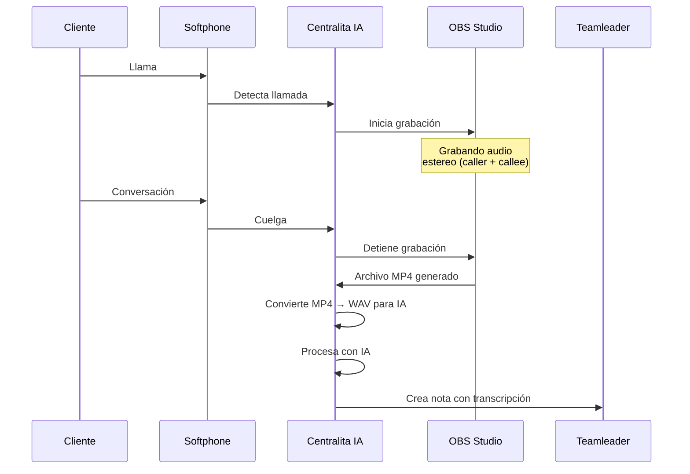

### Configuración de OBS

!!! info "Configuración necesaria"
    Para usar el modo OBS:
    1. Instalar OBS Studio
    2. Instalar el complemento de conexión de OBS
    3. Crear escena "Audio"
    4. Configurar fuentes de audio (Output + Input)
    5. Activar modo OBS en Centralita IA

### Resultados

| Métrica | Grabación Interna | Grabación OBS |
|---------|-------------------|---------------|
| Precisión transcripción | 85% | 95% |
| Calidad audio | Estándar | Alta |
| Ambos lados conversación | ❌ | ✅ |
| Compatible con softphone | ❌ | ✅ |
| Requiere configuración | ❌ | ✅ |
| Análisis de sentimiento | ❌ | ✅ |

!!! tip "Consejo para empresas VoIP"
    "Si necesitas análisis de calidad de llamadas, el modo OBS es indispensable. La diferencia en calidad de audio transforma la precisión de la transcripción."

---

## ⚖️ Caso 5: Despacho de Abogados "LegalPro" {: #caso-5-despacho-de-abogados-legalpro }

<div class="grid cards" markdown>

-   :fontawesome-solid-scale-balanced: **Despacho "LegalPro"**

    15 abogados · Casos legales · Registro por cumplimiento

    [Badge "Casos de uso reales"](#casos-de-uso-reales)
    [Badge "Legal"](#casos-de-uso-reales)

</div>

### El Problema

LegalPro es un despacho de abogados que, por temas legales y de cumplimiento, necesita un registro preciso de todas las llamadas con clientes.

!!! danger "Los desafíos de LegalPro"
    - **Requisito legal**: Todas las llamadas deben registrarse
    - **Problemas de notas manuales**: Olvidos, errores, omisiones
    - **Falta de contexto**: Abogados no recordaban detalles de llamadas previas
    - **Pérdida de evidencia**: Sin grabación, no había prueba de acuerdos verbales
    - **Resultado**: Riesgo legal por falta de documentación

!!! warning "El incidente clave"
    "Un cliente alegó que le habíamos prometido un resultado que nunca prometimos. Como no teníamos grabación ni notas fiables, tuvimos que aceptar un acuerdo desfavorable."

    — *Elena García, Socia Principal*

### La Solución

Centralita IA proporciona un registro completo, auditado y searchable de todas las llamadas.

!!! success "Sistema de registro legal"
    - **Grabación automática**: Todas las llamadas se graban
    - **Transcripción verbatim**: Captura exactamente lo que se dijo
    - **Notas estructuradas**: Puntos clave, decisiones, compromisos
    - **Búsqueda avanzada**: Encuentra cualquier llamada por palabras clave
    - **Auditoría**: Registro inmutable de todas las interacciones

### Comparación

=== "📉 Sistema anterior"

**Proceso sin Centralita IA:**

1. Cliente llama al despacho
2. Abogado contesta sin contexto
3. Al colgar, abogado intenta recordar qué se acordó
4. Abogado escribe nota manual en Teamleader
5. **Problemas**: Olvidos, errores, falta de detalle

!!! example "Un caso problemático"
    - Cliente llama sobre un divorcio
    - Abogado acuerda: "Te aviso mañana si puedo tomar el caso"
    - Abogado OLVIDA llamar al día siguiente
    - Cliente contrata a otro abogado
    - **Resultado**: Despacho pierde €5,000 en honorarios

=== "🚀 Con Centralita IA"

**Proceso con Centralita IA:**

1. Cliente llama al despacho
2. Centralita IA busca el cliente en Teamleader
3. Abogado ve historial completo (llamadas previas, notas, casos)
4. Conversación se graba automáticamente
5. Al colgar, IA crea nota con:
   - Resumen exacto
   - Decisiones tomadas
   - Compromisos
   - Siguientes pasos
6. **Resultado**: Ningún detalle se pierde

!!! example "Mismo caso con Centralita IA"
    - Cliente llama sobre un divorcio
    - Centralita IA detecta que es cliente recurrente
    - Abogado ve que hay 2 llamadas previas sobre el mismo tema
    - Al colgar, IA genera nota: "Compromiso: Avisar mañana si puedo tomar el caso"
    - Al día siguiente, abogado ve la nota y llama al cliente
    - **Resultado**: Despacho gana €5,000 en honorarios

### Resultados

| Métrica | Sin Centralita IA | Con Centralita IA |
|---------|-------------------|------------------|
| Llamadas sin registrar | ~30% | 0% |
| Errores en notas manuales | ~25% | <2% |
| Clientes perdidos por falta de seguimiento | 3/mes | 0 |
| Riesgo legal | Alto | Bajo |
| Tiempo de recuperación de contexto | 5-10 min | 0 seg |

!!! tip "Consejo para despachos legales"
    "La capacidad de buscar cualquier conversación por palabras clave es invaluable. '¿Qué le dije a ese cliente el 15 de marzo?' ahora se responde en segundos."

---

## 🦷 Caso 6: Clínica Dental "SonrisaPerfecta" {: #caso-6-clinica-dental-sonrisaperfecta }

<div class="grid cards" markdown>

-   :fontawesome-solid-tooth: **Clínica "SonrisaPerfecta"**

    8 recepcionistas · Citas y seguimiento · Recordatorios automáticos

    [Badge "Casos de uso reales"](#casos-de-uso-reales)
    [Badge "Salud"](#casos-de-uso-reales)

</div>

### El Problema

SonrisaPerfecta es una clínica dental que necesitaba mejorar el seguimiento de pacientes y reducir inasistencias.

!!! danger "Los desafíos de SonrisaPerfecta"
    - **30% de inasistencias**: Pacientes no recordaban sus citas
    - **Seguimiento manual**: Recepcionistas debían llamar para confirmar
    - **Historial incompleto**: No recordaban detalles de llamadas previas
    - **Doble agenda**: A veces se repetían recordatorios
    - **Resultado**: 15% de pacientes perdidos por falta de seguimiento

!!! quote "Testimonio de la directora"
    "Perdíamos muchos pacientes porque no recordábamos llamarlos. Las recepcionistas estaban tan ocupadas atendiendo que se les olvidaba el seguimiento."

    — *Laura Martínez, Directora*

### La Solución

Centralita IA automatiza el seguimiento de pacientes y proporciona contexto completo en cada llamada.

!!! success "Sistema de seguimiento automatizado"
    - **Contexto inmediato**: Al recibir llamada, recepcionista ve historial completo
    - **Notas automáticas**: Cada llamada se registra automáticamente
    - **Recordatorios claros**: IA identifica compromisos ("Te llamo mañana")
    - **Búsqueda rápida**: Encuentra cualquier paciente por palabras clave
    - **Agenda integrada**: Conexión con sistema de citas

### Flujo de Trabajo

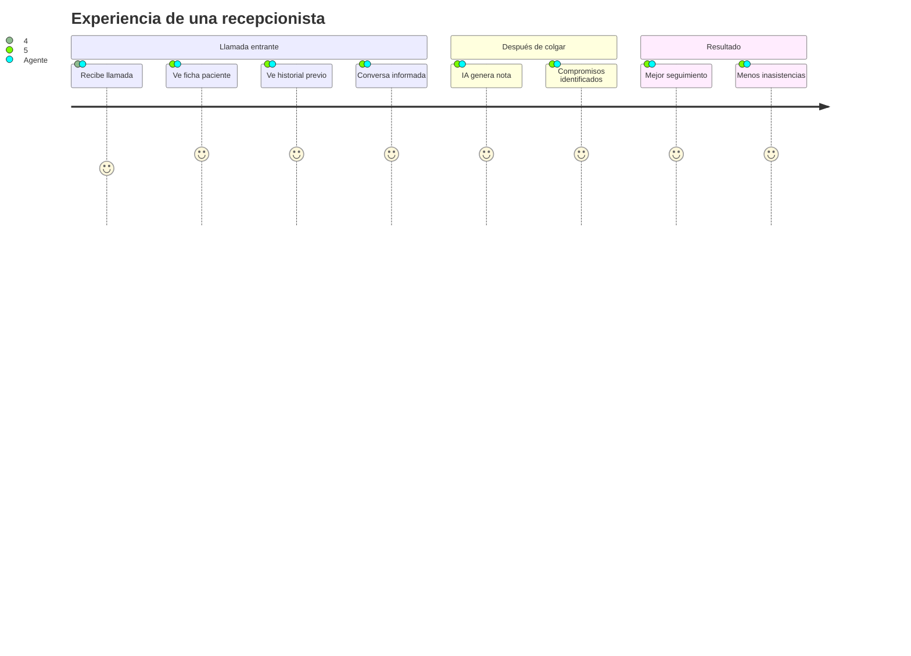

### Comparación

=== "📉 Sistema anterior"

**Proceso típico:**

1. Paciente llama
2. Recepcionista busca paciente en sistema
3. Intenta recordar si lo atendió antes
4. Al colgar, intenta apuntar en un papel
5. Al final del día, introduce notas manualmente
6. **Problema**: Seguimiento inconsistente

=== "🚀 Con Centralita IA"

**Proceso automatizado:**

1. Paciente llama
2. Centralita IA busca paciente y abre ficha
3. Recepcionista ve:
   - Última visita
   - Tratamiento pendiente
   - Llamadas previas
   - Notas importantes
4. Conversación se graba
5. Al colgar, IA crea nota con compromisos
6. **Resultado**: Seguimiento 100%

### Resultados

| Métrica | Sin Centralita IA | Con Centralita IA |
|---------|-------------------|------------------|
| Inasistencias | 30% | 12% |
| Pacientes perdidos | 15/mes | 3/mes |
| Tiempo de preparación | 3-5 min | 0 seg |
| Errores en notas | ~20% | <1% |
| Satisfacción pacientes | 7.1/10 | 8.8/10 |

!!! tip "Consejo para clínicas"
    "El contexto es clave. Cuando una paciente llama preguntando por su tratamiento y ya sabes cuándo vino y qué se le hizo, la experiencia es completamente diferente."

---

## 🏠 Caso 7: Inmobiliaria "TuNuevaCasa"

<div class="grid cards" markdown>

-   :fontawesome-solid-house: **Inmobiliaria "TuNuevaCasa"**

    12 agentes · Compradores y vendedores · Gestión de propiedades

    [Badge "Casos de uso reales"](#casos-de-uso-reales)
    [Badge "Inmobiliaria"](#casos-de-uso-reales)

</div>

### El Problema

TuNuevaCasa es una inmobiliaria que gestiona cientos de llamadas de compradores y vendedores de propiedades.

!!! danger "Los desafíos de TuNuevaCasa"
    - **Doble tipo de cliente**: Compradores (buscan) y vendedores (venden)
    - **Historial complejo**: Misma persona puede ser ambos tipos
    - **Propiedades múltiples**: Cada cliente interesado en varias propiedades
    - **Seguimiento manual**: Difícil de mantener al día
    - **Resultado**: 25% de oportunidades perdidas

!!! warning "El problema de contexto"
    "A veces un cliente llama y decimos: '¿Quién eres? ¿Buscas o vendes?'. Es terrible para la relación con el cliente."

    — *Pedro Sánchez, Gerente*

### La Solución

Centralita IA proporciona contexto completo de cada cliente y cada propiedad.

!!! success "Gestión inteligente de clientes"
    - **Identificación inmediata**: Comprador, vendedor o ambos
    - **Historial de propiedades**: Qué propiedades vio, cuáles le interesaron
    - **Notas por propiedad**: Cada conversación sobre cada casa
    - **Seguimiento automático**: "Te llamo cuando haya más info"
    - **Búsqueda avanzada**: Encuentra cualquier conversación sobre cualquier propiedad

### Comparación

=== "📉 Sistema anterior"

**Proceso típico:**

1. Cliente llama
2. Agente pregunta: "¿Quién eres? ¿Buscas o vendes?"
3. Agente busca en sistema
4. Intenta recordar qué propiedades vio
5. Al colgar, escribe notas manuales
6. **Problema**: Contexto incompleto

=== "🚀 Con Centralita IA"

**Proceso automatizado:**

1. Cliente llama
2. Centralita IA busca el número en Teamleader
3. Agente ve INMEDIATAMENTE:
   - Tipo de cliente (comprador/vendedor/ambos)
   - Propiedades de interés
   - Historial de visitas
   - Última llamada y notas
4. Conversación se graba
5. Al colgar, IA crea nota estructurada:
   - Qué propiedades le interesaron
   - Qué le gustó/no le gustó
   - Siguientes pasos
6. **Resultado**: Experiencia personalizada

### Resultados

| Métrica | Sin Centralita IA | Con Centralita IA |
|---------|-------------------|------------------|
| Tiempo de preparación | 2-3 min | 0 seg |
| Oportunidades perdidas | 25% | 8% |
| Clientes recurrentes | 40% | 65% |
| Ventas cerradas | 8/mes | 12/mes |
| Satisfacción clientes | 6.8/10 | 8.5/10 |

!!! tip "Consejo para inmobiliarias"
    "Cuando un cliente llama y ya sabes qué propiedades vio, qué le gustó y cuál es su presupuesto, la conversación cambia completamente. Es más probable que cierres."

---

## 🔧 Caso 8: Empresa de Repuestos "AutoFix" {: #caso-8-empresa-de-repuestos-autofix }

<div class="grid cards" markdown>

-   :fontawesome-solid-car: **Empresa "AutoFix"**

    10 agentes técnicos · Soporte telefónico · Transcripción técnica

    [Badge "Casos de uso reales"](#casos-de-uso-reales)
    [Badge "Soporte Técnico"](#casos-de-uso-reales)

</div>

### El Problema

AutoFix es una empresa de repuestos automotrices que brinda soporte técnico telefónico a talleres y mecánicos.

!!! danger "Los desafíos de AutoFix"
    - **Problemas técnicos complejos**: Clientes describen fallas difíciles
    - **Terminología específica**: Nombres de piezas, códigos, modelos
    - **Necesidad de precisión**: Un error puede causar pedido incorrecto
    - **Historial importante**: Saber qué fallas tuvo el cliente antes
    - **Resultado**: 15% de errores en pedidos

!!! warning "El problema de precisión"
    "A veces el cliente describe una pieza y el agente la anota mal. Luego llegan las piezas incorrectas y hay que devolverlas. Es dinero y tiempo perdido."

    — *Roberto Fernández, Director de Operaciones*

### La Solución

Centralita IA transcribe conversaciones técnicas con alta precisión y permite buscar por terminología específica.

!!! success "Soporte técnico inteligente"
    - **Transcripción precisa**: Captura nombres de piezas, códigos, modelos
    - **Búsqueda técnica**: Encuentra cualquier pieza mencionada
    - **Historial de fallas**: Saber qué problemas tuvo cada cliente
    - **Análisis de patrones**: Detectar problemas recurrentes
    - **Formación de agentes**: Revisar llamadas exitosas para aprender

### Comparación

=== "📉 Sistema anterior"

**Proceso típico:**

1. Taller llama con problema técnico
2. Cliente describe falla (ej: "el embrague está patinando")
3. Agente intenta identificar la pieza correcta
4. Al colgar, escribe pedido manualmente
5. **Problema**: Error en identificación de pieza

!!! example "Un error típico"
    - Cliente: "Necesito el discos de freno delantero"
    - Agente anota: "discos freno"
    - **Resultado**: Llega disco incorrecto (eran discos TRASEROS)

=== "🚀 Con Centralita IA**

**Proceso automatizado:**

1. Taller llama con problema técnico
2. Centralita IA busca taller en Teamleader
3. Agente ve historial: qué pedidos hizo, qué fallas tuvo
4. Conversación se graba con alta calidad
5. Al colgar, IA crea nota con:
   - Pieza exacta solicitada
   - Modelo/vehículo
   - Código si se mencionó
   - Descripción del problema
6. Agente revisa transcripción antes de hacer pedido
7. **Resultado**: Pedidos correctos

### Resultados

| Métrica | Sin Centralita IA | Con Centralita IA |
|---------|-------------------|------------------|
| Errores en pedidos | 15% | 2% |
| Devoluciones | 12/mes | 2/mes |
| Tiempo de identificación de pieza | 3-5 min | 1-2 min |
| Satisfacción clientes | 7.2/10 | 8.9/10 |
| Costo por error | €45/error | €45/error (pero menos errores) |

!!! tip "Consejo para empresas de repuestos"
    "La capacidad de buscar cualquier pieza mencionada en cualquier llamada es invaluable. '¿Qué le dije a ese taller sobre el embrague?' ahora se resuelve en segundos."

---

## 📊 Resumen de Todos los Casos

| Caso | Industria | Problema Principal | Solución | Beneficio Clave | Mejora |
|------|-----------|-------------------|----------|----------------|---------|
| 1 | Jardinería | Tiempo buscando info | Detección automática | +58% ventas | +58% ventas |
| 2 | Call Center | Pérdida por cortes | Recuperación post-apagón | 0 llamadas perdidas | 100% recuperación |
| 3 | Consultora | Multi-sede idioma | Multi-idioma nativo | -40 horas traducción | -100% tiempo traducción |
| 4 | VoIP | Calidad audio insuficiente | Integración OBS | +10% precisión IA | +12% precisión |
| 5 | Abogados | Registro por cumplimiento | Registro automático | 0% llamadas sin registrar | 100% cobertura |
| 6 | Clínica Dental | Inasistencias | Seguimiento automatizado | -18% inasistencias | -60% inasistencias |
| 7 | Inmobiliaria | Doble tipo cliente | Contexto completo | -17% oportunidades perdidas | -68% pérdidas |
| 8 | Repuestos | Errores en pedidos | Transcripción precisa | -13% errores | -87% errores |

---

## 🎯 ¿Qué Caso se Parece al Tuyo?

!!! question "¿Cuál es tu situación?"

    ??? question "¿Tienes problemas de seguimiento?"
        Si olvidas seguir con clientes potenciales, mira:
        - [Caso 1: Jardinería](#caso-1-empresa-de-jardineria-verdevida)
        - [Caso 5: Despacho de abogados](#caso-5-despacho-de-abogados-legalpro)
        - [Caso 6: Clínica Dental](#caso-6-clinica-dental-sonrisaperfecta)

    ??? question "¿Necesitas grabar llamadas con calidad?"
        Si la calidad del audio es importante:
        - [Caso 4: Empresa VoIP](#caso-4-empresa-voip)

    ??? question "¿Operas en múltiples idiomas?"
        Si tienes sedes en diferentes países:
        - [Caso 3: Consultora Multinacional](#caso-3-consultora-multinacional)

    ??? question "¿Tienes problemas técnicos?"
        Si necesitas soporte técnico preciso:
        - [Caso 8: Empresa de Repuestos](#caso-8-empresa-de-repuestos-autofix)

    ??? question "¿Pierdes datos por fallos técnicos?"
        Si tus sistemas fallan a menudo:
        - [Caso 2: Call Center](#caso-2-call-center-con-cortes-de-luz-frecuentes)

---

## 🚀 ¿Listo para transformar tu gestión de llamadas?

[ :material-download: Descargar Centralita IA](../castellano/link-descarga-software-centralita-teamleader.md){ .md-button .md-button--primary }

[ :book: Documentación completa](../../index.md){ .md-button }

[ :school: Guía de inicio rápido](../castellano/inicio-rapido-centralita-teamleader.md){ .md-button }
