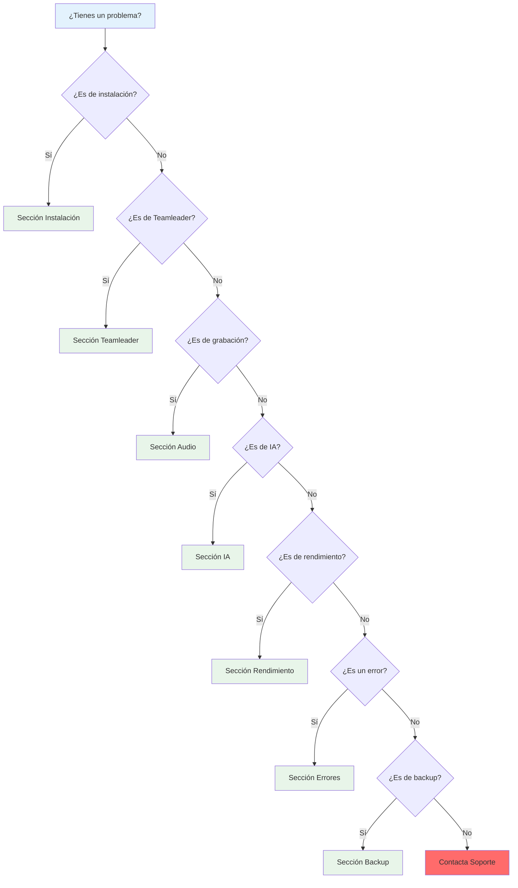
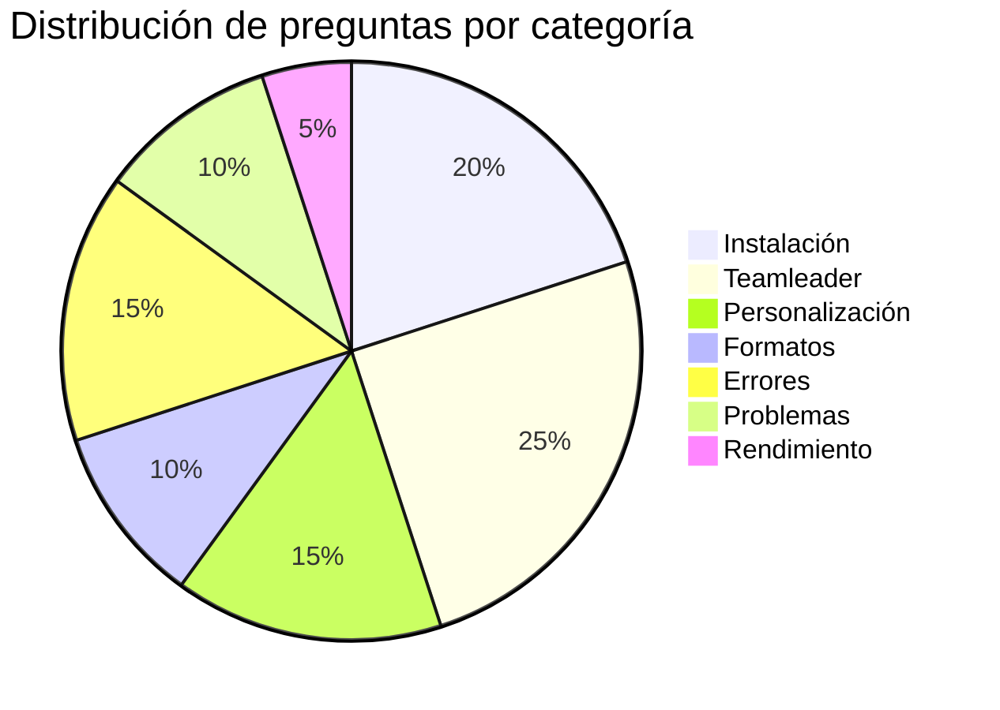
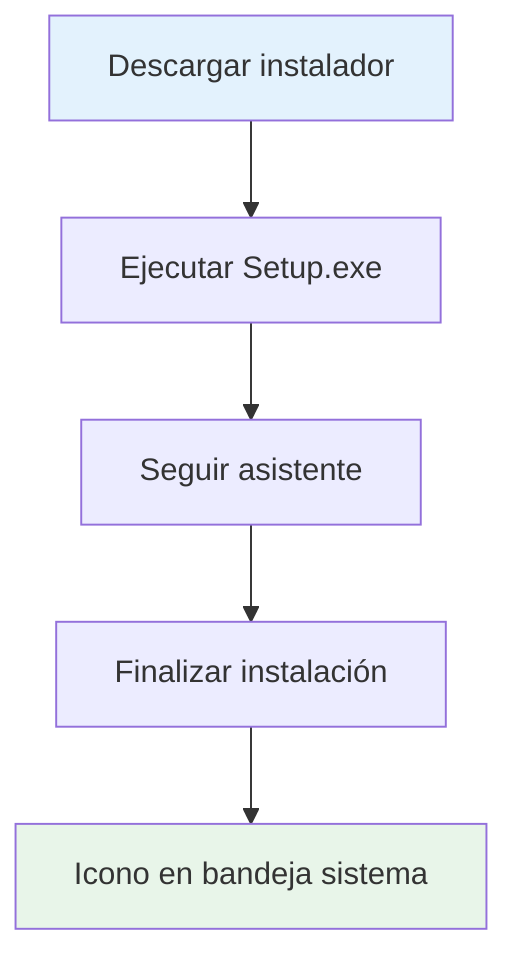
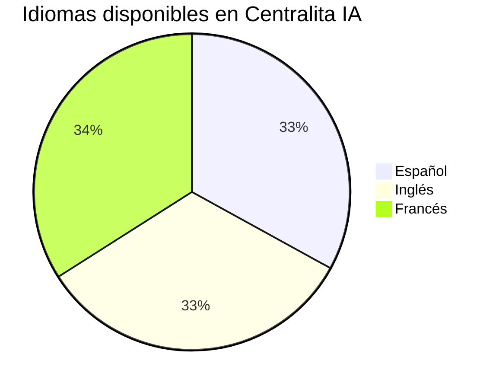
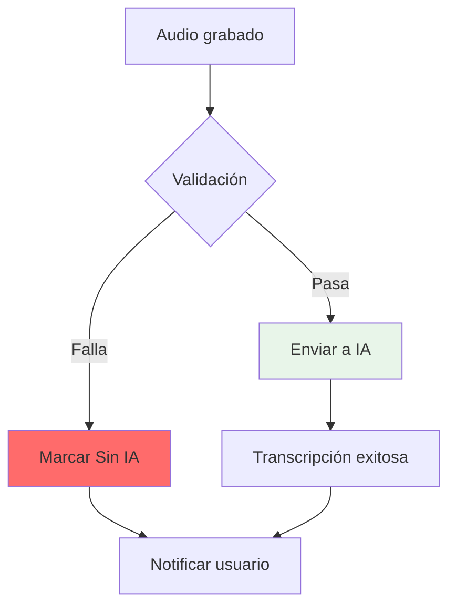
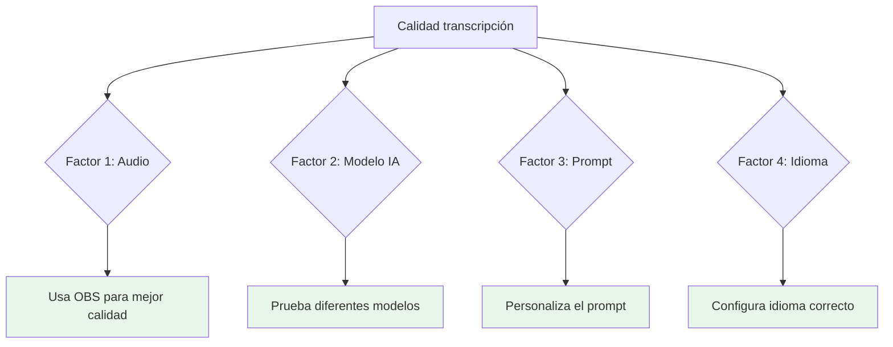
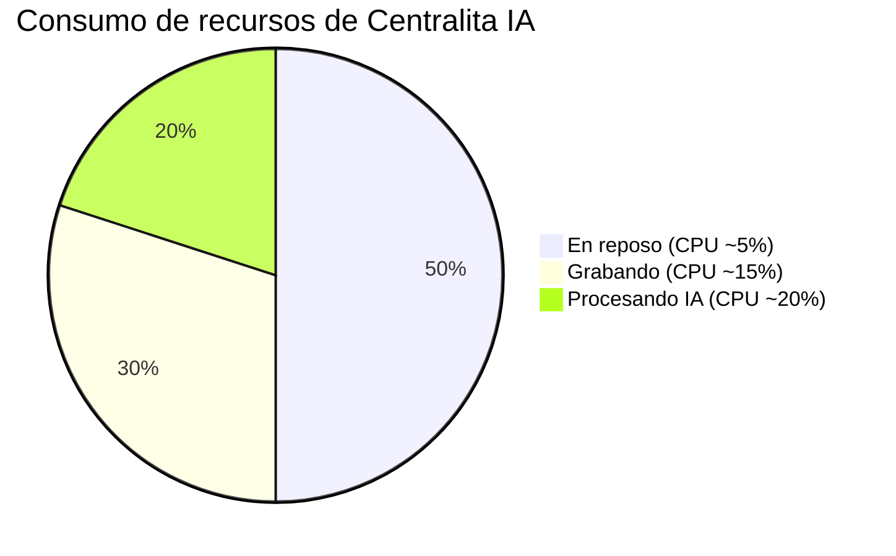
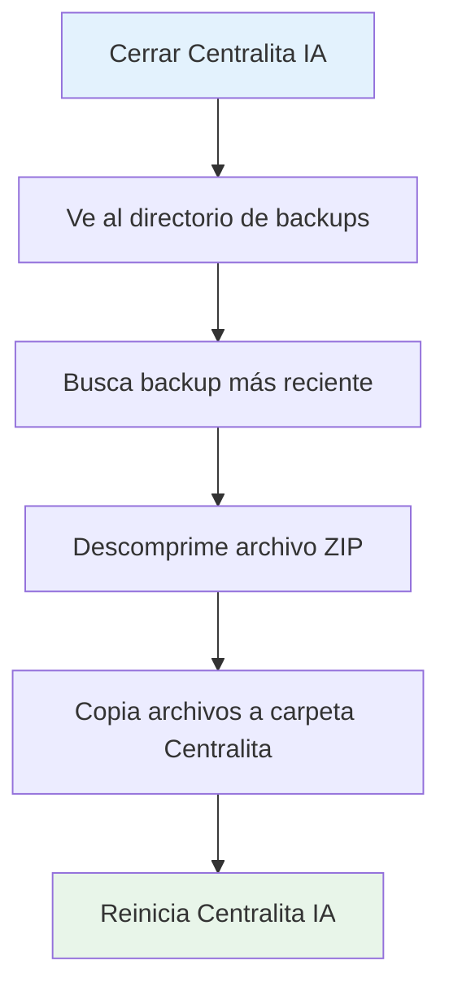
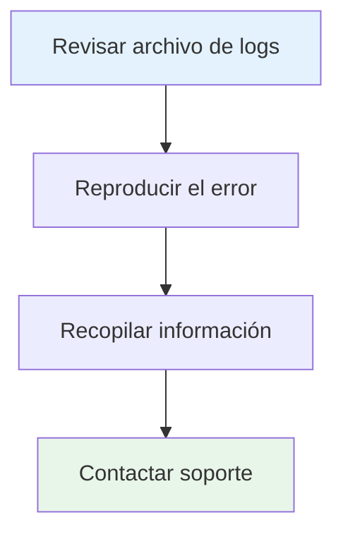

# ❓ Preguntas Frecuentes

Encuentra respuestas a las preguntas más comunes sobre Centralita IA Teamleader. Si no encuentras lo que buscas, contacta con nuestro equipo de soporte.

!!! tip "💡 Búsqueda rápida"
    Usa `Ctrl+F` para buscar palabras clave específicas en esta página.

---

## 🧭 Guía de Navegación Rápida

¿Tienes un problema? Encuentra la solución rápidamente con esta guía:



### Tabs de Categorías

=== "🔧 Instalación"

Preguntas sobre instalación, requisitos previos y configuración inicial.

- [¿Cómo se instala?](#como-se-instala-centralita-ia)
- [¿Qué necesito antes de instalar?](#que-necesito-antes-de-instalar)
- [¿Cómo configuro Teamleader?](#como-configuro-teamleader-por-primera-vez)
- [¿Cómo configuro la IA?](#como-configuro-la-transcripcion-con-ia)

=== ":crm: Teamleader"

Preguntas sobre integración, credenciales y configuración con Teamleader CRM.

- [¿Qué pasa si falla Teamleader?](#que-pasa-si-falla-la-conexion-con-teamleader)
- [¿Cómo obtengo credenciales?](#como-obtengo-las-credenciales-de-teamleader)
- [¿Configuro campos personalizados?](#como-configuro-los-mapeos-de-campos-personalizados)
- [¿Abre la ficha automáticamente?](#centralita-ia-abre-la-ficha-del-cliente-automaticamente)

=== "🎙️ Audio"

Preguntas sobre grabación, formatos y OBS Studio.

- [¿Qué formatos soporta?](#que-formatos-de-audio-soporta-centralita-ia)
- [¿Puedo reproducir audios?](#puedo-reproducir-los-audios-grabados)
- [¿Si OBS no graba?](#que-pasa-si-obs-studio-no-graba)

=== "🤖 IA"

Preguntas sobre transcripción, prompts y modelos de IA.

- [¿Personalizo prompts?](#puedo-personalizar-los-prompts-de-ia)
- [¿Si la transcripción tiene errores?](#que-pasa-si-la-transcripcion-tiene-errores)
- [¿Cómo mejorar la calidad?](#como-puedo-mejorar-el-rendimiento)

=== "⚡ Rendimiento"

Preguntas sobre recursos, optimización y velocidad.

- [¿Cuántos recursos consume?](#cuantos-recursos-consume-centralita-ia)
- [¿Cómo optimizar?](#como-puedo-mejorar-el-rendimiento)

=== "🐛 Errores"

Preguntas sobre errores comunes y troubleshooting.

- [¿Si una llamada no se transcribe?](#que-pasa-si-una-llamada-no-se-transcribe)
- [¿Si no detecta llamadas?](#que-pasa-si-centralita-ia-no-detecta-una-llamada)
- [¿Cómo reportar errores?](#como-reporto-un-error)

=== "💾 Backup"

Preguntas sobre backup y recuperación.

- [¿Cómo hago backup?](#como-hago-backup)
- [¿Cómo resto?](#como-resto-desde-un-backup)

=== "🔒 Seguridad"

Preguntas sobre datos, privacidad y protección.

- [¿Dónde se guardan los datos?](#donde-se-guardan-mis-datos)
- [¿A quién envía datos?](#a-quien-envia-mis-datos)
- [¿Cómo protege credenciales?](#como-protege-centralita-ia-mis-credenciales)

---

## 📊 Problemas Comunes y Soluciones Rápidas

<div class="grid cards" markdown>

-   :fontawesome-solid-phone: **No detecta llamadas**

    [Badge "Frecuente"](#) [Badge "Fácil"](#)

    Verifica que Centralita IA está ejecutándose y que la opción "Detectar llamadas" está activa en configuración.

    [Ver solución →](#que-pasa-si-centralita-ia-no-detecta-una-llamada)

-   :fontawesome-solid-brain: **No transcribe llamadas**

    [Badge "Frecuente"](#) [Badge "Medio"](#)

    Verifica que la API key de OpenRouter es válida y que hay saldo. También revisa que la grabación esté activa.

    [Ver solución →](#que-pasa-si-una-llamada-no-se-transcribe)

-   :fontawesome-solid-plug: **Teamleader no conecta**

    [Badge "Poco común"](#) [Badge "Fácil"](#)

    Verifica las credenciales (Client ID y Secret). Si falla temporalmente, los datos se guardan localmente.

    [Ver solución →](#que-pasa-si-falla-la-conexion-con-teamleader)

-   :fontawesome-solid-video: **OBS no graba**

    [Badge "Poco común"](#) [Badge "Difícil"](#)

    Verifica que OBS está ejecutándose, que la conexión con OBS está activa y que la escena "Audio" existe.

    [Ver solución →](#que-pasa-si-obs-studio-no-graba)

-   :fontawesome-solid-memory: **Consume demasiados recursos**

    [Badge "Poco común"](#) [Badge "Fácil"](#)

    Deshabilita módulos no usados, reduce calidad de audio o usa un modelo de IA más ligero.

    [Ver solución →](#como-puedo-mejorar-el-rendimiento)

-   :fontawesome-solid-bolt: **Corte de luz**

    [Badge "Frecuente en zonas inestables"](#) [Badge "Automático"](#)

    No te preocupes. Al reiniciar, Centralita IA detecta llamadas pendientes y las procesa automáticamente.

    [Ver casos de uso →](casos-de-uso.md#caso-2-call-center-con-cortes-de-luz-frecuentes)

</div>

---

## 📊 Distribución de Preguntas



---

## 🔧 Instalación y Configuración

### :material-download: ¿Cómo se instala Centralita IA?



Centralita IA se instala en unos sencillos pasos:

1. **Descarga el instalador** desde la [página de descargas](../castellano/link-descarga-software-centralita-teamleader.md)
2. **Ejecuta el instalador** `Setup_Centralita_IA_Teamleader.exe`
3. **Sigue el asistente** de instalación (acepta términos, selecciona carpeta)
4. **Finaliza la instalación** y el sistema se iniciará automáticamente

!!! tip "Requisitos previos"
    - Windows 10 o superior
    - 5 MB de espacio en disco
    - Conexión a internet (para integración con APIs)

### :material-clipboard: ¿Qué necesito antes de instalar? {: #que-necesito-antes-de-instalar }

Necesitas tener a mano:

<div class="grid cards" markdown>

-   :material-key: **Credenciales de Teamleader**

    - Client ID (se obtiene al registrar la app en Teamleader)
    - Client Secret (se obtiene al registrar la app en Teamleader)

-   :material-api: **API Key de OpenRouter**

    (para la transcripción con IA)

-   :material-phone: **Un número de teléfono**

    con el que probar

</div>

### :settings: ¿Cómo configuro Teamleader por primera vez? {: #como-configuro-teamleader-por-primera-vez }

???+ info "Configuración paso a paso"

1. Ve a la configuración web: `http://localhost:8585/`
2. Sección **Configuración API**
3. Ingresa tus credenciales de Teamleader:

```ini
Configuración API Teamleader

client_id=xxxxxxxx-xxxx-xxxx-xxxx-xxxxxxxxxxxx      # (1)
client_secret=xxxxxxxxxxxxxxxxxxxxxxxxxxxxxxxxxxxxx  # (2)
tl_access_token=se generará automáticamente            # (3)
```
1.  Lo obtienes al registrar tu aplicación en Teamleader
2.  Se genera junto con el client_id
3.  Token de acceso que se renueva automáticamente

4. Haga clic en **"Autorizar Teamleader"**
5. Inicia sesión en Teamleader
6. Autoriza la aplicación
7. Los tokens se guardan automáticamente

!!! info "Solo una vez"
    Después de la primera autorización, Centralita IA mantiene la sesión activa automáticamente.

### :material-brain: ¿Cómo configuro la transcripción con IA?

??? info "Configuración OpenRouter"

1. Ve a la configuración web: `http://localhost:8585/`
2. Sección **Configuración IA**
3. Ingresa tu API Key de OpenRouter
4. Selecciona el modelo de IA (ej: `google/gemini-2.5-flash-lite`)
5. Personaliza el prompt de instrucciones si lo deseas
6. Guarda los cambios

!!! tip "Modelo recomendado"
    Para la mayoría de las PYMEs, `google/gemini-2.5-flash-lite` ofrece el mejor equilibrio entre calidad y costo.

---

## :crm: Integración con Teamleader

### :material-help: ¿Qué pasa si falla la conexión con Teamleader?

!!! warning "Sin pérdida de información"
    Ninguna llamada se pierde por fallos temporales de Teamleader.

No te preocupes, Centralita IA está diseñado para funcionar incluso si Teamleader no responde:

- ✅ **Las llamadas se siguen grabando y transcribiendo**
- ✅ **Los datos se guardan localmente** en un archivo de registro
- ✅ **El sistema reintenta la conexión automáticamente**
- ✅ **Cuando se restaura, sincroniza los datos pendientes**

### :material-form-select: ¿Cómo obtengo las credenciales de Teamleader?

???+ info "Proceso completo"

=== "📝 Paso 1: Registrar la aplicación"

1. Ve a https://app.teamleader.eu/integrations
2. Haga clic en **"Create app"**
3. Rellena los campos:
   - **App name**: `Centralita Teamleader`
   - **Description**: `Integración de telefonía con IA`
   - **Redirect URI**: `http://localhost:8585/auth/callback`
4. Guarda la configuración

=== "🔑 Paso 2: Obtener credenciales"

Teamleader generará automáticamente:
- **Client ID**: un código largo de letras y números
- **Client Secret**: un código largo de letras y números

!!! danger "⛔ Guarda tus credenciales de forma segura"
    Nunca compartas tu Client Secret con terceros.

=== "⚙️ Paso 3: Configurar en Centralita IA"

1. Ve a la configuración web: `http://localhost:8585/`
2. Sección **Configuración API**
3. Ingresa el Client ID y Client Secret
4. Haga clic en **"Autorizar Teamleader"**

### :map: ¿Cómo configuro los mapeos de campos personalizados?

!!! info "Campos libres en Teamleader"

Si usas campos personalizados en Teamleader, puedes mapearlos para que Centralita IA los reconozca:

1. Ve a la configuración web: `http://localhost:8585/`
2. Sección **Configuración API**
3. Busca el campo **"Campos libres"**
4. Configura el mapeo con el formato:

```text
campo_origen<-->campo_destino
```

Por ejemplo:
```text
telefono<-->custom_field_telefono
nombre<-->custom_field_nombre
email<-->custom_field_email
```

5. Guarda los cambios

!!! info "¿Qué es un campo libre?"
    Los campos libres son campos personalizados que has creado en Teamleader para almacenar información adicional.

### :material-page-next: ¿Centralita IA abre la ficha del cliente automáticamente?

!!! success "Preparado para contestar"
    Al contestar, ya tienes toda la información del cliente visible. No pierdes tiempo buscando.

¡Sí! Es una de las funcionalidades principales:

- ✅ **Detecta** una llamada entrante o saliente
- ✅ **Busca** el número en Teamleader (contactos y empresas)
- ✅ **Abre** la ficha del cliente en tu navegador automáticamente
- ✅ **Te muestra** toda la información antes de que contestes

---

## :palette: Personalización

### :material-text-fields: ¿Puedo personalizar los prompts de IA? {: #puedo-personalizar-los-prompts-de-ia }

!!! tip "A/B testing de prompts"
    Centralita IA permite experimentar con diferentes prompts para encontrar el mejor para tu negocio.

¡Por supuesto! Puedes ajustar qué información extrae la IA de cada llamada:

1. Ve a la configuración web: `http://localhost:8585/`
2. Sección **Configuración IA**
3. Edita el campo **"Instrucciones"**
4. Define qué quieres que la IA extrae

Ejemplo de prompt personalizado:

```text
Transcribe la llamada y genera un resumen con:
- Puntos clave discutidos
- Decisiones tomadas
- Siguientes pasos con fechas
- Objeciones o preocupaciones del cliente
- Información de presupuesto (monto y condiciones)
- Probabilidad de cierre (alta/media/baja)
```

### :translate: ¿Puedo cambiar el idioma de la interfaz?



Sí, Centralita IA soporta varios idiomas:

1. Ve a la configuración web: `http://localhost:8585/`
2. Sección **Configuración general**
3. En el campo **"Idioma"**, selecciona tu idioma preferido
4. Guarda los cambios

Idiomas disponibles:
- 🇪🇸 Español
- 🇬🇧 Inglés
- 🇫🇷 Francés
- 🇮🇹 Italiano (en desarrollo)

### :palette: ¿Puedo personalizar el aspecto visual?

Sí, puedes cambiar el tema visual de la interfaz:

1. Ve a la configuración web: `http://localhost:8585/`
2. Sección **Configuración general**
3. En el campo **"Tema"**, selecciona tu preferido
4. Guarda los cambios

??? info "Temas disponibles"

=== "🌑 Temas oscuros (Recomendados para uso diario)"
- **DarkBlue16**: Azul oscuro profesional ✅ Más popular
- **DarkGrey16**: Gris oscuro elegante
- **DarkBlack1**: Negro absoluto

=== "☀️ Temas claros"
- **LightGreen**: Verde claro
- **LightBlue**: Azul claro
- **LightGrey**: Gris claro

=== "🌈 Temas especiales"
- **HotDogStand**: Estilo retro con colores vibrantes

### :extension: ¿Puedo activar o desactivar módulos?

Sí, puedes habilitar o deshabilitar funcionalidades específicas:

1. Ve a la configuración web: `http://localhost:8585/`
2. Sección **Configuración general**
3. Marca o desmarca los módulos que quieras:

| Módulo | Función |
|--------|---------|
| ✅ `buscar` | Búsqueda en CRM |
| ✅ `audio` | Grabación de llamadas |
| ✅ `ia` | Transcripción con IA |
| ✅ `cuadro` | Cuadro de mando |
| ✅ `plantillas` | Plantillas personalizadas |

4. Guarda los cambios

!!! tip "Deshabilitar módulos no usados"
    Deshabilita módulos que no usas para mejorar el rendimiento del sistema.

---

## :file: Formatos de Archivo

### :material-audio-file: ¿Qué formatos de audio soporta Centralita IA? {: #que-formatos-de-audio-soporta-centralita-ia }

Centralita IA soporta dos formatos principales:

| Formato | Modo de grabación | Calidad | Tamaño |
|---------|-------------------|---------|--------|
| **WAV** | Grabación interna | Estándar | ~1 MB/minuto |
| **MP4** | Grabación con OBS | Alta | ~100 KB/minuto |

### :play-circle: ¿Puedo reproducir los audios grabados? {: #puedo-reproducir-los-audios-grabados }

Sí, todos los audios grabados se guardan en la carpeta de audio configurada:

1. Ve a la configuración web: `http://localhost:8585/`
2. Sección **Configuración audio**
3. Mira el campo **"Carpeta de grabación"**
4. Navega a esa carpeta en tu explorador de archivos
5. Abre cualquier archivo con tu reproductor favorito

!!! tip "Enlace directo desde Teamleader"
    Cada nota creada en Teamleader incluye un enlace al audio grabado.

### :description: ¿Qué otros formatos de archivo usa Centralita IA?

| Tipo | Formato | Descripción |
|------|----------|-------------|
| **Transcripción** | TXT | Texto con el resumen de la llamada |
| **Configuración** | Ajustes del sistema | Preferencias y conexión con servicios |
| **Registro de llamadas** | Historial interno | Seguimiento de llamadas y estados |
| **Logs** | TXT | Registro de errores y eventos |

---

## :error: Manejo de Errores

### :material-block: ¿Qué pasa si una llamada no se transcribe? {: #que-pasa-si-una-llamada-no-se-transcribe }



Centralita IA valida todos los audios antes de enviarlos a la IA. Si un audio no pasa la validación:

1. **Se marca** como "Sin IA" en el registro
2. **Se guarda** el motivo del rechazo
3. **Se notifica** al usuario con un mensaje
4. **Se continúa** procesando otras llamadas

Causas comunes de rechazo:
- Duración menor a 0.8 segundos (llamada equivocada)
- Archivo corrupto o incompleto
- Formato no soportado

!!! info "No pierdes la grabación"
    Aunque no se transcriba, la llamada sigue grabada y puedes escuchar el audio.

### :material-phonelink-off: ¿Qué pasa si Centralita IA no detecta una llamada? {: #que-pasa-si-centralita-ia-no-detecta-una-llamada }

Si Centralita IA no detecta una llamada, verifica:

???+ info "Solución de problemas"

=== "🔧 1. Configuración de telefonía"

- Ve a la configuración web → Configuración general
- Verifica que la opción **"Detectar llamadas"** esté activa

=== "📱 2. Conexión del teléfono"

- Verifica que el teléfono está conectado al ordenador
- Si es un teléfono físico, verifica que está conectado al puerto correcto
- Si es un softphone, verifica que está ejecutándose

=== "🖥️ 3. Permisos de Windows"

- Ejecuta Centralita IA como administrador
- Verifica que Centralita IA tiene acceso a los dispositivos de audio

!!! warning "Contacta con soporte"
    Si después de verificar todo sigue sin detectar llamadas, contacta con nuestro equipo de soporte.

### :video-camera-off: ¿Qué pasa si OBS Studio no graba? {: #que-pasa-si-obs-studio-no-graba }

Si estás usando OBS para la grabación y no funciona:

???+ info "Solución paso a paso"

=== "🔍 1. Verificar OBS ejecutándose"

- Verifica que OBS está ejecutándose
  - Verifica la conexión con OBS desde sus herramientas de conexión
  - Confirma que el control remoto está habilitado
  - Revisa que el puerto configurado coincide con el de Centralita

=== "⚙️ 2. Verificar configuración Centralita"

- Ve a la configuración web → Configuración OBS
- Verifica que "OBS activo" está en `True`
- Verifica que el host y puerto son correctos

=== "🎬 3. Verificar escena de audio"

- En OBS, verifica que existe una escena llamada "Audio"
- Verifica que la fuente de audio está activa

!!! tip "Prueba la conexión"
    En la configuración de OBS, haga clic en "Probar conexión" para comprobar que Centralita IA puede comunicarse con OBS.

### :material-text-snippet: ¿Qué pasa si la transcripción tiene errores? {: #que-pasa-si-la-transcripcion-tiene-errores }

La calidad de la transcripción depende de varios factores:



1. **Calidad del audio**:
   - Usa grabación con OBS para mejor calidad
   - Asegúrate de que el volumen sea adecuado
   - Evita ruidos de fondo

2. **Modelo de IA**:
   - Prueba diferentes modelos (Gemini, GPT-4o)
   - Los modelos más potentes suelen dar mejores resultados

3. **Prompt de instrucciones**:
   - Personaliza el prompt para tu negocio
   - Sé específico sobre qué información necesitas

4. **Idioma**:
   - Configura el idioma correcto en las instrucciones de IA
   - Asegúrate de que el prompt esté en el mismo idioma de la llamada

!!! tip "Mejora continua"
    Centralita IA permite hacer A/B testing de prompts para encontrar la mejor configuración para tu negocio.

---

## :speed: Rendimiento y Optimización

### :material-memory: ¿Cuántos recursos consume Centralita IA? {: #cuantos-recursos-consume-centralita-ia }

Centralita IA está optimizado para consumir pocos recursos:



| Estado | CPU | RAM | Disco |
|--------|-----|-----|-------|
| **En reposo** | ~5% | ~700 MB | - |
| **Grabando llamada** | ~15% | ~800 MB | ~1 MB/minuto |
| **Procesando IA** | ~20% | ~900 MB | - |

!!! info "Optimizado para segundo plano"
    Centralita IA está diseñado para funcionar sin afectar tu trabajo normal.

### :material-tune: ¿Cómo puedo mejorar el rendimiento? {: #como-puedo-mejorar-el-rendimiento }

Si notas que Centralita IA consume demasiados recursos:

???+ info "Optimizaciones disponibles"

=== "📦 1. Deshabilitar módulos no usados"

- Ve a la configuración web → Configuración general
- Deshabilita módulos que no necesites

=== "🎙️ 2. Reducir la calidad de audio"

- Ve a la configuración web → Configuración audio
- Baja el bitrate de 128 kbps a 64 kbps

=== "🤖 3. Usar un modelo de IA más ligero"

- Ve a la configuración web → Configuración IA
- Cambia a `google/gemini-2.5-flash-lite` en lugar de `openai/gpt-4o`

=== "🖥️ 4. Cerrar interfaces web no usadas**

- Las interfaces web (configuración, hoja de tiempo, etc.) se cierran automáticamente tras un tiempo de inactividad
- Puedes reducir este tiempo en la configuración

---

## :backup: Backup y Recuperación

### :material-save: ¿Cómo hago backup de mi configuración? {: #como-hago-backup }

Para hacer un backup manual de tu configuración:

1. Ve a la carpeta de Centralita IA
2. Copia estos archivos a una ubicación segura:
    - Ajustes generales del sistema
    - Historial de llamadas y seguimiento
3. Guarda la copia en un disco externo o en la nube

!!! tip "Backup automático"
    Centralita IA tiene un sistema de backup automático que crea copias periódicas. Verifica que está activo en la configuración.

### :material-restore: ¿Cómo resto desde un backup? {: #como-resto-desde-un-backup }

Si necesitas restaurar desde un backup:



1. **Cierre Centralita IA** (clic con el botón derecho en el icono → Salir)
2. **Vaya al directorio de copias** configurado (por defecto: `d:\backups`)
3. **Busque la copia más reciente**: `backup_YYYYMMDD_HHMMSS.zip`
4. **Descomprime** el archivo en una carpeta temporal
5. **Copia los archivos** a la carpeta de Centralita IA:
    - Ajustes del sistema
    - Historial de llamadas y seguimiento
6. **Reinicia Centralita IA**

!!! warning "Antes de restaurar"
    Siempre crea un backup manual antes de restaurar desde un backup anterior, por si algo sale mal.

---

## :security: Seguridad y Privacidad

### :material-folder: ¿Dónde se guardan mis datos? {: #donde-se-guardan-mis-datos }

Todos los datos de Centralita IA se guardan **localmente en tu ordenador**:

| Tipo | Ubicación |
|------|-----------|
| **Configuración** | Carpeta principal de Centralita IA |
| **Registro de llamadas** | Área de trabajo de Centralita IA |
| **Audios grabados** | carpeta de audio configurada (por defecto: `d:\centralita_ia\rec`) |

!!! info "Datos locales"
    Tus datos nunca salen de tu ordenador, excepto cuando se envían a las APIs que configures (Teamleader, OpenRouter).

### :share: ¿A quién envía Centralita IA mis datos? {: #a-quien-envia-mis-datos }

Centralita IA solo envía datos a los servicios que tú configuras:

| Servicio | ¿Qué se envía? |
|----------|---------------|
| **Teamleader API** | Contactos, empresas y notas para sincronizar con tu CRM |
| **OpenRouter API** | Audios de llamadas para transcripción con IA |
| **No hay telemetría** | Centralita IA no recopila datos de uso |

!!! warning "Privacidad garantizada"
    Tus audios y transcripciones solo se envían a las APIs que tú configuras. No hay terceros involucrados.

### :shield: ¿Cómo protege Centralita IA mis credenciales? {: #como-protege-centralita-ia-mis-credenciales }

Tus credenciales están protegidas de varias formas:

1. **Almacenamiento local**: nunca se envían a servidores de Centralita IA
2. **Codificación**: algunos campos están codificados para evitar lectura accidental
3. **OAuth2**: Teamleader usa tokens OAuth2 con refresh automático
4. **Sin compartir**: tus credenciales nunca se comparten con terceros

!!! info "Responsabilidad del usuario"
    Mantén tus credenciales seguras:
    - No compartas los archivos internos de configuración
    - Usa contraseñas fuertes para tus APIs
    - Actualiza tus credenciales regularmente

---

## :headset: Soporte y Ayuda

### :material-help: ¿Dónde puedo encontrar más ayuda?

Si tienes más preguntas o necesitas ayuda adicional:

<div class="grid cards" markdown>

-   :book: **Documentación técnica**

    Consulta las secciones de [¿Cómo funciona?](arquitectura.md) y [Funcionalidades](funcionalidades-core.md)

-   :installation: **Guías de instalación**

    [Guía de instalación paso a paso](../castellano/inicio-rapido-centralita-teamleader.md)

-   :settings: **Guías de configuración**

    [Guía de configuración completa](../castellano/pantalla-configuracion-centralita-teamleader.md)

-   :bug: **GitHub Issues**

    Reporta bugs o solicita funcionalidades en nuestro repositorio

-   :email: **Email de soporte**

    soporte@alcatic.com

</div>

### :material-bug-report: ¿Cómo reporto un error? {: #como-reporto-un-error }

Si encuentras un error o comportamiento inesperado:



1. **Revisa el archivo de logs**: `log_centralita.log` en la carpeta de Centralita IA
2. **Reproduce el error** si es posible
3. **Recopila información**:
   - ¿Qué estabas haciendo?
   - ¿Qué mensaje de error viste?
   - ¿Es reproducible? ¿Siempre sucede lo mismo?
4. **Contacta con soporte**:
   - Email: soporte@alcatic.com
   - Incluye el archivo de logs (si es posible)

!!! tip "Logs detallados"
    Cuantos más detalles proporciones, más rápido podremos ayudarte.

### :material-lightbulb: ¿Cómo solicito una nueva funcionalidad?

Si tienes una idea para mejorar Centralita IA:

1. **Describe la funcionalidad**:
   - ¿Qué quieres que haga?
   - ¿Por qué lo necesitas?
   - ¿Cómo debería funcionar?

2. **Proporciona ejemplos**:
   - Casos de uso reales
   - Situaciones donde sería útil

3. **Contacta con soporte**:
   - Email: soporte@alcatic.com
   - Asunto: "Solicitud de funcionalidad: [descripción breve]"

!!! success "Valoramos tu feedback"
    Muchas de las funcionalidades actuales de Centralita IA se originaron de sugerencias de usuarios como tú.

---

## 📊 Resumen de Categorías

| Categoría | Preguntas | Badge de frecuencia |
|-----------|-----------|-------------------|
| Instalación | Cómo instalar, requisitos previos, configuración inicial | Frecuente |
| Teamleader | Credenciales, mapeos, fallos de conexión | Muy frecuente |
| Personalización | Prompts IA, temas, idiomas, módulos | Ocasional |
| Formatos | Audio, configuración, logs | Poco común |
| Errores | Validación, reintentos, logging | Frecuente |
| Problemas | Detección de llamadas, OBS, transcripción | Frecuente |
| Rendimiento | Recursos, optimización | Poco común |
| Backup | Copia de seguridad, restauración | Ocasional |
| Seguridad | Protección de credenciales | Rara |
| Soporte | Dónde obtener ayuda | Ocasional |

---

## 🚀 ¿No encuentras tu respuesta?

[ :material-headset: Contactar con soporte](mailto:soporte@alcatic.com){ .md-button .md-button--primary }

[ :book: Documentación completa](../../index.md){ .md-button }

[ :download: Descargar Centralita](../castellano/link-descarga-software-centralita-teamleader.md){ .md-button }
