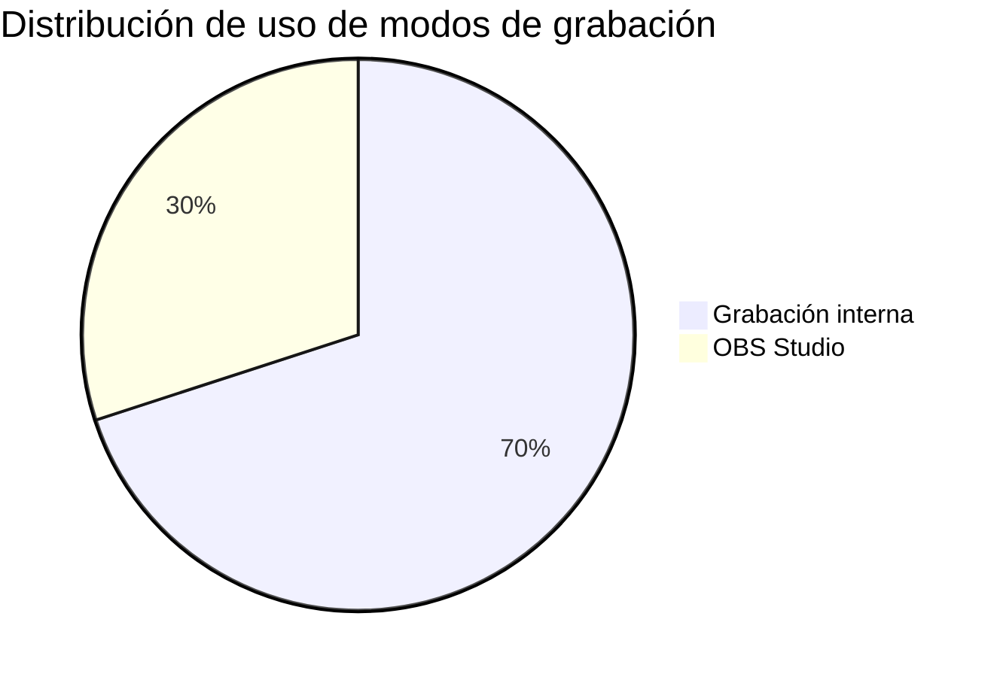
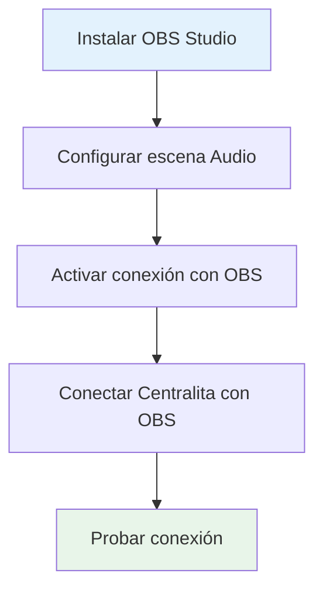
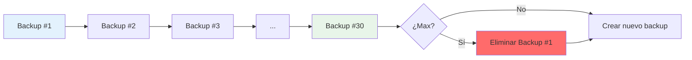
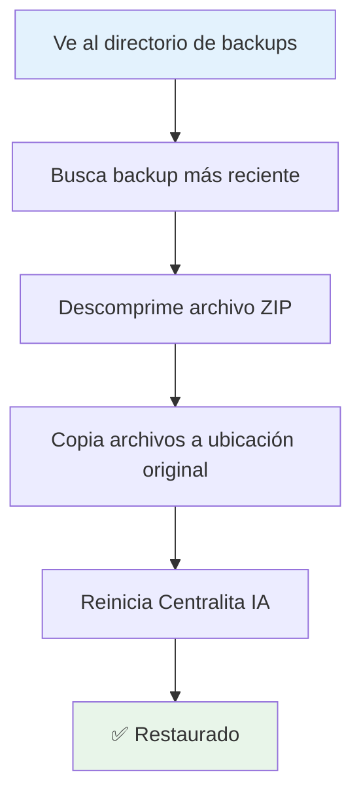
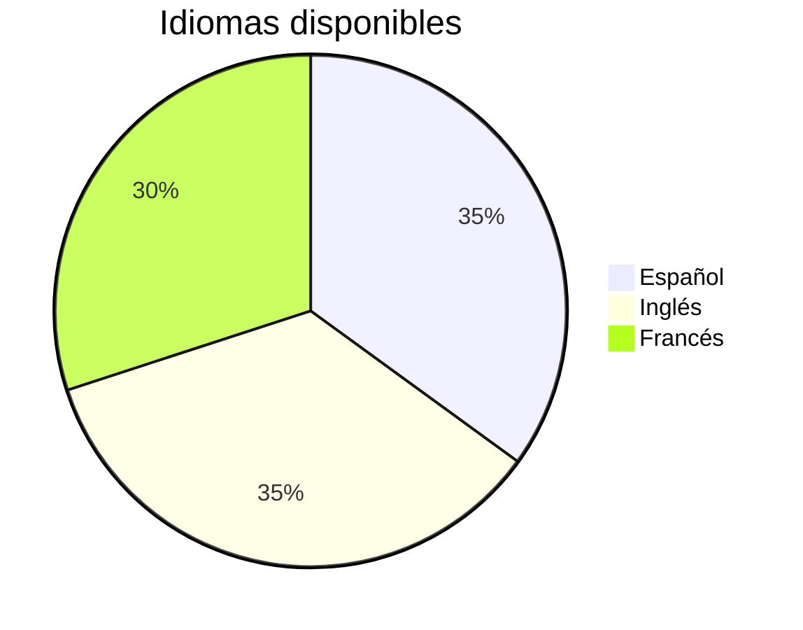
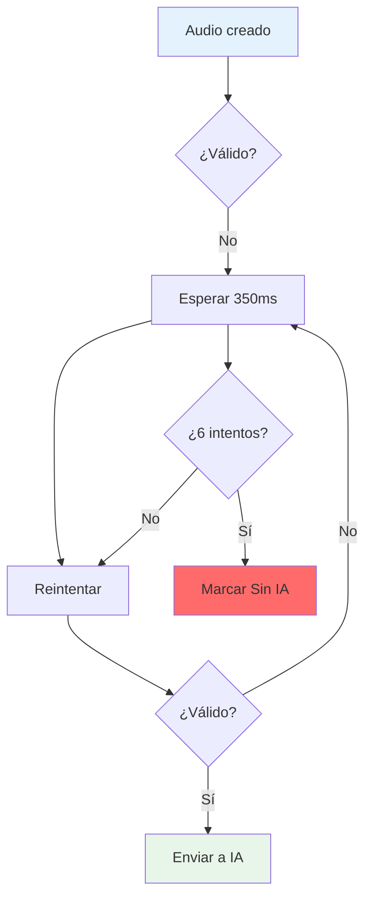
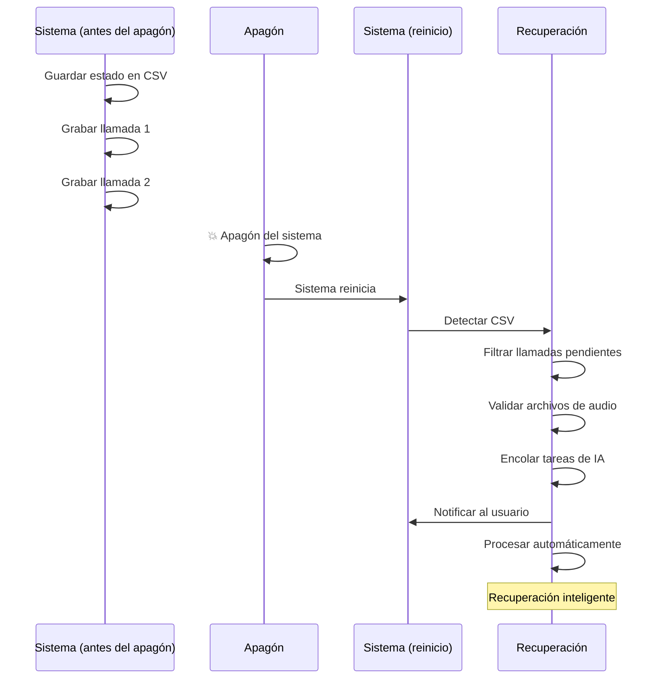
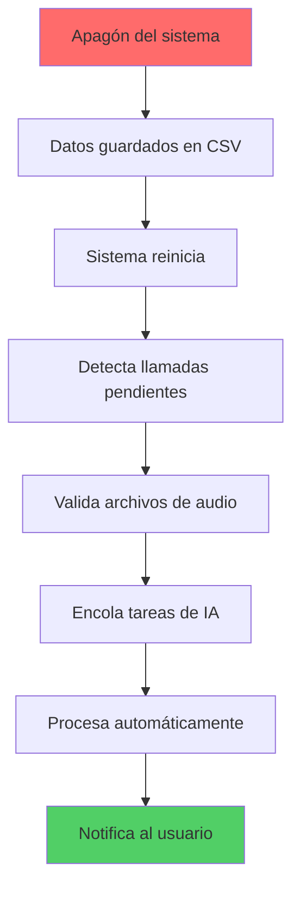

# 🚀 Funcionalidades Avanzadas

Las funcionalidades avanzadas de Centralita IA Teamleader son características opcionales que mejoran la calidad, resiliencia y personalización del sistema. No son esenciales para el funcionamiento básico, pero ofrecen beneficios significativos para entornos de producción más exigentes.

!!! success "🎯 Nivel Pro"
    Estas funcionalidades están diseñadas para usuarios que necesitan:
    - Máxima calidad de audio
    - Resiliencia ante fallos
    - Soporte multiidioma
    - Optimización de costes

---

## 📊 Comparación de Modos de Grabación



---

## :video_camera: 1. Grabación con OBS Studio

### ¿Qué hace?

Utiliza OBS Studio para grabar audio del sistema con máxima calidad, capturando ambos lados de la conversación.

### ¿Cuándo usarlo?

!!! tip "Ideal para softphones VoIP"
    Si usas Zoiper, 3CX u otro softphone, la grabación con OBS es la mejor opción para capturar ambos lados de la conversación.

??? info "¿Cuándo usar OBS vs Interna?"

=== "🎬 Usa OBS Studio cuando:"

- ✅ Usas softphones VoIP (Zoiper, 3CX, RingCentral)
- ✅ Necesitas capturar audio del sistema (no solo micrófono)
- ✅ Requieras máxima calidad de audio
- ✅ Quieres grabar ambos lados de la conversación

=== "🎤 Usa grabación interna cuando:"

- ✅ Usas teléfonos físicos
- ✅ No necesitas configurar software adicional
- ✅ Prefieres simplicidad sobre calidad máxima

### Configuración paso a paso



#### Paso 1: Instalar OBS Studio

1. Descargue OBS Studio desde [obsproject.com](https://obsproject.com/)
2. Ejecute el instalador y complete la instalación
3. Abra OBS Studio para verificar que funciona correctamente

#### Paso 2: Configurar la escena de audio

!!! info "Configuración de escena"

1. En OBS, vaya a **Escenas** → **+** → Crear nueva escena
2. Asigne a la escena el nombre **"Audio"**
3. En **Fuentes** → **+** → **Salida de audio del dispositivo**
4. Seleccione su dispositivo de audio predeterminado
5. Asegúrese de que el volumen esté activo

!!! warning "Importante"
    La escena debe estar seleccionada para que Centralita IA pueda controlar la grabación.

#### Paso 3: Activar la conexión con OBS

```text
Conexión con OBS

Herramientas -> Ajustes de conexión
- Activar control remoto: Sí        # (1)
- Puerto recomendado: 4455          # (2)
- Contraseña: la que prefieras      # (3)
```
1.  Activa la comunicación entre OBS y Centralita
2.  Puedes mantener el puerto recomendado si no hay conflictos
3.  Úsala si quieres más control y seguridad

#### Paso 4: Conectar Centralita IA con OBS

???+ info "Configuración en Centralita"

1. Abre la configuración web de Centralita IA: `http://localhost:8585/`
2. Ve a la sección **Configuración OBS**
3. Configura los siguientes campos:

| Campo | Valor | Descripción |
|-------|-------|-------------|
| **OBS activo** | `True` | Habilita integración con OBS |
| **OBS host** | `localhost` | Donde está ejecutándose OBS |
| **Puerto OBS** | `4455` | Puerto de conexión configurado |
| **OBS password** | `tu_contraseña` | Contraseña configurada en OBS |

4. Guarda la configuración

#### Paso 5: Probar la conexión

!!! success "Verificar conexión"

1. En la configuración de OBS, haga clic en **"Probar conexión"**
2. Si todo es correcto, verá un mensaje de éxito
3. Si falla, compruebe que OBS está ejecutándose y que el puerto es correcto

### Beneficios de la grabación con OBS

| Ventaja | Descripción |
|---------|-------------|
| **Alta calidad** | Audio en formato MP4 con bitrate de 128 kbps |
| **Ambos lados** | Captura tanto el micrófono como el audio del sistema |
| **Compatibilidad VoIP** | Funciona con softphones que no se integran con audio Windows |
| **Menor espacio** | MP4 ocupa menos espacio que WAV (~100 KB/minuto vs 1 MB/minuto) |

### Desventajas

| Limitación | Descripción |
|------------|----------|
| **Software adicional** | Requiere OBS Studio instalado y ejecutándose |
| **Configuración inicial** | Más complejo que la grabación interna |
| **Conversión** | El audio MP4 se convierte a WAV antes del procesamiento IA |

### Escenario de uso

!!! example "Caso real"
    > Tu empresa usa softphone Zoiper para todas las llamadas. Configuras OBS Studio con la escena de audio y conectas Centralita IA. Cuando una llamada entra, OBS graba automáticamente la conversación capturando tanto tu voz como la del cliente. Al terminar, Centralita IA convierte el MP4 a WAV y lo procesa con IA. La transcripción es perfecta porque captura ambos lados de la conversación.

---

## :backup: 2. Backup Automático

### ¿Qué hace?

Realiza copias de seguridad periódicas de todos los datos importantes de Centralita IA automáticamente.

### ¿Qué se respalda?

Centralita IA realiza backup de:

<div class="grid cards" markdown>

-   :file-document: **Ajustes del sistema**

    Configuración completa del sistema

-   :table: **Historial de llamadas**

    Registro de todas las llamadas

-   :pencil: **Campos libres**

    Cache de mapeos personalizados

-   :description: **Logs**

    Registro de errores y eventos

</div>

### Configuración del backup

| Parámetro | Valor por defecto | Descripción |
|-----------|-------------------|-------------|
| **Frecuencia** | `24` | Horas entre copias automáticas |
| **Carpeta de copias** | `d:\backups` | Directorio donde se guardan las copias |
| **Histórico máximo** | `30` | Número máximo de copias a conservar |

!!! tip "Frecuencia recomendada"
    Para la mayoría de las PYMEs, un backup cada 24 horas es suficiente. Si tienes un alto volumen de llamadas, considera backups cada 12 horas.

### Rotación automática



Centralita IA gestiona automáticamente el espacio:

- ✅ **Solo conserva** los últimos N backups (configurable)
- ✅ **Elimina** los backups más antiguos automáticamente
- ✅ **Detecta cambios** antes de crear un backup nuevo

### Restaurar desde backup

!!! warning "Haz backup antes de modificar"
    Siempre crea un backup manual antes de hacer cambios importantes en la configuración.



Si necesitas restaurar datos:

1. Ve al directorio de backups configurado
2. Busque la copia más reciente: `backup_YYYYMMDD_HHMMSS.zip`
3. Descomprime el archivo en una carpeta temporal
4. Copia los elementos necesarios a su ubicación original:
   - Ajustes del sistema
   - Historial de llamadas
5. Reinicia Centralita IA

### Beneficios del backup automático

| Beneficio | Descripción |
|-----------|-------------|
| **Protección de datos** | Recuperación ante desastres |
| **Sin esfuerzo** | Automático, no tienes que recordar |
| **Espacio controlado** | Rotación automática de backups |
| **Rápido** | Backup incremental solo cuando hay cambios |

### Escenario de uso

!!! example "Caso real"
    > Un cambio importante hace que Centralita IA no responda como esperabas. No pasa nada: recuperas la copia del día anterior, restauras los ajustes y vuelves a trabajar en minutos. El backup automático te evita perder tiempo y contexto.

---

## :translate: 3. Sistema Multi-Idioma

### ¿Qué hace?

Permite cambiar el idioma de la interfaz de Centralita IA sin necesidad de reinstalar ni recompilar.

### Idiomas disponibles



Centralita IA soporta actualmente:

| Idioma | Código | Estado |
|--------|--------|--------|
| **Español** | `es` | ✅ Completo |
| **Inglés** | `en` | ✅ Completo |
| **Francés** | `fr` | ✅ Completo |
| **Italiano** | `it` | 🚧 En desarrollo |

!!! info "Añadir nuevos idiomas"
    Si necesitas un idioma adicional, puedes añadirlo fácilmente creando las traducciones correspondientes.

### Cambiar el idioma

???+ info "Pasos para cambiar idioma"

1. Abre la configuración web: `http://localhost:8585/`
2. Ve a **Configuración general**
3. En el campo **Idioma**, selecciona el idioma deseado
4. Guarda los cambios
5. La interfaz se actualiza automáticamente

!!! tip "Recarga en caliente"
    No necesitas reiniciar la aplicación. El cambio de idioma es inmediato.

### Idioma de las transcripciones IA

Además del idioma de la interfaz, puedes configurar el idioma de las instrucciones para la IA:

???+ info "Prompts IA por idioma"

=== "🇪🇸 Español"

```text
Transcribe la llamada y genera un resumen con:
- Puntos clave discutidos
- Decisiones tomadas
- Siguientes pasos con fechas
- Objeciones o preocupaciones del cliente
```

=== "🇬🇧 Inglés"

```text
Transcribe the call and generate a summary with:
- Key points discussed
- Decisions made
- Next steps with dates
- Objections or concerns from the customer
```

=== "🇫🇷 Francés"

```text
Transcrivez l'appel et générez un résumé avec:
- Points clés discutés
- Décisions prises
- Prochaines étapes avec dates
- Objections ou préoccupations du client
```

### Beneficios del multi-idioma

| Beneficio | Descripción |
|-----------|-------------|
| **Mercados multinacionales** | Soporta sedes en diferentes países |
| **Adaptación local** | Prompts IA adaptados a cultura local |
| **Flexibilidad** | Cambio de idioma al vuelo |
| **Fácil expansión** | Añadir nuevos idiomas es sencillo |

### Escenario de uso

!!! example "Caso real"
    > Tu consultora tiene sedes en España, Francia y Reino Unido. Cada sede usa Centralita IA con su idioma local: español en Madrid, francés en París, inglés en Londres. Los prompts de IA están adaptados a cada cultura: más formal en francés, más directo en inglés, más cercano en español. Todo desde el mismo sistema sin necesidad de versiones diferentes.

---

## :check_circle: 4. Validación de Audio Antes de IA

### ¿Qué hace?

Valida automáticamente todos los audios antes de enviarlos a la IA para evitar procesar archivos corruptos, vacíos o demasiado cortos.

### ¿Por qué es importante?

!!! warning "Ahorra créditos API"
    La validación evita gastar créditos en audios que no tienen valor de negocio (llamadas muy cortas, archivos corruptos, etc.).

Sin validación, podrías gastar créditos de IA en:

<div class="grid cards" markdown>

-   :material-phone-off: **Llamadas de menos de 1 segundo**

    Desconexiones rápidas

-   :file-broken: **Archivos corruptos o incompletos**

    Error de grabación

-   :material-volume-off: **Audios vacíos o con silencio**

    Sin contenido útil

-   :file-question: **Archivos en formatos no soportados**

    Incompatibilidad de formato

</div>

### Criterios de validación

Centralita IA valida cada audio antes de enviarlo a la IA:

| Criterio | Requisito | Razón |
|----------|-----------|-------|
| **Tamaño mínimo** | 4 KB | Evita archivos vacíos o corruptos |
| **Duración mínima** | 0.8 segundos | Llamadas demasiado cortas no tienen información valiosa |
| **Formato válido** | WAV o MP4 | Solo formatos compatibles con IA |
| **Checksum SHA256** | Integridad válida | El archivo no está corrupto |

### Reintentos automáticos



Si un audio recién creado no pasa la validación:

1. El sistema espera 350 ms
2. Vuelve a validar
3. Repite hasta 6 veces
4. Si sigue fallando, marca como "Sin IA" y continúa

Esto permite procesar audios que aún están siendo escritos por el sistema de grabación.

### Estadísticas de ahorro

| Tipo de rechazo | Porcentaje | Ahorro estimado |
|-----------------|-----------|-----------------|
| Tamaño < 4 KB | ~2% | ~20 créditos/mes |
| Duración < 0.8s | ~5% | ~50 créditos/mes |
| Checksum inválido | ~0.1% | ~1 crédito/mes |
| **Total ahorrado** | **~7%** | **~71 créditos/mes** |

!!! success "Ahorro significativo"
    En un mes con 1000 llamadas, la validación ahorra aproximadamente 70 créditos de IA.

### Qué pasa si un audio no pasa la validación

1. **Se marca** en el registro como "Sin IA"
2. **Se guarda** el motivo del rechazo
3. **Se notifica** al usuario con un mensaje en system tray
4. **Se continúa** procesando otras tareas (no bloquea el sistema)

### Beneficios de la validación

| Beneficio | Descripción |
|-----------|-------------|
| **Ahorro de créditos** | No procesa audios sin valor |
| **Mejor calidad** | Solo se procesan audios válidos |
| **Transparencia** | Sabes por qué un audio no se transcribió |
| **No bloqueante** | El sistema sigue funcionando |

### Escenario de uso

!!! example "Caso real"
    > Un cliente llama pero se desconecta a los 0.5 segundos (probablemente una llamada equivocada). Centralita IA detecta que el audio es demasiado corto (0.5s < 0.8s mínimo), rechaza el envío a la IA y marca el registro como "Sin IA" con el motivo "Duración insuficiente". No gastas créditos en una llamada sin información valiosa, y el sistema sigue funcionando normalmente.

---

## :restore: 5. Recuperación Tras Apagones

### ¿Qué hace?

Recupera automáticamente todas las llamadas pendientes de procesar tras un corte de luz, apagón del sistema o reinicio inesperado.

### ¿Por qué es importante?

!!! warning "Sin pérdida de información"
    Si hay un corte de luz, Centralita IA recupera automáticamente las llamadas que no se transcribieron.

Sin recuperación, perderías:

- Llamadas grabadas pero no transcritas
- Datos de clientes en llamadas no procesadas
- Información de seguimientos pendientes

### Cómo funciona la recuperación



Centralita IA guarda el estado de cada llamada en tiempo real en un archivo CSV. Al reiniciar tras un apagón:

1. **Detecta** llamadas pendientes de procesar
2. **Filtra** las llamadas que no tienen "IA disponible"
3. **Valida** que los archivos de audio existen y son válidos
4. **Encola** las tareas de IA pendientes
5. **Notifica** al usuario con un resumen

### Proceso de recuperación



### Notificación de recuperación

Al reiniciar el sistema, verás una notificación:

!!! info "Recuperación de pendientes"
    - Pendientes: 3 llamadas
    - Relanzadas: 3 tareas de IA
    - Estado: procesando...

### Estado de las llamadas tras apagón

| Estado | Significado | ¿Qué hace Centralita IA? |
|--------|-------------|-------------------------|
| **Audio finalizado** | Grabada pero sin IA | ✓ Recupera y transcribe |
| **IA disponible** | Ya transcrita | ✓ No hace nada |
| **Sin IA** | Rechazada por validación | ✓ No hace nada |

### Beneficios de la recuperación

| Beneficio | Descripción |
|-----------|-------------|
| **Sin pérdida de datos** | Llamadas grabadas se recuperan |
| **Automático** | No tienes que hacer nada manual |
| **Transparente** | Notificaciones claras del proceso |
| **Robusto** | Funciona tras cualquier apagón |

### Escenario de uso

!!! example "Caso real"
    > Hay un corte de luz mientras Centralita IA está procesando 5 llamadas. El sistema se apaga. Cuando vuelve la electricidad y reinicias Centralita IA, verás una notificación: "Recuperación de pendientes: 5 llamadas encontradas, 5 tareas relanzadas". Centralita IA valida los 5 archivos de audio, los envía a la IA automáticamente y crea las notas en Teamleader. En 10 minutos, todo está actualizado. No has perdido ninguna información.

---

## 📊 Resumen de Funcionalidades Avanzadas

| Funcionalidad | Beneficio clave | ¿Es para mí? |
|--------------|----------------|--------------|
| **Grabación con OBS** | Máxima calidad audio | Si usas softphones VoIP |
| **Backup automático** | Protección de datos | Si tienes datos valiosos |
| **Multi-idioma** | Soporte multinacional | Si tienes sedes en varios países |
| **Validación de audio** | Ahorra créditos IA | Si quieres optimizar costos |
| **Recuperación tras apagones** | No pierdes información | Si tienes corte de luz frecuente |

---

## 🎓 ¿Listo para usar funcionalidades avanzadas?

!!! tip "Configuración paso a paso"
    Cada funcionalidad avanzada tiene instrucciones detalladas en la [Guía de Configuración](../castellano/pantalla-configuracion-centralita-teamleader.md).

[ :material-settings: Guía de configuración avanzada](../castellano/pantalla-configuracion-centralita-teamleader.md){ .md-button .md-button--primary }

[ :material-book: Funcionalidades principales](funcionalidades-core.md){ .md-button }

[ :material-help: Preguntas frecuentes](faq-tecnica.md){ .md-button }

---

## 🔗 Recursos Adicionales

| Documentación | Descripción |
|---------------|-------------|
| [Guía de Configuración](../castellano/pantalla-configuracion-centralita-teamleader.md) | Configuración completa paso a paso |
| [Funcionalidades Principales](funcionalidades-core.md) | Características básicas |
| [Preguntas Frecuentes](faq-tecnica.md) | Solución de problemas |
| [Integraciones](integraciones.md) | OBS Studio y otros sistemas |
