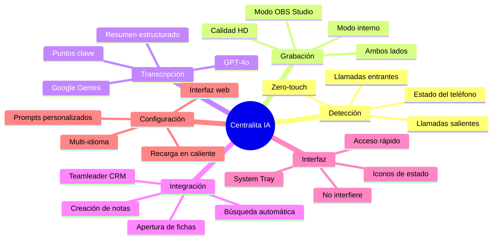
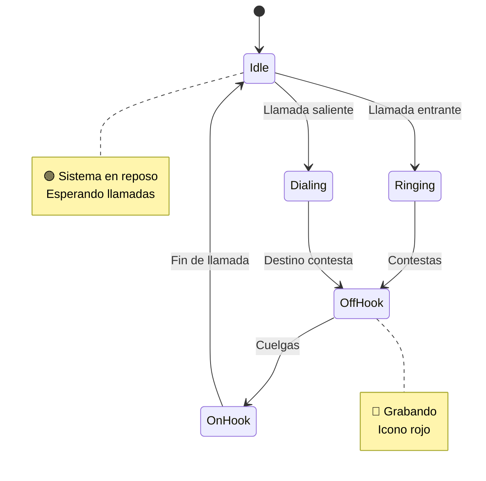
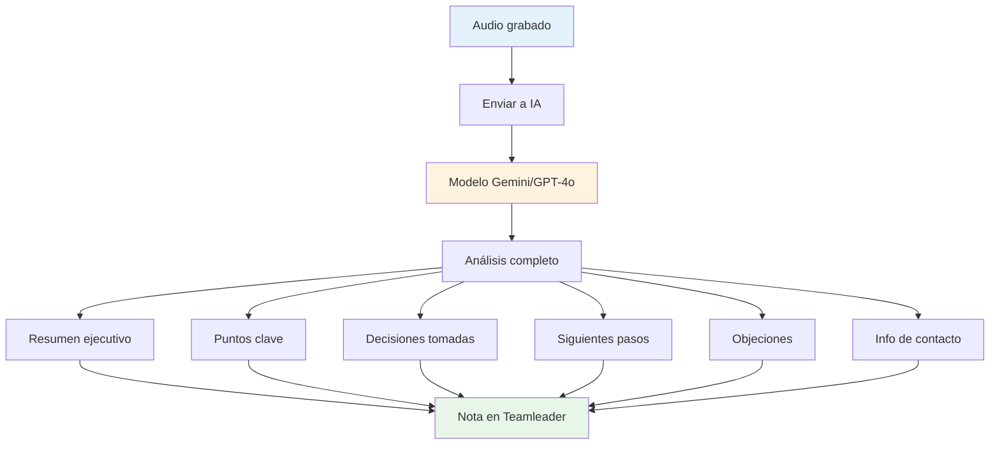
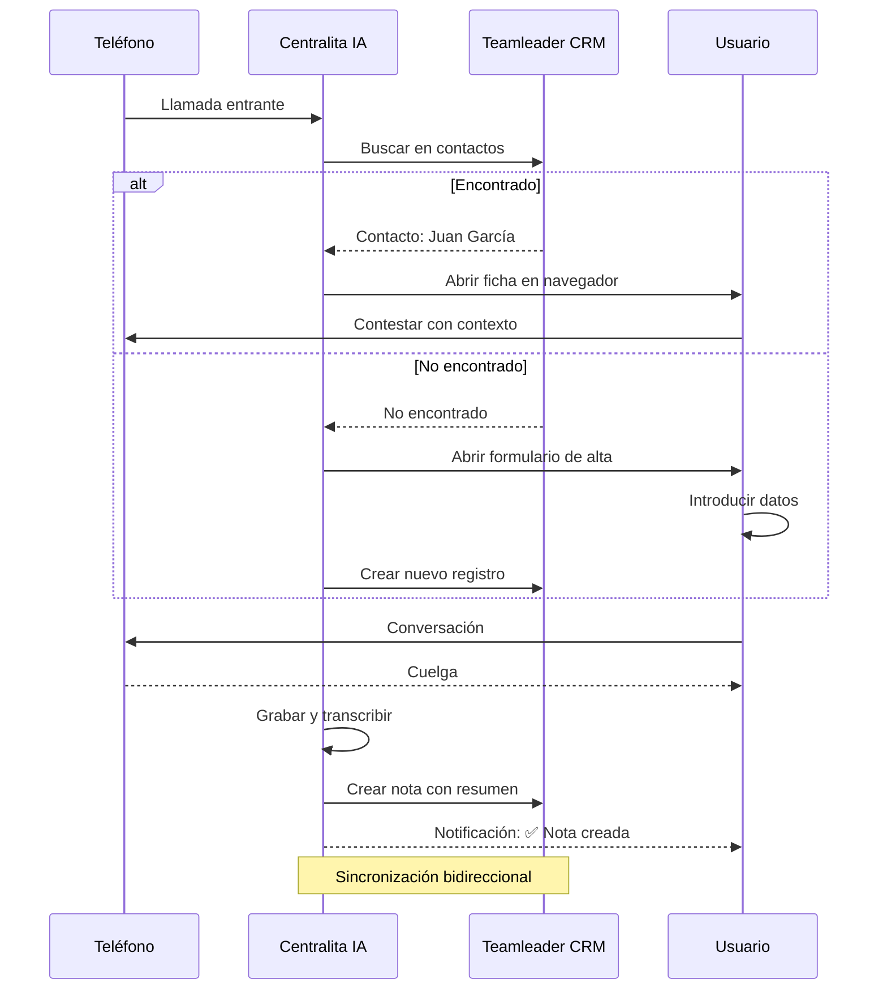
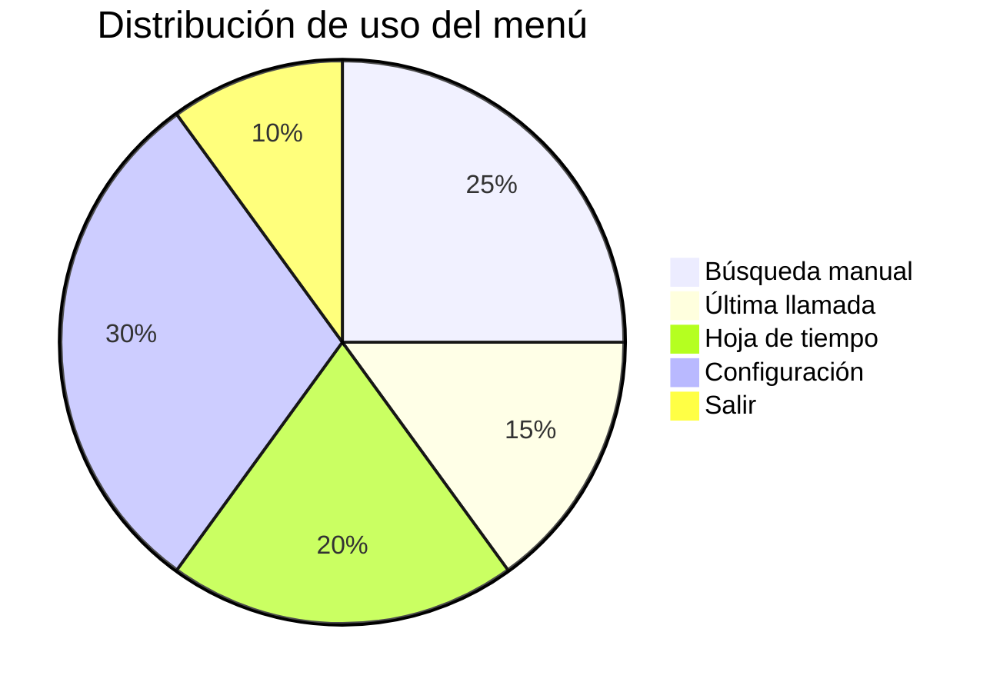

# 🎯 Funcionalidades Principales

Las funcionalidades principales de Centralita IA Teamleader son las características esenciales que transforman tu gestión de llamadas telefónicas. Cada una está diseñada para ahorrar tiempo, mejorar la calidad del servicio y reducir errores manuales.

!!! success "💎 Transforma tu gestión de llamadas"
    - Ahorra ~10 minutos por llamada
    - Aumenta la tasa de conversión
    - Mejora la satisfacción del cliente

---

## 🗺️ Mapa de Funcionalidades



---

## :material-phone-in-talk: 1. Detección Automática de Llamadas

### ¿Qué hace?

Centralita IA detecta automáticamente cuando recibes o realizas una llamada, sin que tengas que hacer nada.

### ¿Cómo funciona?

El sistema monitorea tu línea telefónica en segundo plano y reconoce:



!!! tip "Hands-free"
    No necesitas presionar botones ni iniciar ningún proceso. Centralita IA detecta la llamada y arranca el flujo automático.

### Beneficios para tu negocio

<div class="grid cards" markdown>

-   :material-check-circle: **Cero intervención manual**

    Enfócate en atender al cliente

-   :material-calendar-check: **Sin olvidos**

    Todas las llamadas se procesan automáticamente

-   :material-clock-fast: **Tiempo ahorrado**

    No inicias procesos ni registras llamadas manualmente

</div>

### Escenario de uso

!!! example "Caso real"
    > Tu teléfono suena. Mientras sigues trabajando, Centralita IA detecta la llamada, busca el número en Teamleader y abre la ficha del cliente en tu navegador. Solo levantas el auricular y ya tienes toda la información del cliente visible.

---

## :material-mic: 2. Grabación de Audio

### ¿Qué hace?

Graba automáticamente toda la conversación telefónica en alta calidad para posterior transcripción.

### Opciones de grabación

???+ info "Modos de grabación disponibles"

=== "🎤 Grabación Interna"

| Característica | Detalle |
|---------------|---------|
| **Método** | Captura audio del micrófono |
| **Calidad** | Estándar (16 kHz, WAV) |
| **Requisitos** | Ninguno adicional |
| **Ideal para** | Teléfonos físicos |
| **Ventajas** | Sin configuración extra |
| **Limitaciones** | Solo micrófono |

!!! info "Grabación transparente"
    La grabación es imperceptible para el cliente. No afecta la calidad de la llamada.

=== "🎬 Grabación con OBS Studio"

| Característica | Detalle |
|---------------|---------|
| **Método** | Captura audio del sistema |
| **Calidad** | Alta (MP4, 128 kbps) |
| **Requisitos** | OBS Studio + conexión habilitada |
| **Ideal para** | Softphones VoIP |
| **Ventajas** | Ambos lados, máxima calidad |
| **Limitaciones** | Configuración adicional |

!!! tip "Ideal para softphones VoIP"
    Si usas Zoiper, 3CX u otro softphone, la grabación con OBS es la mejor opción para capturar ambos lados de la conversación.

### Calidad de audio

| Parámetro | Valor | Descripción |
|-----------|-------|-------------|
| **Frecuencia de muestreo** | 16 kHz | Para transcripción precisa |
| **Formato** | WAV (interna) / MP4 (OBS) | Compatible con todas las APIs de IA |
| **Canales** | Mono (interna) / Estéreo (OBS) | Según modo de grabación |
| **Bitrate** | 64-128 kbps | Configurable según necesidades |

### Beneficios para tu negocio

| Beneficio | Descripción |
|-----------|-------------|
| **Registro completo** | Nunca pierdes información de una llamada |
| **Transcripción precisa** | Mejor calidad de audio = mejores resultados de IA |
| **Auditoría** | Puedes revisar llamadas si hay disputas o dudas |

### Escenario de uso

!!! example "Caso real"
    > Estás en una llamada importante de ventas con un cliente nuevo. Centralita IA graba la conversación completa. Al terminar, la IA transcribe el audio y crea una nota en Teamleader con todos los detalles: presupuesto discutido, objeciones del cliente y siguientes pasos acordados.

---

## :material-brain: 3. Transcripción con Inteligencia Artificial

### ¿Qué hace?

Convierte automáticamente el audio de la llamada en texto y genera un resumen estructurado con la información más importante.

### ¿Qué incluye la transcripción?



La IA crea un resumen que incluye:

<div class="grid cards" markdown>

-   :material-text-fields: **Resumen ejecutivo**

    Breve descripción de la llamada en 2-3 frases

-   :material-lightbulb: **Puntos clave**

    Temas principales tratados

-   :material-check-circle: **Decisiones tomadas**

    Acuerdos y compromisos

-   :material-arrow-right: **Siguientes pasos**

    Acciones a realizar con fechas

-   :material-alert: **Objeciones o preocupaciones**

    Dudas del cliente

-   :material-account-box: **Información de contacto**

    Datos relevantes mencionados

</div>

!!! success "Más allá de la transcripción"
    No solo convierte audio a texto: extrae la información valiosa para tu negocio.

### Modelos de IA disponibles

???+ info "Comparación de modelos"

=== "🚀 Google Gemini 2.5 Flash Lite"

| Característica | Valor |
|---------------|-------|
| **Coste** | $0.02-0.03 por llamada |
| **Velocidad** | ⚡ Muy rápido |
| **Calidad** | Alta |
| **Uso recomendado** | ✅ Uso diario |

=== "⚡ Google Gemini 2.5 Flash"

| Característica | Valor |
|---------------|-------|
| **Coste** | $0.04-0.06 por llamada |
| **Velocidad** | ⚡ Rápido |
| **Calidad** | Muy alta |
| **Uso recomendado** | Llamadas importantes |

=== "🧠 OpenAI GPT-4o"

| Característica | Valor |
|---------------|-------|
| **Coste** | $0.15-0.20 por llamada |
| **Velocidad** | 🐌 Lento |
| **Calidad** | Excelente |
| **Uso recomendado** | Reuniones críticas |

### Beneficios para tu negocio

| Beneficio | Descripción |
|-----------|-------------|
| **No más notas manuales** | La IA toma notas por ti |
| **Sin olvidos** | Captura todos los detalles importantes |
| **Análisis rápido** | Resúmenes fáciles de consultar |
| **Búsqueda inteligente** | Puedes buscar en las transcripciones |

### Escenario de uso

!!! example "Caso real"
    > Terminas una llamada de 30 minutos con un cliente. En lugar de perder 10 minutos escribiendo notas, Centralita IA ya ha generado un resumen completo: "Cliente interesado en plan premium, presupuesto de 5.000€, objeción sobre tiempos de entrega, siguiente reunión agendada para el viernes."

---

## :material-crm: 4. Integración con Teamleader

### ¿Qué hace?

Sincroniza automáticamente toda la información de las llamadas con tu CRM Teamleader.

### Funciones automáticas



!!! tip "Información al instante"
    Antes de contestar, ya tienes la ficha del cliente abierta con su historial completo.

### Integración bidireccional

| Función | Descripción |
|---------|-------------|
| **Búsqueda automática** | Encuentra contactos por número telefónico |
| **Apertura de fichas** | Teamleader se abre automáticamente |
| **Creación de notas** | Las llamadas quedan registradas en el CRM |
| **Pre-notas para nuevos clientes** | Si el cliente no existe, facilita el alta rápida |

### Beneficios para tu negocio

| Beneficio | Descripción |
|-----------|-------------|
| **Centralización** | Toda la información en un solo lugar (Teamleader) |
| **Historial completo** | Todas las llamadas están disponibles en el CRM |
| **Colaboración** | Tu equipo puede acceder al historial de llamadas |
| **Sin duplicación** | No copias ni pegas información |

### Escenario de uso

!!! example "Caso real"
    > Llama el cliente "Empresa ABC S.L." que ya tiene varias llamadas registradas. Centralita IA detecta la llamada, abre su ficha en Teamleader donde ves las notas de las llamadas anteriores (problemas resueltos, compromisos pendientes). Contestas sabiendo exactamente el contexto de la relación.

---

## :monitor: 5. Interfaz de System Tray (Bandeja de Sistema)

### ¿Qué hace?

Controla Centralita IA desde el área de notificación de Windows con acceso rápido a todas las funciones.

### Menú de acceso rápido

Desde el icono en la bandeja de sistema puedes:



<div class="grid cards" markdown>

-   :magnify: **Búsqueda manual**

    Buscar un número en Teamleader

-   :phone: **Última llamada**

    Ver detalles de la llamada más reciente

-   :table: **Hoja de tiempo**

    Registro completo de todas las llamadas

-   :settings: **Configuración**

    Ajustar parámetros en tiempo real

-   :logout: **Salir**

    Apagar el sistema de forma controlada

</div>

### Indicadores visuales

| Color | Estado | Significado |
|-------|--------|-------------|
| 🟢 **Verde** | Sistema listo | Esperando llamadas |
| 🔴 **Rojo** | Grabando | Llamada en curso |
| 🟡 **Amarillo** | Procesando | Transcribiendo con IA |

!!! info "Sin interrupciones"
    El sistema funciona en segundo plano sin interrumpir tu trabajo normal.

### Beneficios para tu negocio

| Beneficio | Descripción |
|-----------|-------------|
| **Acceso permanente** | Control total desde la bandeja de sistema |
| **No interfiere** | Sigue trabajando normalmente en tus aplicaciones |
| **Notificaciones visuales** | Siempre sabes el estado del sistema |

### Escenario de uso

!!! example "Caso real"
    > Estás trabajando en Excel cuando tuena el teléfono. No necesitas cambiar de aplicación: contestas y Centralita IA detecta la llamada automáticamente. Al terminar, ves el icono pasar a amarillo mientras procesa la transcripción, y luego a verde cuando está listo. Todo sin salir de tu hoja de cálculo.

---

## :web: 6. Configuración Web

### ¿Qué hace?

Interfaz web para ajustar todos los parámetros de Centralita IA en tiempo real sin reiniciar la aplicación.

### Secciones de configuración

???+ info "Explora las secciones de configuración"

=== "🌐 Configuración general"

| Parámetro | Descripción |
|-----------|-------------|
| **Idioma** | Español, Inglés, Francés |
| **Tema visual** | 50 temas disponibles |
| **Módulos activos** | Activar/desactivar funcionalidades |

=== "🔑 Configuración API"

| Parámetro | Descripción |
|-----------|-------------|
| **Client ID** | Identificador OAuth2 |
| **Client Secret** | Contraseña de aplicación |
| **Tokens** | Acceso y refresh tokens |

=== "🤖 Configuración IA"

| Parámetro | Descripción |
|-----------|-------------|
| **API Key** | Clave de acceso OpenRouter |
| **Modelo** | Gemini, GPT-4o, etc. |
| **Prompt** | Instrucciones personalizadas |

=== "🎙️ Configuración audio"

| Parámetro | Descripción |
|-----------|-------------|
| **Modo de grabación** | Interna (1) u OBS (2) |
| **Rutas** | Carpeta de grabación |
| **Formato** | WAV, MP4 |

=== "📱 Configuración OBS**

| Parámetro | Descripción |
|-----------|-------------|
| **Host** | localhost |
| **Puerto** | 4455 |
| **Contraseña** | Contraseña de conexión |

!!! tip "Recarga en caliente"
    Los cambios se aplican inmediatamente sin necesidad de reiniciar la aplicación.

### Personalización de prompts de IA

Puedes personalizar qué información extrae la IA de cada llamada:

```text
Transcribe la llamada y genera un resumen con:
- Puntos clave discutidos
- Decisiones tomadas
- Siguientes pasos con fechas
- Objeciones o preocupaciones del cliente
- Información de presupuesto mencionada
```

!!! tip "A/B testing de prompts"
    Centralita IA permite experimentar con diferentes prompts para encontrar el mejor para tu negocio.

### Beneficios para tu negocio

| Beneficio | Descripción |
|-----------|-------------|
| **Sin reinicios** | Ajusta la configuración al vuelo |
| **Flexible** | Adapta la IA a tu negocio específico |
| **Intuitiva** | Interfaz web sencilla, sin conocimientos técnicos |

### Escenario de uso

!!! example "Caso real"
    > Decides que quieres que la IA extraiga información sobre presupuestos en todas las llamadas. Abres la configuración web en `http://localhost:8585/`, editas el prompt de instrucciones añadiendo "incluye información de presupuestos mencionados", guardas los cambios y listo. La próxima llamada ya usará el nuevo prompt.

---

## 📊 Resumen de Funcionalidades

| Funcionalidad | Beneficio clave | ¿Por qué es importante? |
|---------------|----------------|------------------------|
| Detección automática | Cero intervención | Ahorra tiempo y evita olvidos |
| Grabación de audio | Registro completo | No pierdes información valiosa |
| Transcripción IA | Notas automáticas | Resúmenes precisos y accionables |
| Integración Teamleader | Centralización | Todo en tu CRM, colaborativo |
| System tray | Acceso permanente | Control sin interrumpir tu trabajo |
| Configuración web | Personalización | Adaptable a tu negocio |

---

## 🎓 ¿Listo para empezar?

!!! success "Comienza hoy mismo"
    La instalación es sencilla y en menos de 10 minutos estarás usando todas estas funcionalidades.

[ :material-download: Descargar Centralita Gratis](../castellano/link-descarga-software-centralita-teamleader.md){ .md-button .md-button--primary }

[ :material-book: Guía de Instalación](../castellano/inicio-rapido-centralita-teamleader.md){ .md-button }

[ :material-settings: Configuración Paso a Paso](../castellano/pantalla-configuracion-centralita-teamleader.md){ .md-button }

---

## 🔗 Recursos Adicionales

??? info "¿Quieres funcionalidades avanzadas?"
    Descubre [Funcionalidades Avanzadas](funcionalidades-avanzadas.md) para características adicionales como grabación con OBS Studio, backup automático y más.

| Documentación | Descripción |
|---------------|-------------|
| [Funcionalidades Avanzadas](funcionalidades-avanzadas.md) | OBS Studio, backup, multi-idioma |
| [Preguntas Frecuentes](faq-tecnica.md) | Solución de problemas comunes |
| [Integraciones](integraciones.md) | OBS Studio y otros sistemas |
| [Guía Completa](../castellano/centralita-crm-ia-teamleader.md) | Manual de usuario completo |
